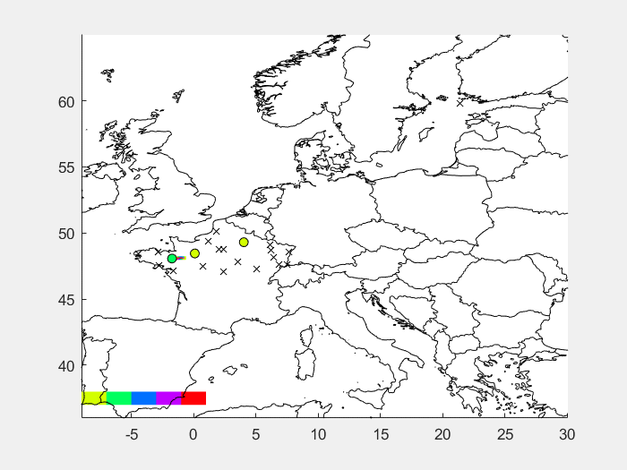

```@raw html


```
---

```@setup grsetup
using Plots
ENV["GKSwstype"] = "100"
gr()
```

Welcome to our course *Julia for Optimization and Learning*. This course consists of two parts:
- *Basics of Julia*: [Julia](https://julialang.org/) is a fast programming language for scientific computing. Designed and developed at MIT, it quickly keeps gaining popularity and scored rank 22 among programming languages in the [PYPL rating](https://pypl.github.io/PYPL.html) (as of September 2021).
- *Applications*: The second part of the course will be dedicated to applications. The main emphasis will given to machine learning, but we will also go through statistics and differential equations.

This course is taught at the [Czech Technical University](https://www.cvut.cz/en/) in Prague. It is part of the [prg.ai minor](https://prg.ai/minor/), a study programme combining top courses from four faculties of two Prague universities.


## What will we emphasize?

The main goals of the course are the following:
- You will learn the *connections between theory and coding*. There are many lectures which teach either only theory or only coding. We will show you both.
- You will learn how to *code efficiently*. We will teach you to split the code into small parts which are simpler to debug or optimize. We will often show you several writing possibilities and comment on the differences.
- You will learn about *machine learning and neural networks*. You will understand neural networks by writing a simple one from scratch. Then you will learn how to use packages to write simple code for complicated networks.
- You will learn *independence*. The problem formulation of many exercises is very general, which simulates when no step-by-step procedure is provided.


## What will you learn?

Selected examples of what you will be able to write at the end of the course include:
- *Efficient coding*: The following plot can be created in twenty lines of code
  
- *Numerical techniques*: You will learn many techniques to minimize functions
  
- *Neural networks*: And apply techniques to train neural networks
  
  - Figure 1 contains digit 5 with probability 0.999683.
  - Figure 2 contains digit 0 with probability 1.000000.
  - Figure 3 contains digit 4 with probability 0.974734.
- *Connection to Matlab, R or Python*: Do you have a Matlab code which you need to run from Julia? No problem, write five lines of code to get
  


## Technical details

Scripts for each lecture is available at its own [Github repository](https://github.com/JuliaTeachingCTU/Julia-for-Optimization-and-Learning-Scripts). For Czech students, we list the [requirements for passing the course](https://cw.fel.cvut.cz/b221/courses/b0b36jul/start) (in Czech only).


## Useful materials

- [Official documentation](https://docs.julialang.org/en/v1/)
- [Cheatsheet for differences between Julia and Matlab and Python](https://cheatsheets.quantecon.org/)
- [Cheatsheet of basic functions](https://cheatsheets.quantecon.org/julia-cheatsheet.html)
- [Cheatsheet of advanced functions](https://juliadocs.github.io/Julia-Cheat-Sheet/)
- [Think Julia: How to Think Like a Computer Scientist](https://benlauwens.github.io/ThinkJulia.jl/latest/book.html#chap01)
- [From Zero to Julia!](https://techytok.com/from-zero-to-julia/)
