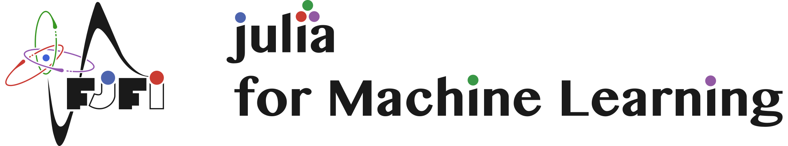

---

```@setup grsetup
using Plots
ENV["GKSwstype"] = "100"
gr()
```

Welcome to our course *Julia for Machine Learning*. This course consists of two parts:
- *Basics of Julia*: [Julia](https://julialang.org/) is a fast programming language for scientific computing. Designed and developed at MIT, it quickly keeps gaining popularity and scored rank 25 among programming languages in the [PYPL rating](https://pypl.github.io/PYPL.html) (as of February 2021).
- *Applications*: The second part of the course will be dedicated to applications. The main emphasis will given to machine learning, but we will also go through statistics and differential equations.
Since there are no course requirements, all students who want to learn to program efficiently or machine learning techniques are welcome to join.

The course's main requirement is to finish a small project of your choice. This project can be connected to your bachelor or master thesis, and we hope that our course will help you prepare a better thesis.


## Information about the course

- Teachers: Lukáš Adam, Václav Mácha
- Credits: 3
- FJFI code: [01SUJ](http://bilakniha.cvut.cz/cs/predmet6606806.html)
- Requirements for the course:
    - Finish three [homework](@ref homeworks). Each homework is a short task.
    - Finish one final [project](@ref project). Project is a more complex task, where you can choose the topic.
- Grading: The attendance and homework are compulsory to pass the course. The final grade will be based solely on the project.
- Teaching way: online via MS Teams. CTU students will be added automatically to a team after registering for the course in [KOS](https://www.kos.cvut.cz). Students from other universities should write us an email.


## What will we emphasize?

The main goals of the course are the following:
- You will learn the *connections between theory and coding*. There are many lectures which teach either only theory or only coding. We will show you both.
- You will learn how to *code efficiently*. We will teach you to split the code into small parts which are simpler to debug or optimize. We will often show you several writing possibilities and comment on the differences.
- You will learn about *machine learning and neural networks*. You will understand neural networks by writing a simple one from scratch. Then you will learn how to use packages to write simple code for complicated networks.
- You will learn *independence*. The problem formulation of many exercises is very general, which simulates when no step-by-step procedure is provided.


## What will you learn?

Selected examples of what you will be able to write at the end of the course include:
- *Efficient coding*: The following plot can be created in twenty lines of code
  
- *Numerical techniques*: You will learn many techniques to minimize functions
  
- *Neural networks*: And apply techniques to train neural networks
  
  - Figure 1 contains digit 5 with probability 0.999683.
  - Figure 2 contains digit 0 with probability 1.000000.
  - Figure 3 contains digit 4 with probability 0.974734.
- *Connection to Matlab, R or Python*: Do you have a Matlab code which you need to run from Julia? No problem, write five lines of code to get
  


## Recommended courses

We recommend the following courses at FJFI:
- [Matematické problémy nematematiků](http://bilakniha.cvut.cz/cs/predmet5677506.html) invites people from companies to talk about how scientific methods are used in real applications.


## References

- [Official documentation](https://docs.julialang.org/en/v1/)
- [Think Julia: How to Think Like a Computer Scientist](https://benlauwens.github.io/ThinkJulia.jl/latest/book.html#chap01)
- [From Zero to Julia!](https://techytok.com/from-zero-to-julia/)
- [WikiBooks](https://en.wikibooks.org/wiki/Introducing_Julia)
