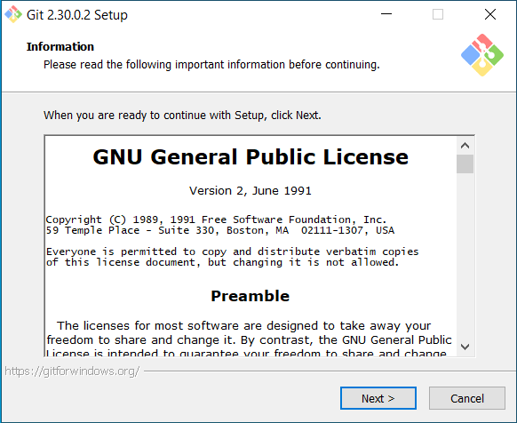
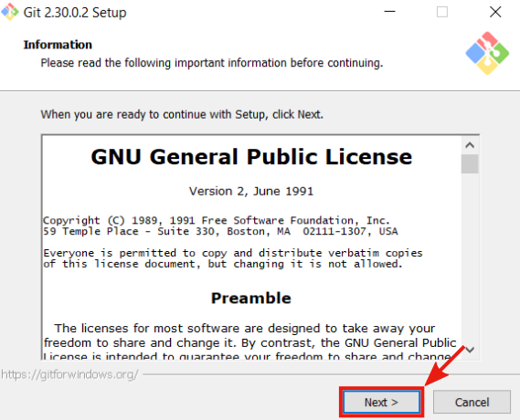
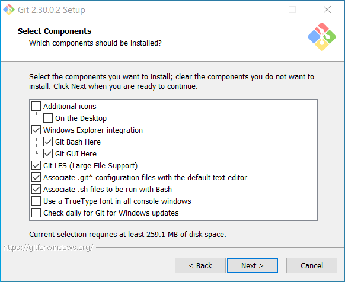
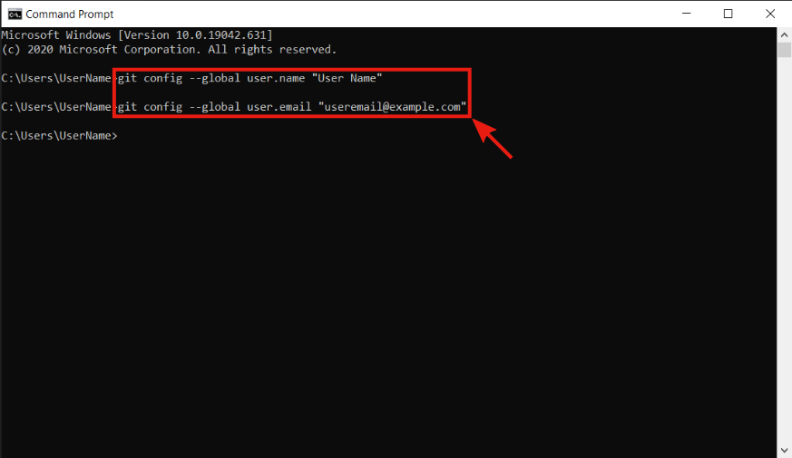

# Git

[Git](https://git-scm.com/) is a distributed version control system for tracking changes in any set of text files. It is designed for coordinating work among cooperating programmers during software development. The Julia package system is based on Git, and the whole Julia project is hosted on [GitHub](https://github.com/). GitHub is a service that provides internet hosting for software development and version control using Git. This section offers a basic tutorial on installing and setting Git on Windows 10.

Git installer can be download from the official [download page](https://git-scm.com/downloads).



Download the proper installer, run it and follow the instructions.



There is no need to change the default settings. However, we recommend changing the default editor used by Git to Visual Studio Code.



After setting the editor used by Git, finish the installation with default settings.

```@raw html
<div class="admonition is-info">
<header class="admonition-header">GitHub Account</header>
<div class="admonition-body">
```
Create a GitHub account on the official [GitHub page](https://github.com/). Do not forget to verify your email address.
```@raw html
</div></div>
```

## User settings

Before using Git, we need to make the necessary settings. Type `cmd` into the search bar and open the `Command Prompt`.


In the `Command Prompt` type the following two commands

> `git config --global user.name "USERNAME"`
>
> `git config --global user.email "USEREMAIL"`

and press `Enter`. Do not forget to change `USERNAME` and `USEREMAIL` to the ones registered at GitHub.



The commands above set the user name and email for Git. Because Git is designed for collaboration between multiple people, this information is used to track who made which changes.
