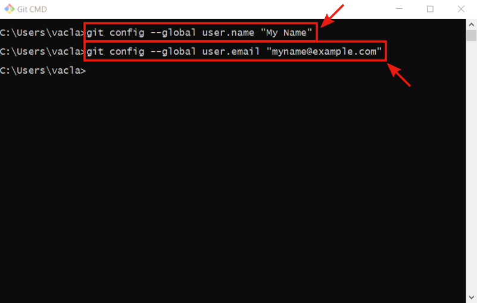
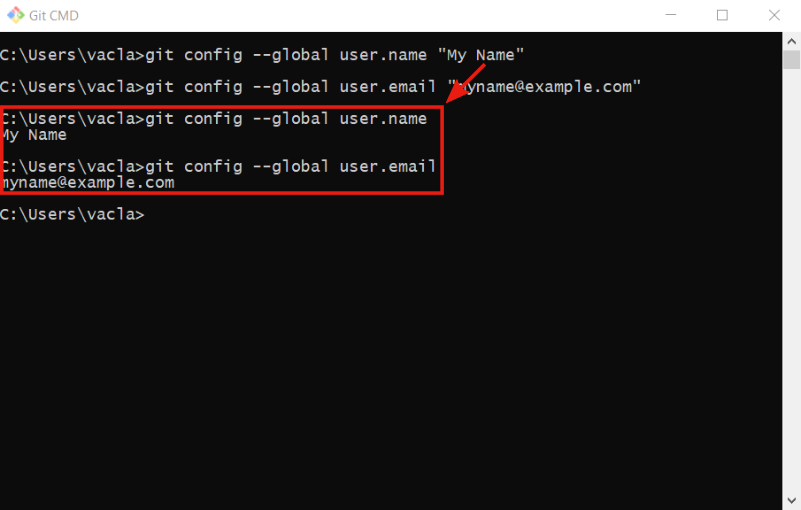

# Git

## Install Git
- **!!! TODO: add description !!!**

- **!!! TODO: add description !!!**

- **!!! TODO: add description !!!**

- **!!! TODO: add description !!!**

- **!!! TODO: add description !!!**

- **!!! TODO: add description !!!**

- **!!! TODO: add description !!!**

- **!!! TODO: add description !!!**

- **!!! TODO: add description !!!**

- **!!! TODO: add description !!!**

- **!!! TODO: add description !!!**

- **!!! TODO: add description !!!**

- **!!! TODO: add description !!!**

- **!!! TODO: add description !!!**

- **!!! TODO: add description !!!**

## Basic settings

- **!!! TODO: add description !!!**

- **!!! TODO: add description !!!**
> `git config --global user.name USERNAME`
> `git config --global user.email USEREMAIL`

- **!!! TODO: add description !!!**
> `git config --global user.name`
> `git config --global user.email`

