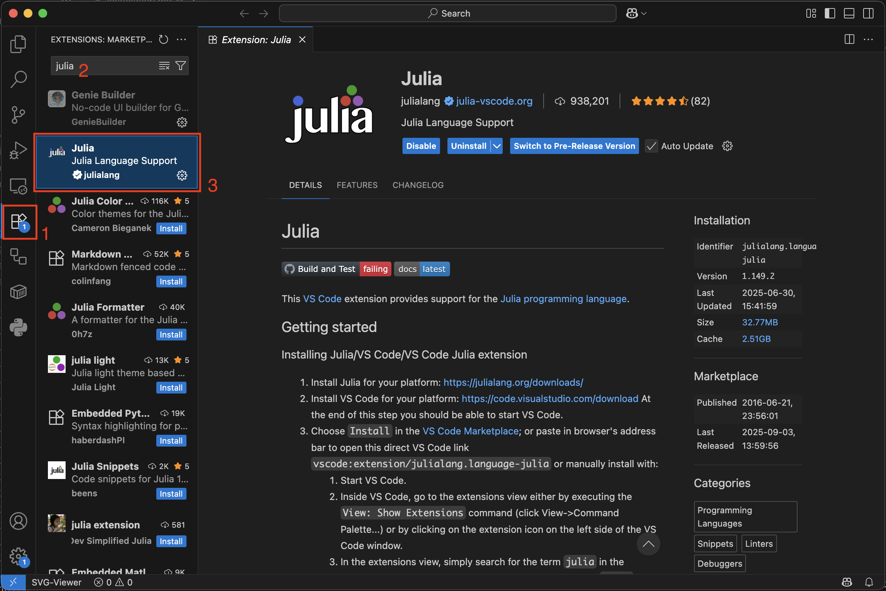

## Julia

There are multiple ways how to install Julia. We recommend using the official version manager [Juliaup](https://julialang.org/install/):

- **Windows** users can install Julia and also Juliaup directly from [Windows Store](https://apps.microsoft.com/detail/9njnww8pvkmn?hl=cs-cz&gl=CZ) or equivalently use the following command

```powershell
winget install julia -s msstore
```

- **Linux** and **MacOS** users can install Julia and also Juliaup by running the following command

```shell
curl -fsSL https://install.julialang.org | sh
```

Once finished, the `julia` and `juliaup` commands should be available via command line interface.

!!! info "Other installation options:"
    For more options how to install Julia and Juliaup, see the [Juliaup Github repository](https://github.com/JuliaLang/juliaup).

For the upcoming course, we recommend to install Julia version 1.11 and set is as a default Julia. It can be done in the following way 

```shell
> juliaup add 1.11

> juliaup default 1.11
Configured the default Julia version to be '1.11'.
```

##  Git

[Git](https://git-scm.com/) is a distributed version control system for tracking changes in any set of text files. It is designed for coordinating work among cooperating programmers during software development. Git installer can be downloaded from the official [download page](https://git-scm.com/downloads). Download the proper installer, run it and follow the instructions. Before using Git, we need to make the necessary settings. It can be done easily using command line interface the two following commands

```shell
> git config --global user.name "<your_username>"

> git config --global user.email "<your_email_adress>"
```

The commands above set the user name and email for Git. Because Git is designed for collaboration between multiple people, this information is used to track who made which changes.

!!! info "GitHub Account:"
    The Julia package system is based on Git, and the Julia project is hosted on [GitHub](https://github.com/). GitHub is a service that provides internet hosting for software development and version control using Git. We use GitHub to host all the materials and final projects in this course. Therefore, every student needs to create a GitHub account to be able to finish the course. It can be done in a few steps on the official [GitHub page](https://github.com/).

## Visual Studio Code

It is possible to write Julia codes in any text editor, and run them directly from the terminal. However, it is usually better to use an IDE that provides additional features such as syntax highlighting, or code suggestions. We recommend using [Visual Studio Code](https://code.visualstudio.com/), a free source-code editor made by Microsoft. It supports many programming languages (Julia, Python, LaTex, ...) via extensions. The editor is available at the official [download page](https://code.visualstudio.com/download). Download the proper installer, run it and follow the instructions.

To use the VS Code as an IDE for Julia, we have to install the [Julia extension](https://marketplace.visualstudio.com/items?itemName=julialang.language-julia). It can be done directly from the VS Code. Open the `Extension MarketPlace` by pressing the button in the `Activity bar` (the left bar). Type `julia` in the search bar and select the Julia extension. Then press the `Install` button to install the extension. For more information see the [official documentation](https://www.julia-vscode.org/docs/stable/#).


