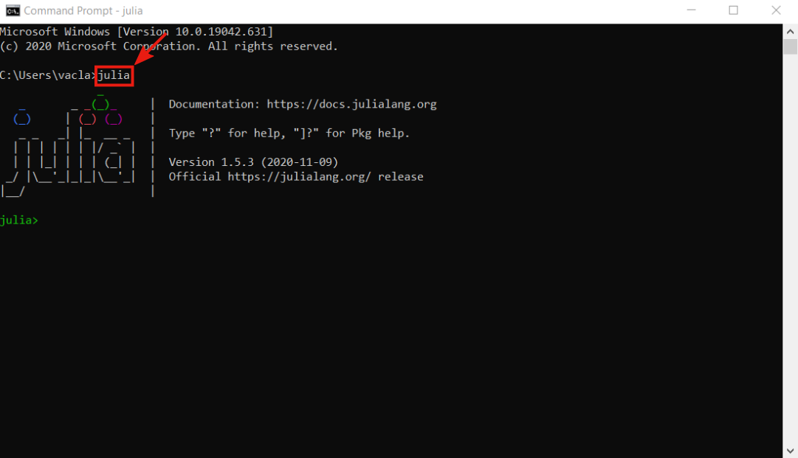

# Julia

- The first step is to download the proper installation file from the official [download page](https://julialang.org/downloads/). In most cases, the proper version is the **64-bits** version for the Windows operation system

- **!!! TODO: add description !!!**

- **!!! TODO: add description !!!**

- **!!! TODO: add description !!!**

## Adding Julia to PATH on Windows 10

- **!!! TODO: add description !!!**

- **!!! TODO: add description !!!**

- **!!! TODO: add description !!!**
> rundll32 sysdm.cpl,EditEnvironmentVariables

- **!!! TODO: add description !!!**

- **!!! TODO: add description !!!**

- **!!! TODO: add description !!!**

- **!!! TODO: add description !!!**

- **!!! TODO: add description !!!**

- **!!! TODO: add description !!!**

