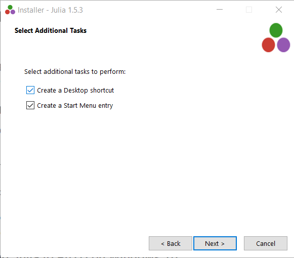
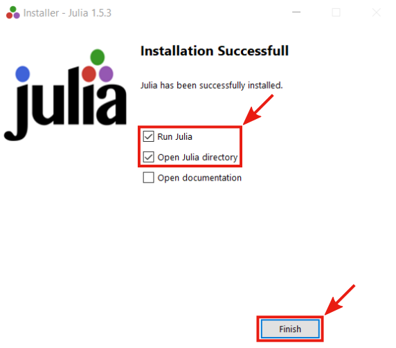
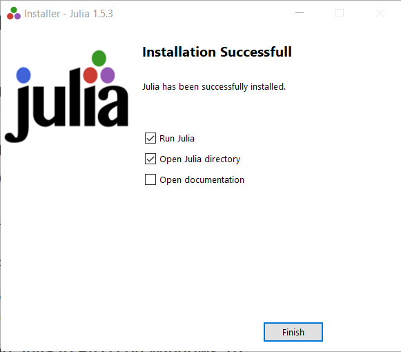
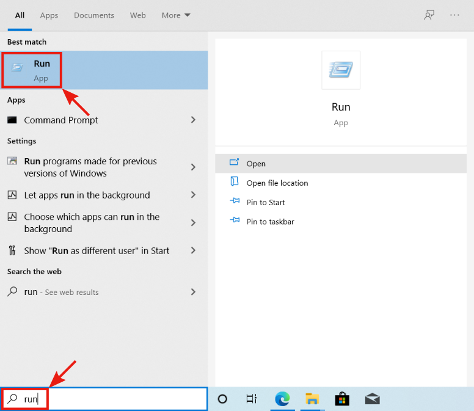
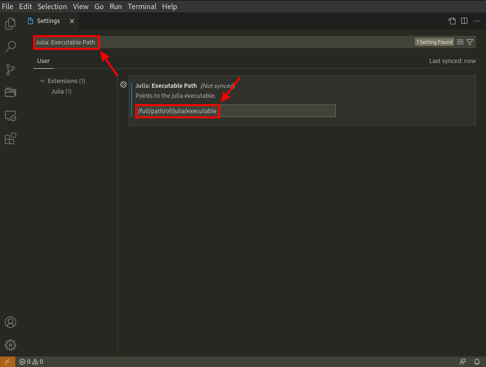
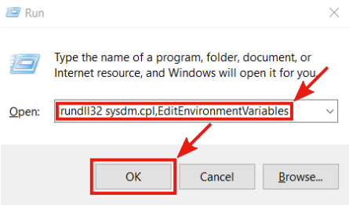
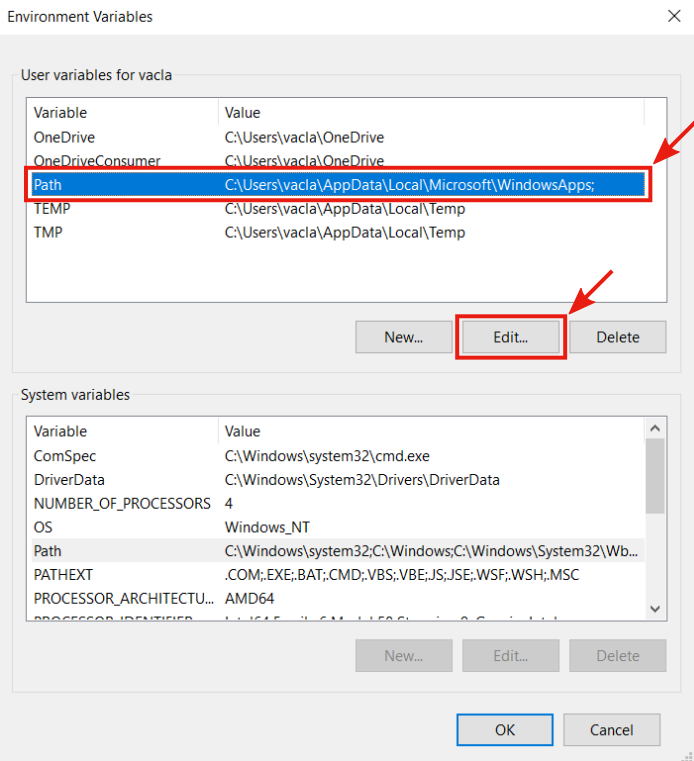
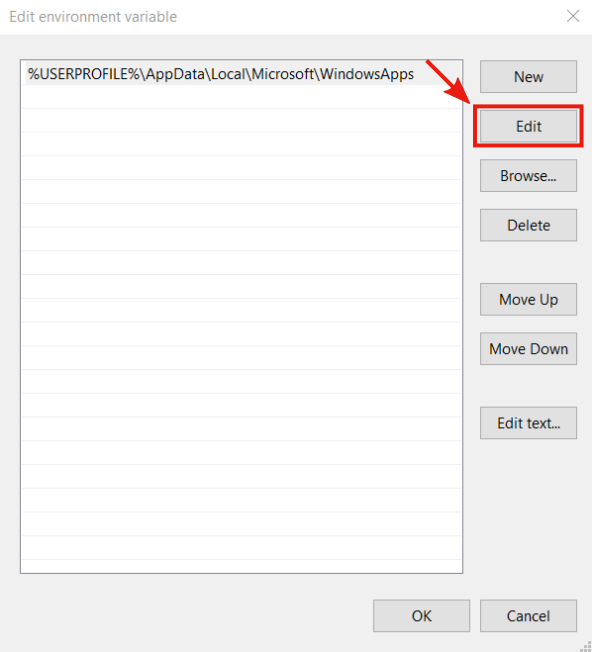
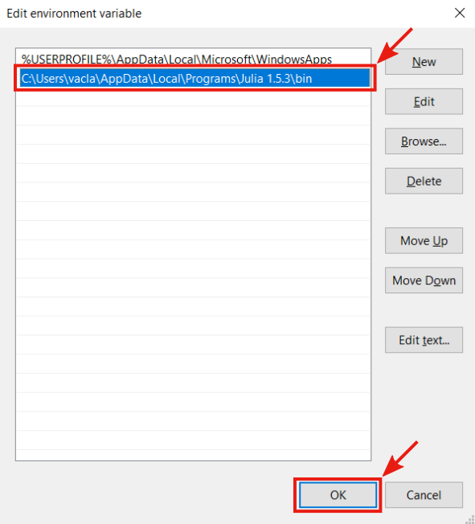

# Julia

In this section, we provide instructions on how to install all the software needed for the purposes of this course. However, we only provide installation instructions for Windows 10 operating system.

Surprisingly the first thing we have to install is the Julia programming language. The first step is to download the proper installation file from the official [download page](https://julialang.org/downloads/). In most cases, the proper version is the **64-bits** version for the Windows operating system.

If you're using an operating system other than Windows 10, follow the [platform-specific instructions](https://julialang.org/downloads/platform/). Otherwise, you can follow the instructions below. Run the downloaded Julia installer and follow the given instruction.

There is no need to change the default settings. However, in the last window of the installer, make sure that the `Open Julia directory` option is selected

After finishing the installation, the Julia terminal and the Julia directory in the file explorer should open. **Do not close the Julia directory, since we will need it later!!!**

## Adding Julia to PATH

To invoke Julia by simply typing `julia` in the command line, the Julia executable directory needs to be added to `PATH`. Open the `Run` app using the shortcut `Windows key + R` or by typing `Run` in the search bar

Then type `rundll32 sysdm.cpl,EditEnvironmentVariables` into the `Run` app and press `OK`

After the previous step, the `Environment Variables` window should appear. Under the `User Variables` section, select the row with variable `Path` and click the `Edit` button

The `Edit environment variable` window will appear. Now we need to get the path to Julia bin folder. It can be done easily from the Julia directory opened by the Julia installer. In Julia directory navigate to the `bin` folder

In the Julia bin folder select and copy the path from the file explorer

Navigate back to the `Edit environment variable` window and select the first empty row, press the `Edit` button, and paste the path to the Julia `bin` folder. Then press the `OK` button to leave the window and again press `OK` in the `Environment Variables` to leave it too.

Finally, we can check, that we added the path correctly. Type `cmd` into the search bar and open the `Command Prompt`.

In the `Command Prompt` type `julia` and press `Enter`. If everything is set correctly,  it will start a new Julia session (REPL)

