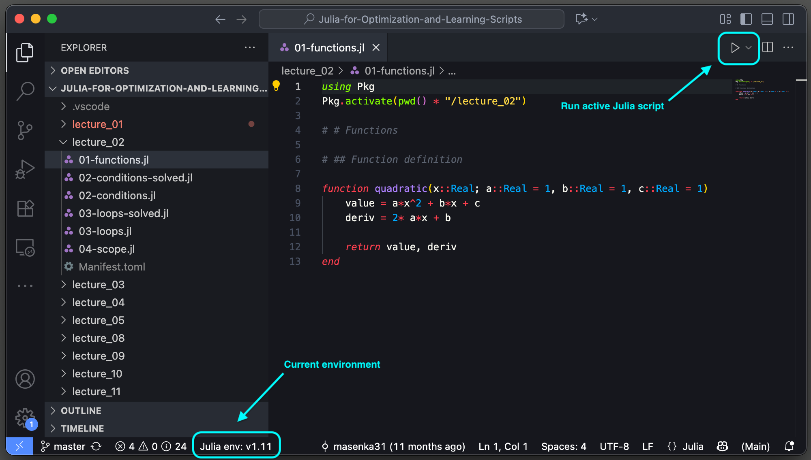
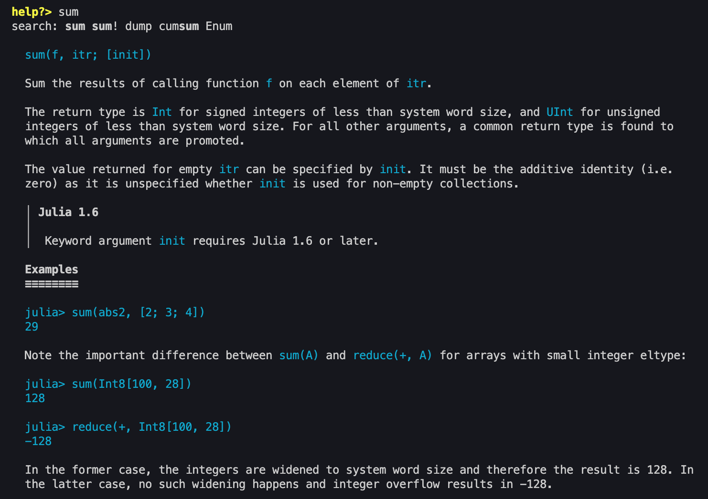
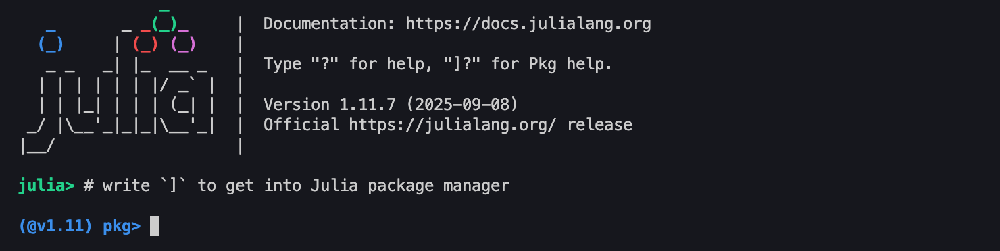
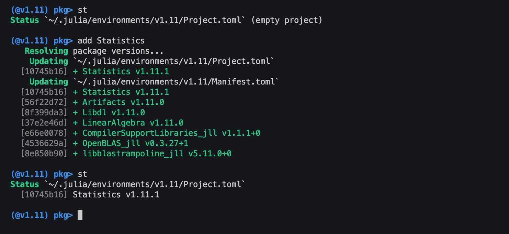
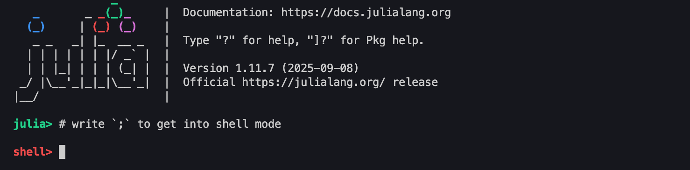
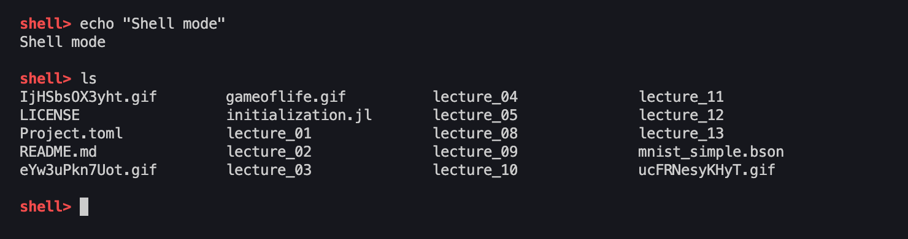

## Julia in Visual Studio Code

In the labs, we will be using Visual Studio Code to work on Julia projects and run Julia. An IDE like VS Code allows us to use certain keybaord shortcuts and other utilities (such as syntax highlighting) to more effectively work with Julia code.

We recommend to install at least the Julia Extension, which comes with a lot of functionality to run, format, and work with Julia scripts.

### Julia commands

Julia Extension enables us to use important Julia-specific commands. Running `cmd + shift + P` opens VS code command pallete. When searching for `>Julia`, you can see the available commands.

The most important ones are
- `Julia: Start REPL`
- `Julia: Send Current Line or Selection to REPL`
- `Julia: Execute Code in REPL`
- `Julia: Execute Code in REPL and Move`
- `Julia: Execute Code Cell in REPL and Move`
- `Julia: Execute Code Cell in REPL and Move`.

Some of these are already mapped to keyboard shortcuts. We recommend to test what those commands do and to map the ones you are comfortable with to your custom keyboard shortcuts.

We will spend a lot of time in the Julia REPL, therefore we recommend to get used to the commands that either send or execute lines of code in the Julia REPL.

## Julia REPL

Julia is a language that is very easy to work with in terminal (inside Julia REPL). The REPL comes with additional functionality that makes developing Julia code easy.

In previous versions, there did not exist any debugging tools. Nowadays, debugging exists in Julia, but we will not be using these tools and run the code directly in Julia REPL. We believe this approach to be easier, faster, and better manageable.

Note: When Julia is started with the `Julia: Start REPL` command, it starts the Julia REPL in the project directory and activates the environment that is set in the bottom status bar in `Julia env:`.

### REPL utilities

Using basic commands (keys), we can easily switch from standard Julia REPL into other modes
- help
- Julia package manager
- shell

To get into help, simply type `?` in the Julia REPL.

In help, you can use any function or type to search for its documentation. For example, we can see documentation of the function `sum` from standard library:

To get into Julia package manager, type `]` in the Julia REPL.

Inside the package manager, we can easily install, update, or remove packages. We can also check the installed packages with the `st` or `status` commands.

Lastly, to get into standard shell terminal, type `;` in the Julia REPL.

The shell environment works like a standard default terminal and allows for easy terminal commands.

