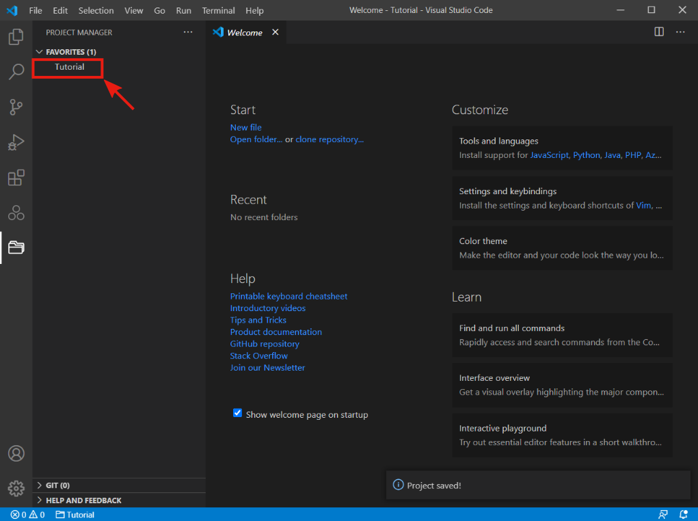
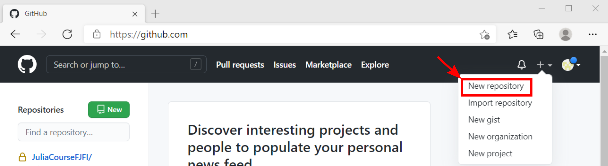
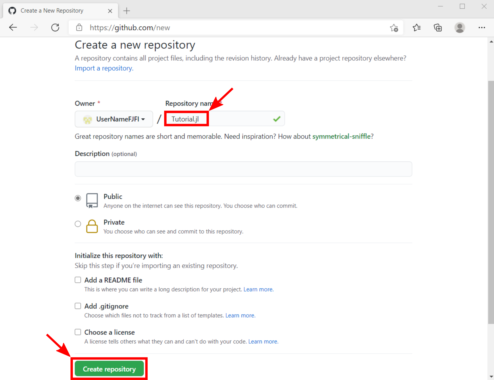
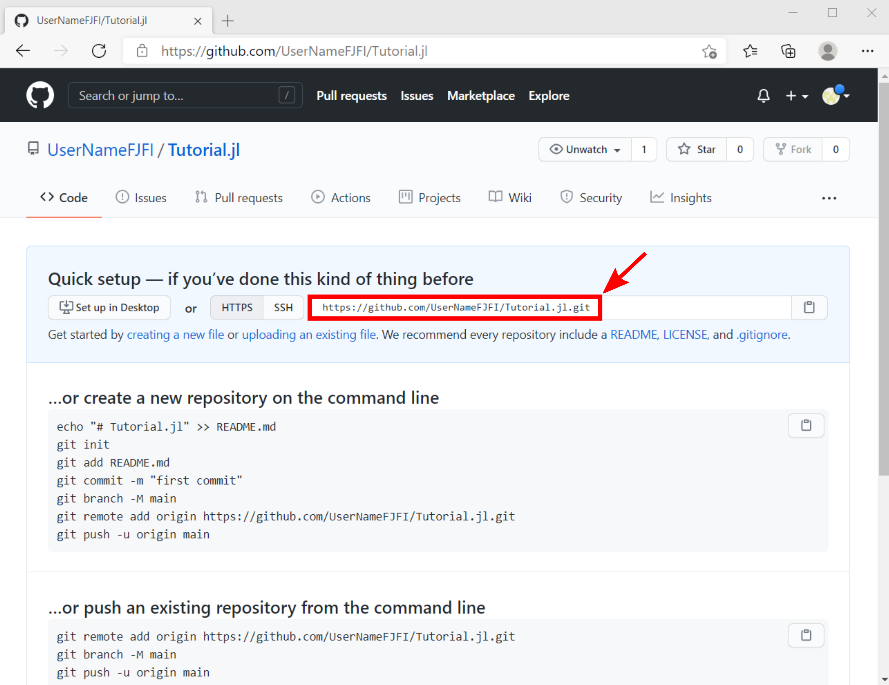
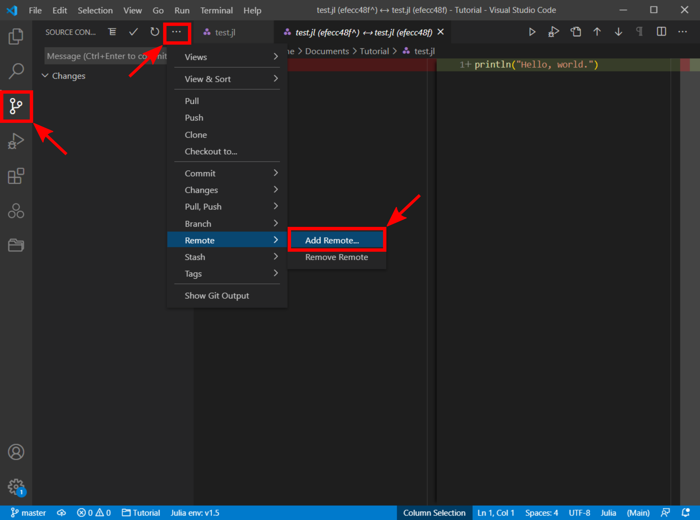
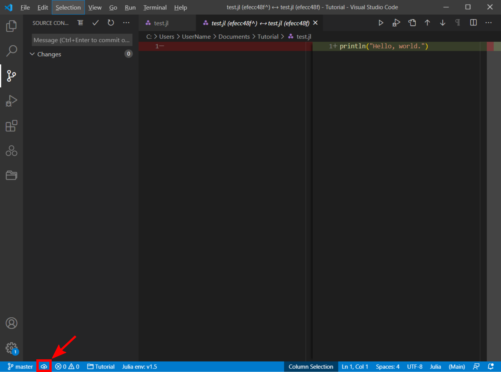
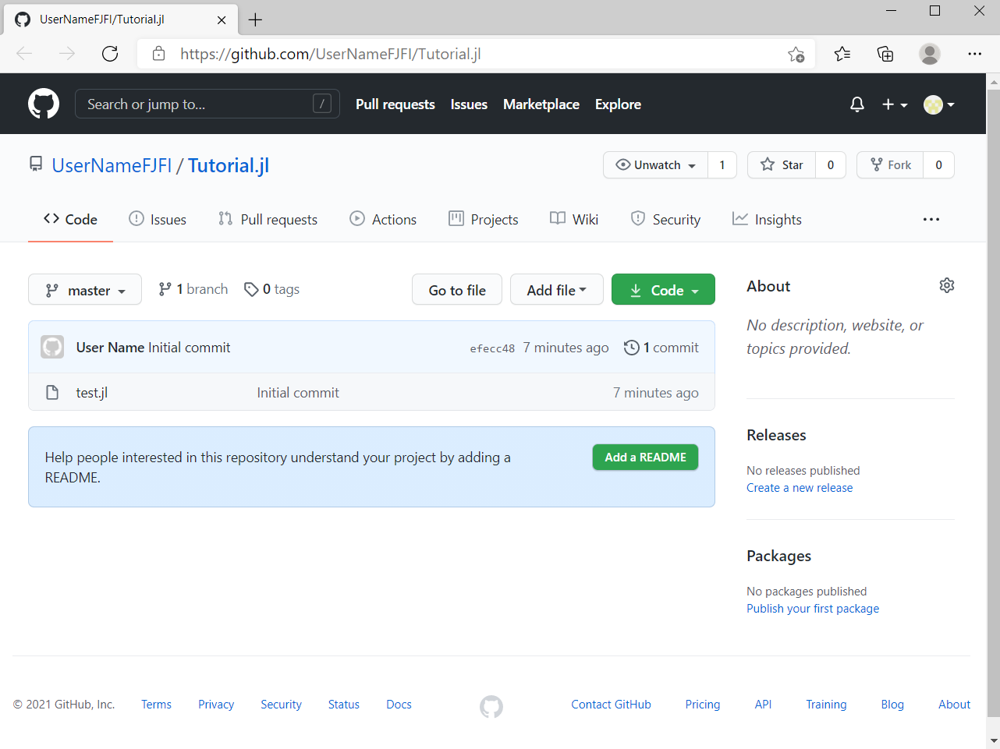

## Creating project

- **!!! TODO: add description !!!**

- **!!! TODO: add description !!!**

- **!!! TODO: add description !!!**

## Initialize Git Repository

- **!!! TODO: add description !!!**

- **!!! TODO: add description !!!**

## Adding New File

- **!!! TODO: add description !!!**

- **!!! TODO: add description !!!**

- **!!! TODO: add description !!!**

- **!!! TODO: add description !!!**

## Git Commit

- **!!! TODO: add description !!!**

- **!!! TODO: add description !!!**

- **!!! TODO: add description !!!**

## Create GitHub account

## Publish on GitHub

- **!!! TODO: add description !!!**

- **!!! TODO: add description !!!**

- **!!! TODO: add description !!!**

- **!!! TODO: add description !!!**

- **!!! TODO: add description !!!**

- **!!! TODO: add description !!!**

- **!!! TODO: add description !!!**

- **!!! TODO: add description !!!**

- **!!! TODO: add description !!!**

