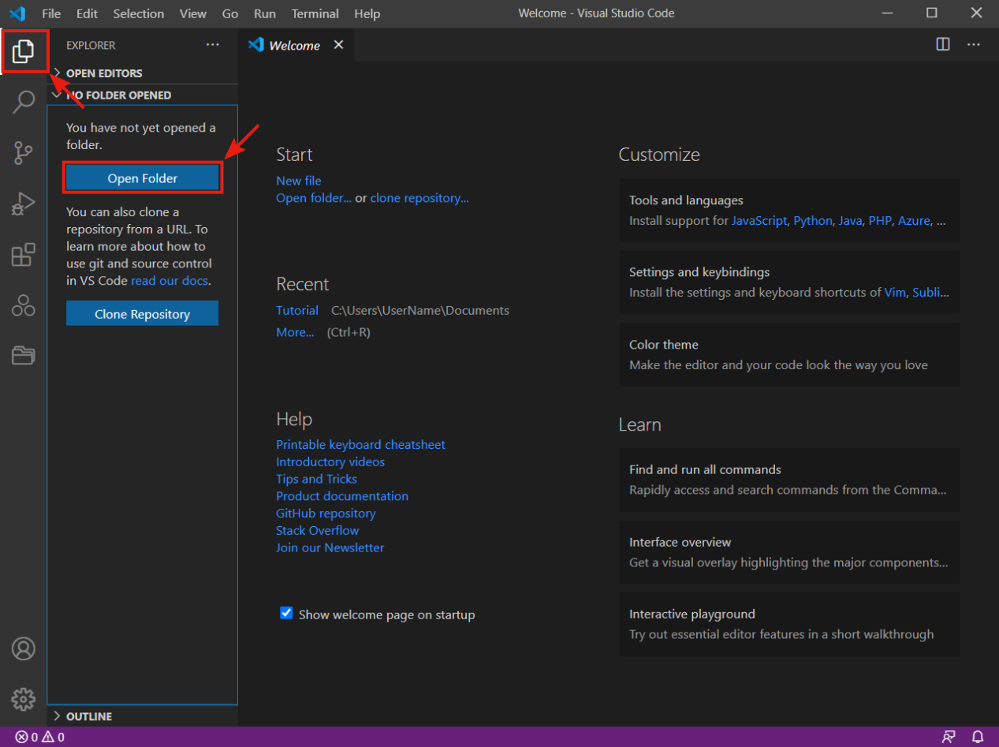
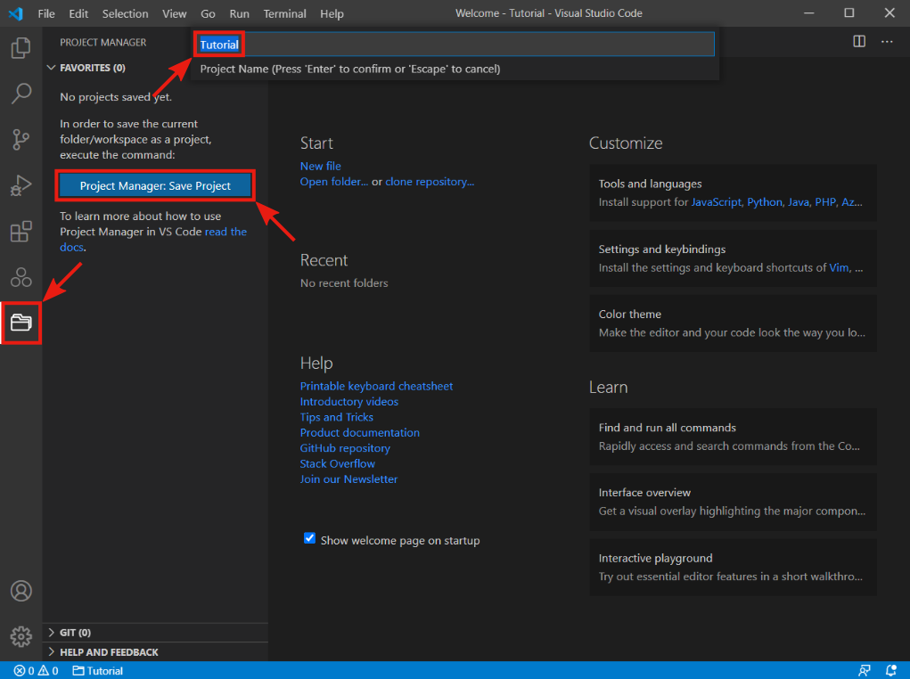
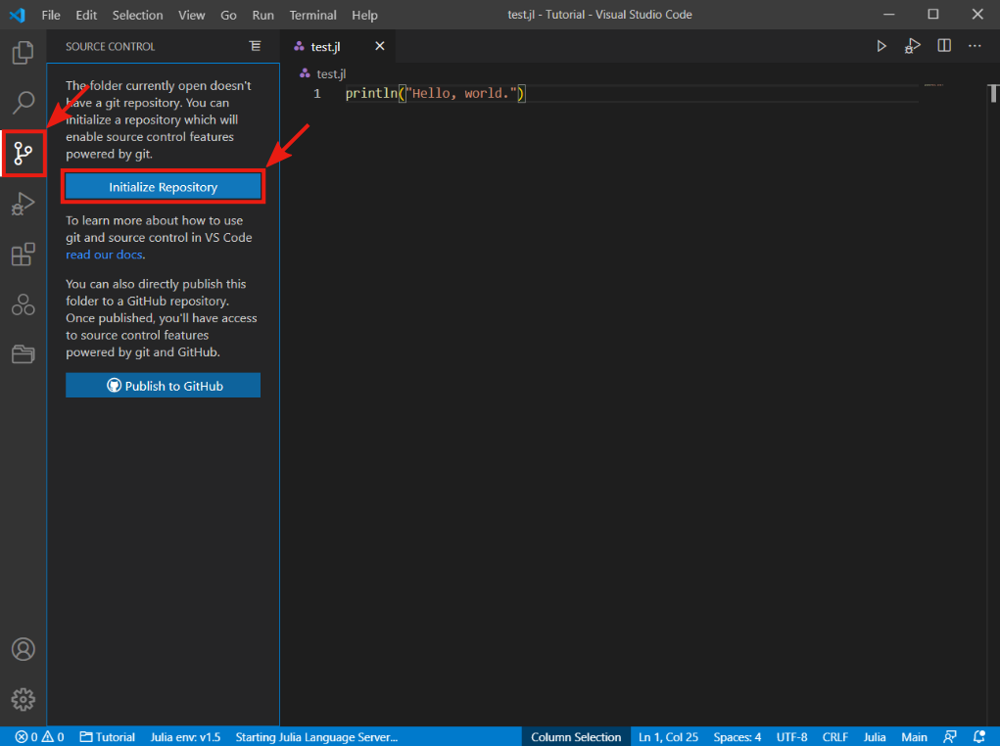
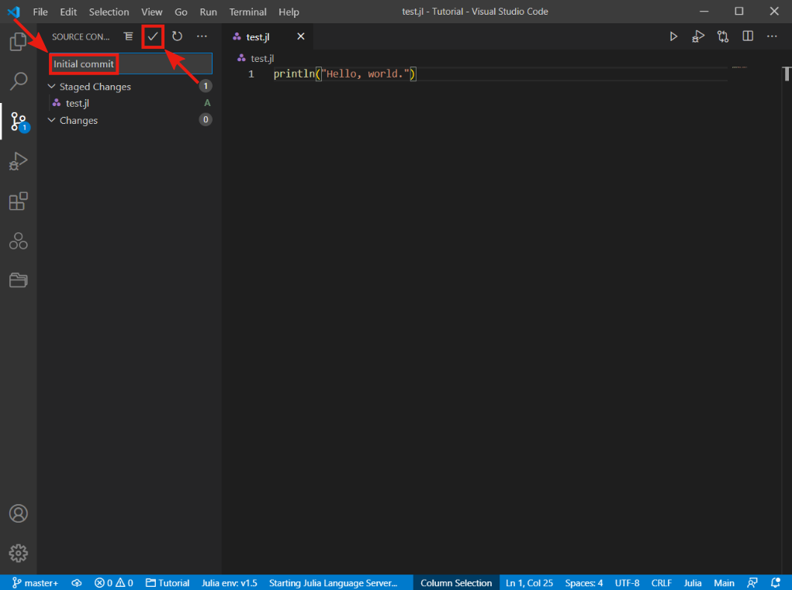

## Creating new project

This section provides a step-by-step tutorial showing how to create a new project, add a new file, initialize a git repository, and publish the repository on Github.

The first thing we have to do when creating a new project is to select a folder where we want to store the project. Open the file `Explorer` in the VS Code by pressing its icon in the activity bar and pressing the `Open Folder` button. Alternatively, use the keyboard shortcut `Ctrl + K Ctrl + O`.

A system file explorer should open, so find and select the folder you want to use as a project folder. In our case, it is a `Tutorial` folder in `Documents`.

Now go to the project manager by pressing the appropriate button in the activity bar. Since we are creating our first project, the project manager tab should be empty. Press the `Project Manager: Save Project` button, type a project name in the pop-up bar, and then press `Enter`.

It will add a new project to the project manager. In our case, it is a project called `Tutorial`.

Now go back to the file explorer. In the sidebar, under the project name, there should be an empty space. Press the `New File` button next to the project name and write a new file name with the `.jl` extension. Alternatively, use the keyboard shortcut `Ctr + N` to create a new file and then `Ctrl + S` to save the file.

The new file will open in the editor to the right of the File Explorer sidebar. Type `println("Hello, world.")` in the new file and press `Ctrl + S` to save the change. Now select the code and press `Ctrl + Enter` to execute the code. This shortcut runs the new Julia session and sends the code to the session. Congratulations, you have just created and run a **Hello, world** program in Julia.

## Initialize Git Repository

Now that we have created a new project, it is time to initialize the git repository to track the project's changes. Go to the `Source Control` bar by pressing the appropriate button in the activity bar. Then press the `Initialize Repository` button, which will create a new Git repository in the project folder.

We can check if the Git repository is initialized in the system file explorer. Go to the project folder, and in the file explorer, in the top bar under the `View` tab, select the `Hidden items` option. Now you should see the `.git` folder in the project directory.

With the initialized Git repository, we can start tracking our work changes. Note the number 1 in the control source icon. It indicates one change against the last version of the project.

Git provides the `commit` command to capture changes in the project. To create a new git commit, we must first select what changes we want to capture. In our case, it is trivial since there is only one change. In the source control under the `Changes` section, you should see the `test.jl` file. Press the `Stage Changes` button located on the file name's right (`+` icon).

This moves the file under the `Staged Changes` section. The next step is to add a summary to the git commit. Type any message that describes changes made in the project. It is good to use short but descriptive messages since it will help navigate the project history. We use the `Initial commit` message. To finish the git commit, press the `Commit` button above the message bar or use the keyboard shortcut `Ctrl + Enter` in the message bar.

Now return to the file explorer bar and open the `Timeline` drop-down menu at the bottom. In the `Timeline` bar, you can see the currently open file history. In our case, we can see the history of the `test.jl` file: one git commit created by user  `User Name` and described by the `Initial commit` message. If you click on that git commit, it shows changes made to the current file. On the left-hand side, we can see the file's state before the git commit and on the right-hand side after the git commit. It allows us to see all the changes made in the file. We can see that we added one line of code.

## Publish on GitHub

Now it's time to publish our work on GitHub. With GitHub, it's easy to share and collaborate on a project with multiple people. If you did not create a GitHub account in the previous section about Git installation, please do it now.

To publish a local git project on GitHub, press the `Publish Changes` button on the bottom status bar. Then VS Code extension `GitHub` asks to sign in using a GitHub account. Press the `Allow` button and follow the given instructions.

After logging into GitHub, a pop-up window will appear. Enter the desired repository name and select whether the repository should be private or public, and press `Enter`. In our case, we use the `Tutorial.jl` name for the repository since it is an easy way to show that the project is written in Julia. You may also need to add permissions to Git Credential Manager to access your GitHub account.

If everything went well, a pop-up window would inform you that the project was successfully published to Github. Press the `Open in GitHub` button to open the repository in your browser.

And that's all. Now that you've published your first repository on GitHub, you can easily share your project with others.

