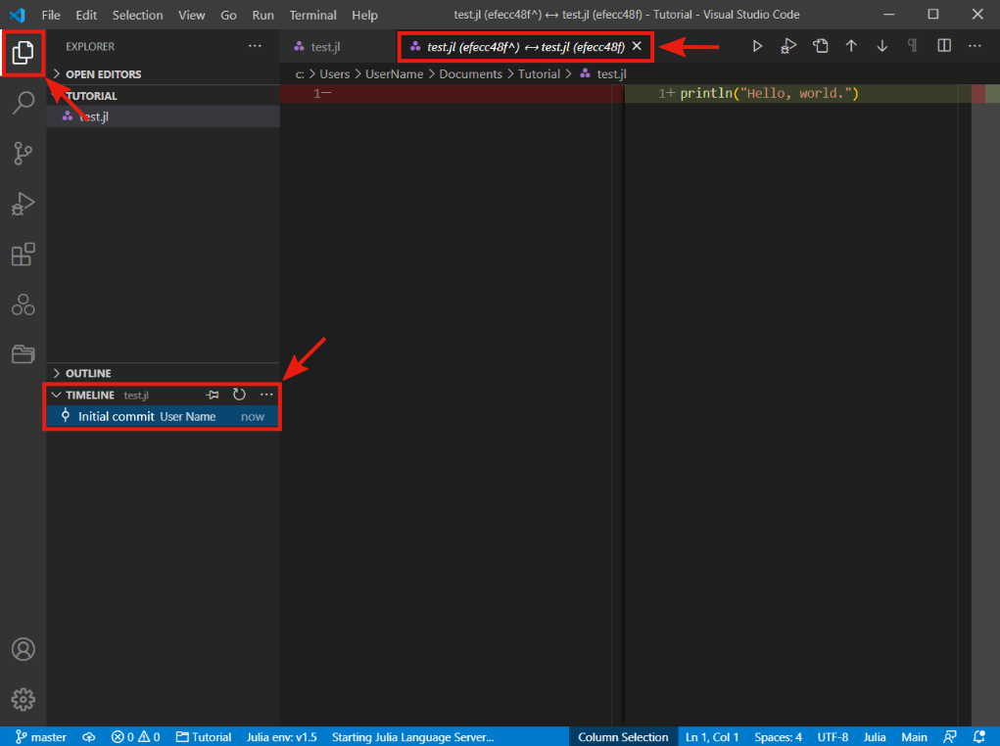

## Creating new project

In this section, we provide a step-by-step tutorial in which we show how to create a new project, add a new file, initialize a git repository and publish the repository on Github.

The first thing we have to do when creating a new project is to select a folder where we want to store the project. Open the file `Explorer` in the VS Code by pressing its icon in the activity bar and then press the `Open Folder` button. Alternatively use the keyboard shortcut `Ctrl + K Ctrl + O`.

A system file explorer should open, so find and select the desired folder that you want to use as a project folder. In our case, it is a `Tutorial` folder in `Documents`.

Now go to the project manager by pressing the appropriate button in the activity bar. Since we are creating the first project, the project manager tab should be empty. Press the `Project Manager: Save Project` button, type a project name in the popup bar, and then press `Enter`.

It will add a new project to the project manager. In our case, it is a project called `Tutorial`

Now go back to the file explorer. in the sidebar, under the project name, there should be an empty space. Press the `New File` button located next to the project name and write a new file name with the `.jl` extension. Alternatively use the keyboard shortcut `Ctr + N` to create a new file and then `Ctrl + S` to save the file.

The new file will open in the editor to the right of the File Explorer sidebar. Type `println("Hello, world.")` in the new file and press `Ctrl + S` to save the change. Now select the code and press `Ctrl + Enter` to execute the code. This shortcut runs the new Julia session in the bar at the bottom and sends the code to the Julia session. Congratulations, you just create and run a **Hello, world** program in Julia.

## Initialize Git Repository

Now that we have created a new project, it is time to initialize the git repository to track the changes made to the project. Go to the `Source Control` bar by pressing the appropriate button in the activity bar. Then press the `Initialize Repository button` and it will create a new Git repository in the project folder.

We can check it in the system file explorer. Go to the project folder and in the file explorer in the top bar under the `View` tab select the `Hidden items` option. Now you should see the `.git` folder in the project directory.

With the initialized Git repository, we can start tracking changes in our work. We can see, that In the activity bar, appears the number 1 in the control source icon. It indicates, that there is one change against the last version of the project. Git provides the `commit` command to capture changes in the project. To create a new git commit, we have to first select what changes we want to capture. in our case, it is trivial, since there is only one change. In the source control under the `Changes` section, you should see `test.jl` file. Press the `Stage Changes` button located on the right of the file name (`+` icon).

It will move the file under the `Staged Changes` section. All files in this section will be captured by the git commit. The next step is to add a message to the git commit. Type any message that describes changes made in the project. it is a good practice to use messages that are short but descriptive since it will help later to navigate in the project history. We use the `Initial commit` message. To finish the git commit, press the `Commit` button above the message bar or use the keyboard shortcut `Ctrl + Enter` in the message bar. Congratulations you just created your first git commit.

Now return to the file explorer bar and open the `Timeline` drop-down menu at the bottom. In the `Timeline` bar you can see the history of the file that is currently open. In our case, we can see the history of the `test.jl` file: one git commit created by user  `User Name` and described by the `Initial commit` message. If you click on that git commit, it will open an editor with changes that were made to the current file. In the editor on the left-hand side, we can see the state of the file before the git commit, and on the right-hand side the state of the file after the git commit. It allows us to easily see all the changes made in the file. In our case, we can see that we added one line of code.

## Publish on GitHub

Now it's time to publish our work on GitHub. With GitHub, it's easy to share and collaborate on a project with multiple people. If you did not create a GitHub account in the previous section about Git installation, please do it now.

To publish a local git project on GitHub press the `Publish Changes` button on the bottom status bar. Then VS Code extension `GitHub` asks to sign in using a GitHub account. Press the `Allow` button and follow the given instructions.

After logging into GitHub, a pop-up window will appear. Enter the desired repository name and select whether the repository should be private or public and press `Enter`. In our case, we use `Tutorial.jl` name for the repository, since it is a good way to show, that the project is written in Julia. It is possible that you will have to also add permission to the Git Credential Manager to access your GitHub account.

If everything went well, a pop-up window will appear informing you that the project has been successfully published to Github. Press the `Open in GitHub` button to open the repository in your browser.

And that's all. Now that you've published your first repository on GitHub, you can easily share your project with others

