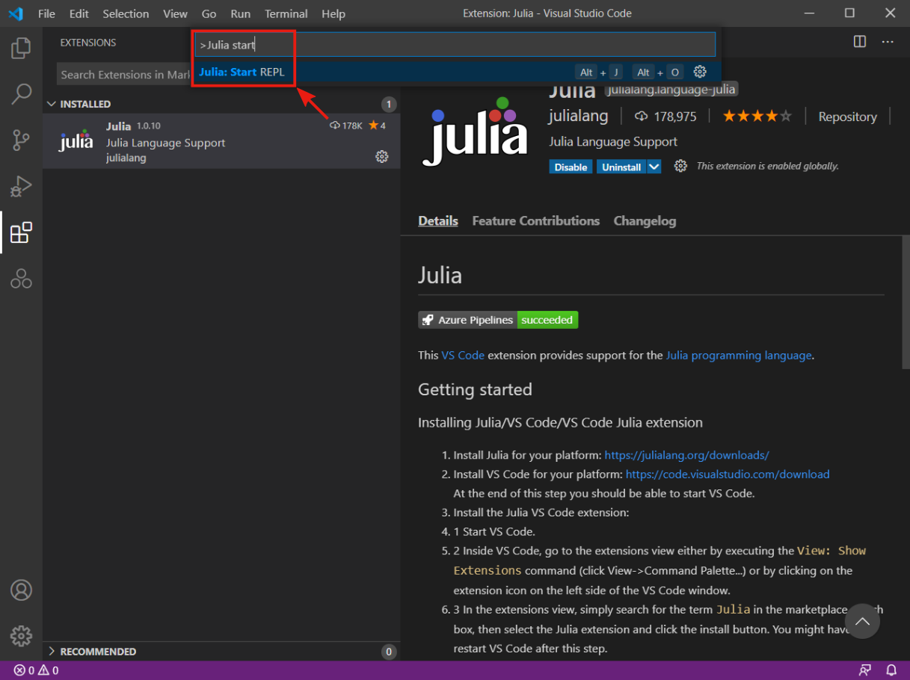
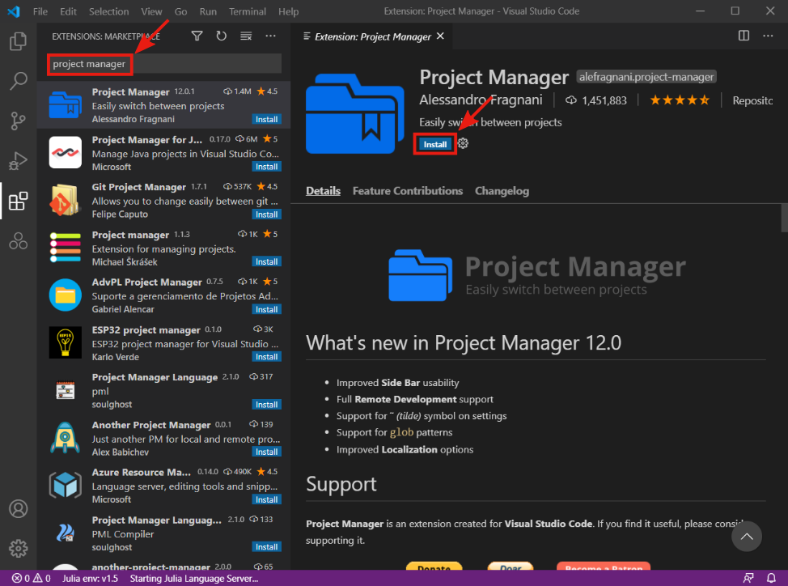

## Julia

Julia can be installed from the official [download page](https://julialang.org/downloads/). The appropriate version is the **64-bits** version for the Windows operating system in most cases. In case of difficulties, we refer to [platform-specific instructions](https://julialang.org/downloads/platform/).

## Visual Studio Code

It is possible to write Julia codes in any text editor, and run them directly from the terminal. However, it is usually better to use an IDE that provides additional features such as syntax highlighting, or code suggestions. We recommend using [Visual Studio Code](https://code.visualstudio.com/), a free source-code editor made by Microsoft. It supports many programming languages (Julia, Python, LaTex, ...) via extensions. The editor is available at the official [download page](https://code.visualstudio.com/download).

Download the proper installer, run it and follow the instructions

There is no need to change the default settings. On the installer's last window, select the `Launch Visual Studio Code` option and press the `Finish` button.

If the installation was successful, the VS Code should open in a new window.

## Extensions

To use the VS Code as an IDE for Julia, we have to install the Julia extension. It can be done directly from the VS Code. Open the `Extension MarketPlace` by pressing the button in the `Activity bar` (the left bar). Type `julia` in the search bar and select the Julia extension. Then press the `Install` button to install the extension.

After the installation, press `Ctrl + Shift + P` to open the command palette. Type `Julia: Start REPL` into the command palette and press enter.

The panel with the terminal and new Julia session should open.

!!! info "Configuring the Julia extension:"
    If you installed Julia into a standard location on Mac or Windows, or if the Julia binary is on your PATH, the Julia VS Code extension automatically finds your Julia installation. If the VS Code extension does not find your Julia installation automatically, or you want to use a different Julia installation than the default one, you need to configure the extension using the following steps: 

    1. Open VS Code settings.
    

    2. Type `Julia: Executable Path` in the search box.

    3. Set the `Julia: Executable Path` to the full path of Julia executable that the extension should use. The format of the path should follow your platform specific conventions.
    

There are other useful extensions. We recommend installing the `Project Manager` extension that provides additional features to manage projects.

