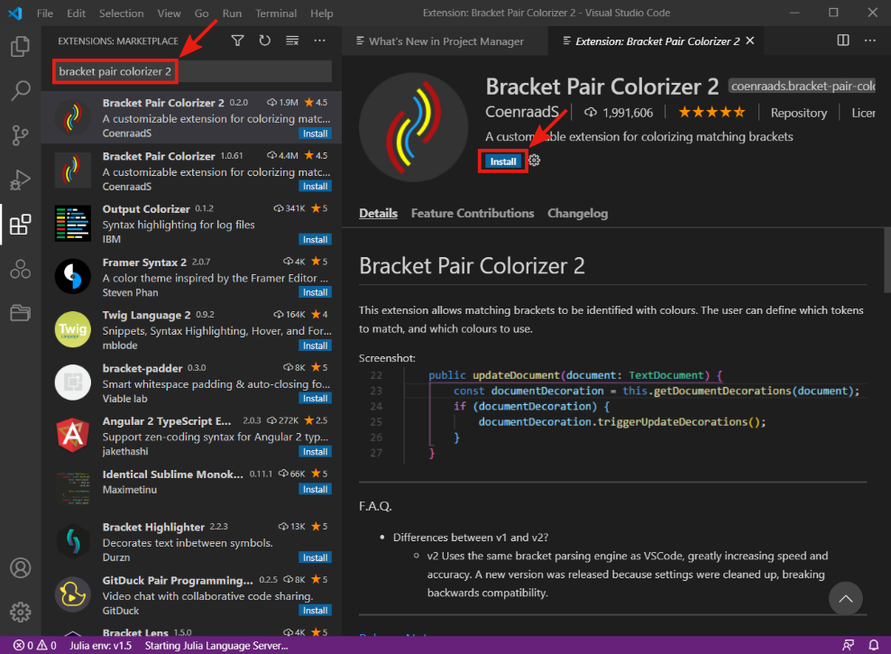

# Visual Studio Code

- **!!! TODO: add description !!!**

- **!!! TODO: add description !!!**

- **!!! TODO: add description !!!**

- **!!! TODO: add description !!!**

- **!!! TODO: add description !!!**

- **!!! TODO: add description !!!**

- **!!! TODO: add description !!!**

## Install Julia extension

- **!!! TODO: add description !!!**

- **!!! TODO: add description !!!**

- **!!! TODO: add description !!!**

## Additional Extensions (Optional)

- **!!! TODO: add description !!!**

- **!!! TODO: add description !!!**

