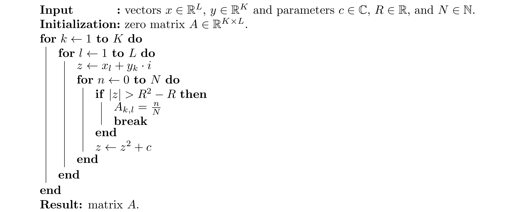

# Julia set

So far, we used only the standard library shipped with Julia. However, the standard library provides only basic functionality. If we want to get additional functions, we have to use extra packages. There is a [Plots](https://github.com/JuliaPlots/Plots.jl) package for creating plots. Packages can be installed via Pkg REPL. To enter the Pkg REPL from the Julia REPL, press `]` and install the package by

```julia
(@v1.5) pkg> add Plots
```

We need to use the `using` keyword to load the package. For example, we can use the Plots package to visualize the `sin` and `cos` functions.

```@example plots
using Plots
x = 0:0.01π:2π

plot(x, sin.(x); label = "sinus", linewidth = 2)
plot!(x, cos.(x); label = "cosinus", linewidth = 2)

savefig("sin.svg") # hide
```


There will be a whole [section](@ref Plots.jl) dedicated to the Plots package. However, we need some basic functionality to visualize the outputs of the following exercises.

```@raw html
<div class="admonition is-category-exercise">
<header class="admonition-header">Exercise 1: </header>
<div class="admonition-body">
```

Every programmer should be able to rewrite pseudocode to actual code. The goal of this exercise is to rewrite the following pseudocode:



This pseudocode describes how to compute the [Julia set](https://en.wikipedia.org/wiki/Julia_set) for the following function

```math
f_c(z) = z^2 + c,
```

where ``c \in \mathbb{C}`` is a complex parameter. To test the resulting code, try the following settings of input parameters
- ``x`` is a vector of 1500 evenly spaced numbers from `-1.5` to `1.5`.
- ``y`` is a vector of 1000 evenly spaced numbers from `-1` to `1`.
- ``c = - 0.4 + 0.61 \cdot i``
- ``R = 2``
- ``N = 1000``

Use this code given below to plot the heatmap of the matrix ``A``.

```julia
using Plots
heatmap(A;
    c = :viridis,
    clims = (0, 0.15),
    cbar = :none,
    axis = :none,
    ticks = :none
)
```

```@raw html
</div></div>
<details class = "solution-body">
<summary class = "solution-header">Solution:</summary><p>
```

Firstly, we have to define all input parameters.

```julia
c = - 0.4 + 0.61im
R = 2
N = 1000
L = 1500
K = 1000
```

The second step is to define the vectors `x` and `y`. Since we know that these vectors contain evenly spaced numbers, and we also know the starting point, the stopping point, and the length of the vectors, we can use the `range` function.

```julia
x = range(-1.5, 1.5; length = L)
y = range(-1.0, 1.0; length = K)
```

The next step is to define the `A` matrix of zeros by the `zeros` function.

```julia
A = zeros(K, L)
```

Now, we rewrite the for loops from the pseudocode. It is possible to rewrite the pseudocode in an almost identical way. However, in many cases, the code can be simplified. For example, we can use the shorter syntax for writing nested `for` loops.

```julia
for k in 1:K, l in 1:L
    z = x[l] + y[k]*im
    for n in 0:N
        if abs(z) > R^2 - R
            A[k, l] = n/N
            break
        end
        z = z^2 + c
    end
end
```

Finally, we visualize the heatmap of the matrix `A`.

```julia
using Plots
heatmap(A;
    c = :viridis,
    clims = (0, 0.15),
    cbar = :none,
    axis = :none,
    ticks = :none,
)
```

```@raw html
</p></details>
```


```@raw html
<div class="admonition is-category-exercise">
<header class="admonition-header">Exercise 2:</header>
<div class="admonition-body">
```

In the previous exercise, we rewrote pseudocode to an actual Julia code. This exercise will improve the central part of the code: the inner loop. Write a function which replaces the inner loop in the code from the exercise above. Use the following function definition

```julia
function juliaset(z, c, R, N)
    ???
    return ???
end
```

where ``z, c \in \mathbb{C}``, ``R \in \mathbb{R}`` and ``N \in \mathbb{N}``. Use the `while` loop to replace the `for` loop in the original pseudocode. Visualize the resulting matrix by the same code as in the previous exercise.


**Hint:** recall that the function should return `0` if `n > N` and `n/N` otherwise.
```@raw html
</div></div>
<details class = "solution-body">
<summary class = "solution-header">Solution:</summary><p>
```

As suggested in the exercise description, we will use the `while` loop. Using the `while` loop, we have to define a stopping condition. In this case, we have two conditions:
1. maximal number of iterations is `N + 1`,
2. the absolute value of `z` needs to be smaller or equal to `R^2 - R`.
These two conditions can be merged into `n <= N && abs(z) <= R^2 - R`. Inside the `while` loop, we only have to update `n` and `z`.

```julia
function juliaset(z, c, R, N)
    n = 0
    while n <= N && abs(z) <= R^2 - R
        n += 1
        z = z^2 + c
    end
    return n > N ? 0 : n/N
end
```

We use the ternary operator to decide which value is returned. Now we need to define all input parameters as in the previous exercise.

```julia
c = - 0.4 + 0.61im
R = 2
N = 1000
x = range(-1.5, 1.5; length = 1500)
y = range(-1.0, 1.0; length = 1000)
```

We can use a nested `for` loops to create `A`. However, a simpler way is to use the list comprehension or broadcasting to vectorize the `juliaset` function.

```julia
A1 = [juliaset(xl + yk*im, c, R, N) for yk in y, xl in x]
A2 = juliaset.(x' .+ y .* im, c, R, N)
```

Both `A1` and `A2` are the same. In the second case, we have to pay attention to use the correct form of the input. We use the transposition of `x`. Finally, we can call the same code to create the same plot.

```julia
using Plots
heatmap(A1;
    c = :viridis,
    clims = (0, 0.15),
    cbar = :none,
    axis = :none,
    ticks = :none,
    size = (800, 600),
)
```

```@raw html
</p></details>
```


```@raw html
<div class="admonition is-category-exercise">
<header class="admonition-header">Exercise 3: </header>
<div class="admonition-body">
```

Try different values of variable `c` to create different plots. For inspiration, check the Wikipedia page about [Julia set](https://en.wikipedia.org/wiki/Julia_set).
```@raw html
</div></div>
```

- ``c = 0.285 + 0.01 \cdot i``


- ``c = - 0.835 - 0.2321 \cdot i``


- ``c = -0.8 + 0.156 \cdot i``


- ``c = -0.70176 + 0.3842 \cdot i``


## Animation

!!! warning "Warning"
    It takes a lot of time to create the animation below, especially when using the default [GR](https://github.com/jheinen/GR.jl) backend for the Plots package. The plotting time can be reduced by using a different backend such as the [PyPlot](https://github.com/JuliaPy/PyPlot.jl) backend.

    ```julia
    using Plots, PyPlot
    pyplot()
    ```
    The PyPlot package must be installed first. An alternative way is to use the [Makie](https://github.com/JuliaPlots/Makie.jl) package instead of the Plots package.

We will now create an animation of the Julia sets for `c` defined as follows

```math
c_k = 0.7885 \exp \{ k \cdot i \}, \qquad k \in \left [\frac{\pi}{2}, \frac{3\pi}{2} \right ].
```

Firstly, we create the vector of all values `c` by combining the `range` function and broadcasting.

```julia
cs = 0.7885 .* exp.(range(π/2, 3π/2; length = 500) .* im)
```

Note that we use the `length` keyword to specify the length of `cs`. To create an animation, it suffices to use the `for` loop in combination with the `@animate` macro.

```julia
anim = @animate for c in cs
    A = juliaset.(x' .+ y .* im, c, R, N)
    heatmap(A;
        c = :viridis,
        clims = (0, 0.15),
        cbar = :none,
        axis = :none,
        ticks = :none,
        size = (800, 600),
    )
end
gif(anim, "juliaset.gif", fps = 20) # save animation as a gif
```

The code inside the loop is the same as in the previous exercise.


