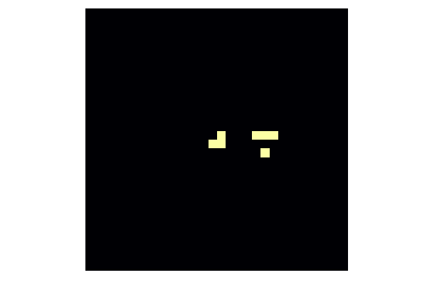

# Conway's Game of Life

The [Game of Life](https://en.wikipedia.org/wiki/Conway%27s_Game_of_Life) (the following description is taken from Wikipedia), also known simply as Life, is a cellular automaton devised by the British mathematician John Horton Conway in 1970. It is a zero-player game, meaning that its evolution is determined by its initial state, requiring no further input. One interacts with the Game of Life by creating an initial configuration and observing how it evolves. It is Turing complete and can simulate a universal constructor or any other Turing machine.

The universe of the Game of Life is an infinite, two-dimensional orthogonal grid of square cells, each of which is in one of two possible states, live or dead, (or populated and unpopulated, respectively). Every cell interacts with its eight neighbours, which are the cells that are horizontally, vertically, or diagonally adjacent. At each step in time, the following transitions occur:

1. Any live cell with two or three live neighbours survives.
2. Any dead cell with three live neighbours becomes a live cell.
3. All other live cells die in the next generation. Similarly, all other dead cells stay dead.

The initial pattern constitutes the seed of the system. The first generation is created by applying the above rules simultaneously to every cell in the seed; births and deaths occur simultaneously, and the discrete moment at which this happens is sometimes called a tick. Each generation is a pure function of the preceding one. The rules continue to be applied repeatedly to create further generations.

```@raw html
<div class = "exercise-body">
<header class = "exercise-header">Exercise:</header><p>
```

Write a function `neighbours` that return the number of live neighbours of the given cell. The function should accept the `world` matrix of boolean values that represents state of all cells (`true` if cell is alive and `false` otherwise) and index of the row and column of the target cell.

**Hint:** use the following properties of the `mod1` function to implement periodic boundaries

```@repl
mod1(1, 4)
mod1(4, 4)
mod1(5, 4)
```

**Bonus:** define more general function that compute number of alive cells in a neighborhood of an arbitrary size.

```@raw html
</p></div>
<details class = "solution-body">
<summary class = "solution-header">Solution:</summary><p>
```
One way how to define the `neighbours` function is to manually write all neighbours indexes as follows

```julia
function neighbours(world, row, col)
    n, m = size(world)

    # this implements periodic boundaries
    down  = mod1(row + 1, n)
    up    = mod1(row - 1, n)
    left  = mod1(col - 1, m)
    right = mod1(col + 1, m)

    return ( world[up,   left] + world[up,  col]  + world[up,   right]
           + world[row,  left] +                  + world[row,  right]
           + world[down, left] + world[down, col] + world[down, right])
end
```

Note that it is possible to write an expression on multiple lines. However, the approach above can not be used to define a general version of the `neighbours` function. In this case, we can use nested loops. Firstly we compute proper row indexes using a linear range in combination with the `mod1` function

```julia
rows = mod1.(row .+ (-r:r), size(world, 1))
```

Column indexes can be computed similarly. Then we use nested loops to iterate through the rows and columns defined above. Do not forget to subtract the state of the middle cell.

```julia
function neighbours(world, row, col; r = 1)
    rows = mod1.(row .+ (-r:r), size(world, 1))
    cols = mod1.(col .+ (-r:r), size(world, 2))

    return sum(world[i, j] for i in rows, j in cols) - world[row, col]
end
```

```@raw html
</p></details>
```


```@raw html
<div class = "exercise-body">
<header class = "exercise-header">Exercise:</header><p>
```

Add new method to the `neighbours` function that for the given `world` matrix returns matrix that contains numbers of living neighbours.

```@raw html
</p></div>
<details class = "solution-body">
<summary class = "solution-header">Solution:</summary><p>
```

We created a function that computes the number of living neighbours in the exercise above. One way how to create a matrix with numbers of living neighbours is as follows

```julia
function neighbours(world)
    n, m = size(world, 1)
    return [neighbours(world, row, col) for row in 1:n, col in 1:m]
end
```

```@raw html
</p></details>
```

```@raw html
<div class = "exercise-body">
<header class = "exercise-header">Exercise:</header><p>
```

Write a function `willsurvive` that returns `true` if the cell will survive based on the conditions described in the beginning of the section, and `false` otherwise. This function should accept two arguments: state of the cell (`true`/`false`) and the number of living neighbours.

```@raw html
</p></div>
<details class = "solution-body">
<summary class = "solution-header">Solution:</summary><p>
```

This function can be written using the `if-elseif-else` statement as follows

```julia
function willsurvive(cell, k)
    if k == 3
        return true
    elseif k == 2 && cell == 1
        return true
    else
        return false
    end
end
```

But we can also write the function in simpler form. The first thing that we have to realize the first two conditions can be merged together using short-circuit evaluation. Since the function returns  only `true` or `false`, we can write the function on one line as follows

```julia
willsurvive(cell, k) = k == 3 || k == 2 && cell == 1
```

```@raw html
</p></details>
```


```@raw html
<div class = "exercise-body">
<header class = "exercise-header">Exercise:</header><p>
```

Use all functions defined above to write a function `evolve!` that evolve the given `world` matrix into a new generation.

```@raw html
</p></div>
<details class = "solution-body">
<summary class = "solution-header">Solution:</summary><p>
```

The first thing we have to do is to compute the matrix  with numbers of living neighbours. Then we can iterate over all elements of the given `world` matrix and copute new state of the current element using the `willsurvive` function

```julia
function evolve!(world)
    ks = neighbours(world)
    for i in eachindex(world)
        world[i] = willsurvive(world[i], ks[i])
    end
    return
end
```

```@raw html
</p></details>
```

In the four exercises above, we defined a function that are necessary to create an animation of Game of Life. Use the following code to get the initialization of the `world`

```julia
world = zeros(Bool, 30, 30)
row, col = 15, 15

world[row, col] = 1
world[row, col + 1] = 1
world[row - 1, col + 6] = 1
world[row + 1, col + 1] = 1
world[row + 1, col + 5] = 1
world[row + 1, col + 6] = 1
world[row + 1, col + 7] = 1
```

To create an animation, we will use the Plots package, that we introduced in the previous [lecture](@ref Julia-set)

```julia
using Plots

anim = @animate for i in 1:150
    heatmap(world; axis = nothing, border = :none, cbar = false, ratio = :equal)
    evolve!(world)
end
gif(anim, "gameoflife.gif"; fps = 10)
```



Many different types of patterns occur in the Game of Life. For example, the following initialization is called pulsar

```julia
world = zeros(Bool, 17, 17)
line = zeros(17)
line[5:7] .= 1
line[11:13] .= 1

for ind in [3,8,10,15]
    world[ind, :] .= line
    world[:, ind] .= line
end
```


