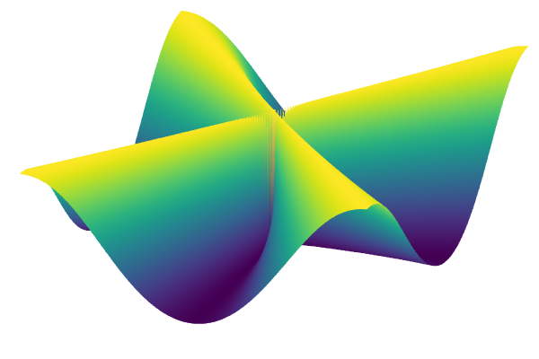

# Plots.jl

```@setup plots
using Plots
```

The [Plots](https://github.com/JuliaPlots/Plots.jl) package is not a standard plotting package known from other languages. The Plots package provides a unified interface and toolset for creating plots, and the plots themselves are drawed by different [backends](http://docs.juliaplots.org/latest/backends/), like GR, PyPlot, PGFPlotsX, or Plotly. If one backend does not support desired features, it is possible to switch to another backend with one command. No need to change the code. No need to learn a new syntax.

!!! warning "Time to the first plot"
    Compared to Python or Matlab, it takes a lot of time to create the first plot in a new Julia session. In Julia, all functions are compiled at their first run, and the result is that the first run of a function is slow.

The Plots package's core is the `plot` function that provides an interface for creating all types of plots. The most basic plot style provided by the `plot` function is line style. The line plot can be created by calling the plot function on two vectors of numbers

```@example plots
using Plots
x = range(0, 2π; length = 100)
y = sin.(x)
plot(x, y)
```

The plot is displayed in a plot pane, a stand-alone window, or the browser, depending on the environment and backend, see official [documentation](http://docs.juliaplots.org/latest/tutorial/#plotting-backends) for more details. Each column in the given input arguments to the plot function is treated as a separate plot series, i.e., a set of related points that form one line, surfaces, or any other plot type. Thus it is possible to create multiple curves at once

```@example plots
y = hcat(sin.(x), cos.(x))
plot(x, y)
```

However, sometimes it is more convenient to add new curves to the existing plot incrementally in many cases. It can be done using the `plot!` function, which modifies the current plot

```@example plots
plot!(x, sin.(x .+ π/4))
```

By default, the Plots package determines the current plot using the global variable `Plots.CURRENT_PLOT`. However, it is possible to pass figure that should be modified as follows

```@example plots
plt = plot(x, hcat(sin.(x), cos.(x)))
plot!(plt, x, sin.(x .+ π/4))
```

## Plot attributes

So far, we have created several simple plots without any change of style. In reality, we typically want to change the plot appearance based on our preferences. The Plots package provides a large number of plot attributes to change the plot appearance. The package follows a simple rule with data vs. attributes: positional arguments are input data, and keyword arguments are attributes.

As an example, we can modify the plot of trigonometric functions from the previous section. We will use the following attributes:

- `label`: the label for a series, which appears in a legend.
- `xguide`, `yguide`: axis guide (label).
- `legend`: legend position.
- `title`: plot title.
- `xticks`: position and labels for ticks.
- `color`: series color.
- `linestyle`: style of the line.
- `linewidth`: width of the line.

The names of the attributes are in almost all cases intuitive and sufficiently descriptive.

```@example plots
x = range(0, 2π; length = 100)
y = hcat(sin.(x), cos.(x))
plot(x, y;
    label = ["sine" "cosine"],
    xguide = "x",
    yguide = "y",
    legend = :bottomleft,
    title = "Trigonometric functions",
    xticks = (0:0.5π:2π, ["0", "0.5π", "π", "1.5π", "2π"]),
    color = [:red :blue],
    linestyle = [:dash :dot],
    linewidth = [2 4],
)
```

Note that we use multiple values for some attributes since we want to use a different setting for different curves. The logic is the same as for input data, i.e., each column corresponds to one series, so we have to use row vectors. However, it is also possible to use column vectors as attributes. In such a case, the different values of the attributes will be applied to data points. For example, in the following example, we create a sine function plot from 1000 data points. As a `linewidth` attribute, we use a range from 1 to 50 of length 1000, i.e., each point of the resulting curve will be of different width. The same applies to the `color` attribute. We use the `palette` function to generate 1000 colors from the `viridis` color scheme. Then each color is applied to one point of the resulting curve

```@example plots
n = 200
x = range(0, 2π; length = n)
linewidth = range(1, 50; length = n)
color = palette(:viridis, n)
xlims = (0, 7)
ylims = (-1.2, 1.2)
label = ""

plot(x, sin.(x); linewidth, color, label, xlims, ylims)
```

Note that it is possible to use column vectors and row vectors as attributes at the same time. In the following example, we add a cosine function into the previous plot and set its color to red

```@example plots
plot(x, [sin.(x) cos.(x)]; linewidth, color = [color :red], label, xlims, ylims)
```

There is a large number of attributes. The Plots package provides the `plotattr` to print a list of all attributes for either series, plots, subplots, or axes

```@repl plots
plotattr(:Series)
```

The `plotattr` function accepts any of the following arguments: `:Plots`, `:Series`, `:Subplot`, and `:Axis`. It is also possible to use the `plotattr` function to print a concrete attribute description

```@repl plots
plotattr("title")
```

Note that in this case, we use a `String` instead of `Symbol`. Be aware that not all attributes are supported. For example, attributes that can be specified for different axes, such as `xguide` and `yguide`, are not usually supported

```@repl plots
plotattr("xguide")
```

However, descriptions for these attributes can be found using the attribute name without the axis specification, i.e., for example, `guide` instead of `xguide`

```@repl plots
plotattr("guide")
```

```@raw html
<div class = "exercise-body">
<header class = "exercise-header">Exercise:</header><p>
```

Consider the following set of equations

```math
\begin{aligned}
x(t) & = \cos(3t), \\
y(t) & = \sin(2t),\\
\end{aligned}
```

where ``t \in [0, 2\pi]``. Create a plot of the curve described by the equations above. Use plot attributes to set the following properties
1. The line width of the resulting curve should start at `1` and increase to `50` and then decrease back to `1`.
2. The line color of the resulting curve should change with the changing line width.
Use `:viridis` color scheme or any other [color scheme](http://docs.juliaplots.org/latest/generated/colorschemes/) supported by the Plots package. Use additional plot attributes to get a nice looking graph.

**Hint:** use the `pallete` function combined with the `collect` function to generate a vector of colors from the `:viridis` color scheme.

```@raw html
</p></div>
<details class = "solution-body">
<summary class = "solution-header">Solution:</summary><p>
```

Firstly, we define the vector `t`  using the `range` function with a predefined length

```@example plots
n = 1000
t = range(0, 2π; length = n)
nothing # hide
```

Then we define functions described by the set of equations in the exercise description

```@example plots
fx(t) = cos(3t)
fy(t) = sin(2t)
nothing # hide
```

We want to use different plot attributes to each point of the resulting curve. Since we know that the resulting curve will be of length `1000`, the attributes must be vectors of length `1000`. The increase and decrease of the line width can be done using the `linewidth` argument with values given by the `range` function as follows

```@example plots
linewidth = vcat(
    range(1, 50; length = n ÷ 2),
    range(50, 1; length = n - n ÷ 2)
)
nothing # hide
```

Note that we use integer division to set the length in the `range` function. In the same way, we can create a vector of colors. The Plots package provides the `palate` function that allows generating equidistantly spaced colors from a given color scheme

```@repl plots
c = palette(:viridis, 2);
typeof(c)
```

However, as shown in the example above, the `palette` function returns the `ColorPalette` type. It is perfectly fine in most cases. However, in our case, we want to concatenate two vectors of colors together. So we have to use the `collect` function to extract the vector of colors from the `ColorPalette` type

```@repl plots
c = collect(palette(:viridis, 2))
```

Now we can use a similar code as before in combination with the `rev` keyword to change the order of colors

```@example plots
color = vcat(
    collect(palette(:viridis, n ÷ 2)),
    collect(palette(:viridis, n - n ÷ 2; rev = true))
)
nothing # hide
```

Finally, we can call the `plot` function with input arguments and attributes defined above. Note that we use `axis = nothing` and `border = :none` to remove all decorators such as ticks or axis frame

```@example plots
plot(fx.(t), fy.(t);
    linewidth,
    color,
    lims = (-1.2, 1.2),
    legend = false,
    axis = nothing,
    border = :none,
)
```

```@raw html
</p></details>
```

## Function plotting

```@setup plots_fce
using Plots
```

In the previous section, we used the sine and cosine functions to show the `plot` function basic functionality. In all previous examples, we first calculated the values of the functions and then created the graphs. However, it is possible to pass functions directly to the `plot` function

```@example plots_fce
t = range(0, 2π; length = 100)
plot(t, [sin, cos]; label = ["sine" "cosine"])
```

It is even possible to pass two functions first and then the vector of values in which these function will be evaluated

```@example plots_fce
plot(sin, x -> sin(2x), t; linewidth = 2, label = "")
```

Instead of the vector of values, it is also possible to use the similar syntax as for ranges and to pass the starting, stopping point, and length (the length is optional)

```@example plots_fce
plot(sin, x -> sin(2x), 0, 2π, 100; linewidth = 2, label = "")
```

```@raw html
<div class = "exercise-body">
<header class = "exercise-header">Exercise:</header><p>
```

Create a plot given by the following set of equations

```math
\begin{aligned}
x(t) & = (a + b)\cos(t) - b \cdot \cos \left( \left(\frac{a}{b} + 1 \right)t \right) \\
y(t) & = (a + b)\sin(t) - b \cdot \sin \left( \left(\frac{a}{b} + 1 \right)t \right) \\
\end{aligned}
```
where ``a = 4.23``, ``b = 2.35`` and ``t \in [-15, 20]``. Use additional plot attributes to get a nice looking graph.

```@raw html
</p></div>
<details class = "solution-body">
<summary class = "solution-header">Solution:</summary><p>
```

This exercise is straightforward. The first thing that we have to do is to define functions described by the set of equations in the exercise description

```@example plots_fce
fx(t; a = 4.23, b = 2.35) = (a + b)*cos(t) - b*cos((a/b + 1)*t)
fy(t; a = 4.23, b = 2.35) = (a + b)*sin(t) - b*sin((a/b + 1)*t)

nothing # hide
```

We now use the ability of the Plots package to plot functions directly

```@example plots_fce
plot(fx, fy, -15, 20, 500;
    linewidth = 2,
    legend = false,
    axis = nothing,
    border = :none,
)
```

```@raw html
</p></details>
```

## Changing the Plotting Series

```@setup plots_srs
using Plots
```

In the previous sections, we used only line plots. However, there are many other series types, such as scatter plots, heatmaps, or contours. One way how to change the plot series is to use the `seriestype` attribute. In the following example, we create a sine function plot using the `scatter` series type.

```@example plots_srs
x = range(0, 2π; length = 100)
y = sin.(x)
plot(x, y; seriestype = :scatter)
```

The second way is to use the specialized function. The Plots package provides a specialized function for each series type. These functions have the same name as the corresponding series type. For example, the `scatter` function can be used instead of the `seriestype = :scatter` attribute

```@example plots_srs
scatter(x, y)
```

```@raw html
<div class = "exercise-body">
<header class = "exercise-header">Exercise:</header><p>
```

Consider the following function

```math
f(x, y) = \frac{x^2 \cdot y^2}{x^4 + y^4}
```

Draw this function for ``x, y \in [-5, 5]``. Use the following three plot series `contourf`, `heatmap`, and `surface` with the following settings:
- `:viridis` color scheme,
- camera angle `(25, 65)`,
- no legend, color bar, or decorators (`axis`, `frame` and `ticks`).

**Hint:** Removing all decorators is a bit tricky. It can be done using the following attributes: `axis = nothing`,`border = :none`.

```@raw html
</p></div>
<details class = "solution-body">
<summary class = "solution-header">Solution:</summary><p>
```

As usual, we first define the function and the values in which the function is to be evaluated

```@example plots_srs
x = range(-5, 5; length = 200)
fz(x, y) = x^2*y^2/(x^4 + y^4)
nothing # hide
```

Now, since we want to create three different plots with the same attributes, we can create a named tuple to store the attribute values. It will allow us to reuse the attributes in a simple way

```@example plots_srs
kwargs = (
    color = :viridis,
    legend = false,
    cbar = false,
    axis = nothing,
    border = :none,
)
nothing # hide
```

With defined input arguments and attributes, we can use the `plot` function with the `seriestype = :contourf` keyword to draw a filled contour plot or the `contourf` function

```julia
contourf(x, x, fz; kwargs...) # or plot(x, x, fz; seriestype = :contourf, kwargs...)
```


Note that we use triple-dot syntax to unpack keyword arguments. Recall that in this case, the semi-colon is mandatory. Similarly, we can draw the `heatmap` plot

```julia
heatmap(x, x, fz; kwargs...)
```


and the 3D `surface` plot. For the `surface` plot, we also change the camera angle

```julia
surface(x, x, fz; camera = (25, 65), kwargs...)
```



```@raw html
</p></details>
```


## Subplots

Sometimes it is useful to create a plot with a specific layout that contains multiple subplots. The Plots package provides the `layout` keyword to do it. The primary usage is as follows

```@example plots_srs
x = range(0, 2π; length = 100)
plot(x, [sin, cos, tan, sinc];
    layout = 4,
    linewidth = 2,
    legend = false,
    title = ["1" "2" "3" "4"]
)
```

In the example above, we create four curves at once, and by the `layout` keyword, we tell to Plots package to draw each curve in a separate subplot. Note that in this case, if we use attributes with multiple values (row vectors), then each value is applied to one subplot. The Plots package also provides the `grid` function used to create a subplot grid manually with additional properties. For example, we can easily change the grid to `4x1` and set the height of each subplot as follows

```@example plots_srs
plot(x, [sin, cos, tan, sinc];
    layout = grid(4, 1; heights = [0.1 ,0.4, 0.4, 0.1]),
    linewidth = 2,
    legend = false
)
```

It is possible to create even more advanced layouts using the `@layout` macro. This macro allows creating nonsymmetric grids. In the example below, we create a layout with one subplot on the first row and two subplots on the second row. Moreover, we set the width of the first subplot on the second row to be `0.3` the whole plot width

```@example plots_srs
l = @layout [a ; b{0.3w} c]
plot(x, [sin, cos, tan]; layout = l, linewidth = 2, legend = false)
```

All examples above can also be created incrementally. For example, we can reproduce the last example as follows

```@example plots_srs
linewidth = range(1, 20; length = 100)
p1 = plot(x, sin; legend = false, line_z = 1:100, color = :viridis, linewidth)
p2 = plot(x, cos; legend = false, line_z = 1:100, color = :Blues_9, linewidth)
p3 = plot(x, tan; legend = false, line_z = 1:100, color = :hsv, linewidth)
nothing # hide
```

Note that we use the `line_z` keyword that allows applying different colors to the curve's different points in an easy way. When we are happy with the appearance of each plot, we can use the `plot` function and the `layout` keyword to create a final plot

```@example plots_srs
l = @layout [a ; b{0.3w} c]
plot(p1, p2, p3; layout = l)
```

## Animations

```@setup plots_anim
using Plots
```

The last thing we will discuss in this lecture is creating animations. In the following example, we will show how to update the existing curve. The first thing we have to do is to create an empty plot a set all attributes we want

```julia
n = 300
plt = plot(Float64[], [sin, cos];
    legend = false,
    xlims = (0, 6π),
    ylims = (-1.1, 1.1),
    linewidth = range(1, 20; length = n),
    color = palette(:viridis, n),
    axis = nothing,
    border = :none
)
```

The next step is to create an empty animation using the `Animation` function

```julia
anim = Animation()
```

Finally, we can use a simple `for` loop and the `frame` function to create an animation. On the second line, we use the `push!` function to append new points to the `plt` plot we defined before. The `frame` function captures the current state of the `plt` plot and creates a new frame for the animation

```julia
for x in range(0, 6π; length = n)
    push!(plt, x, [sin(x), cos(x)])
    frame(anim)
end
```

When the animation is created, we can save it as a gif using the `gif` function

```julia
gif(anim, "animsincos.gif", fps = 15)
```


Another way how to create an animation is using the `@animate` macro. Consider the following 3D surface plot

```julia
x = range(-5, 5; length = 400)
fz(x, y) = x^2*y^2/(x^4 + y^4)
plt = surface(x, x, fz;
    camera = (30, 65),
    color = :viridis,
    legend = false,
    axis = nothing,
    border = :none,
    cbar = false,
)
```

In the following example, we create an animation of the surface defined above, where we change the camera's position in each frame. To change the camera position, we can use the `plot!` function and the `camera` keyword arguments as follows

```julia
anim = @animate for i in vcat(30:60, 60:-1:30)
    plot!(plt, camera = (i, 65))
end
```

Finally, we can save the animation using the `gif`  function as in the previous example

```julia
gif(anim, "animsurf.gif", fps = 15)
```


## Integration with other packages

Plots package provides a simple way of defining special plots for custom data types using so-called recipes (in fact, recipes are defined in a stand-alone package [RecipeBase](https://github.com/JuliaPlots/RecipesBase.jl)). By defining custom recipes, it is possible to change the data preprocessing before they are plotted. Many packages provide specialized plot recipes. For example, [StatsPlots](https://github.com/JuliaPlots/StatsPlots.jl) provides recipes for plotting histograms and boxplots or violin plots. This package also offers recipes to treat DataFrames and Distributions, allowing simple plotting of tabular data and distributions.
