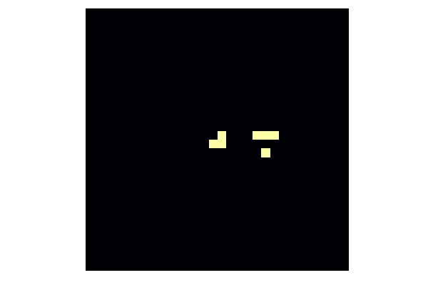

# Conway's Game of Life

The [Game of Life](https://en.wikipedia.org/wiki/Conway%27s_Game_of_Life) is a cellular automaton devised by the British mathematician John Horton Conway in 1970. It is a zero-player game, meaning that its evolution is determined by its initial state, requiring no further input. One only interacts with the Game of Life by creating an initial configuration.

The universe of the Game of Life is an infinite, two-dimensional orthogonal grid of square cells, each of which is in one of two possible states: live or dead. Every cell interacts with its eight neighbours. The game evolves. At each time step, the following transitions occur:

1. Any live cell with exactly two or three live neighbours survives.
2. Any dead cell with exactly three live neighbours becomes a live cell.
3. All other live cells die in the next generation. All other dead cells stay dead.

The first generation must be initialized. Every new generation is created by applying the above rules simultaneously to every cell in the previous generations; births and deaths occur simultaneously. The moment when this happens is called a tick. Since every generation depends only on the previous one, this process is a [Markov chain](https://en.wikipedia.org/wiki/Markov_chain).

The following few exercises will implement the Game of Life. We will consider finite universe with periodic boundary conditions.

!!! warning "Exercise:"
    Write a function `neighbours` that return the number of live neighbours of a cell. The function should accept the `world` matrix of boolean values representing the state of all cells (`true` if the cell is alive and `false` otherwise) and index of the row and column of the cell.

    **Hint:** use the following properties of the `mod1` function to implement periodic boundaries.

    ```@repl
    mod1(1, 4)
    mod1(4, 4)
    mod1(5, 4)
    ```

    **Bonus:** implement a more general function which computes the number of alive cells in a neighbourhood of given size.

!!! details "Solution:"
    One way to define the `neighbours` function is to check all neighbours manually.

    ```julia
    function neighbours(world, row, col)
        n, m = size(world)

        # this implements periodic boundaries
        down  = mod1(row + 1, n)
        up    = mod1(row - 1, n)
        left  = mod1(col - 1, m)
        right = mod1(col + 1, m)

        return ( world[up,   left] + world[up,  col]  + world[up,   right]
            + world[row,  left] +                  + world[row,  right]
            + world[down, left] + world[down, col] + world[down, right])
    end
    ```

    The approach above cannot define a general version of the `neighbours` function. In this case, we can use nested loops. First, we compute proper row indices by `range` combined with the `mod1` function.

    ```julia
    rows = mod1.(row .+ (-r:r), size(world, 1))
    ```

    Column indexes can be computed similarly. Then we use nested loops to iterate through both rows and columns. Since the iteration includes the middle cell, we need to subtract its state.

    ```julia
    function neighbours(world, row, col; r = 1)
        rows = mod1.(row .+ (-r:r), size(world, 1))
        cols = mod1.(col .+ (-r:r), size(world, 2))

        return sum(world[i, j] for i in rows, j in cols) - world[row, col]
    end
    ```

!!! warning "Exercise:"
    Add a new method to the `neighbours` function that, for the `world` matrix, returns a matrix containing numbers of living neighbours.

!!! details "Solution:"
    We created a function that computes the number of living neighbours in the exercise above. One way how to create a matrix with numbers of living neighbours is:

    ```julia
    function neighbours(world)
        n, m = size(world)
        return [neighbours(world, row, col) for row in 1:n, col in 1:m]
    end
    ```

    This is an example of multiple dispatch. The function `neighbours` can have both one and three input arguments.

!!! warning "Exercise:"
    Write a function `willsurvive` that returns `true` if the cell will survive based on the conditions described at the beginning of the section and `false` otherwise. This function should accept two arguments: state of the cell (`true`/`false`) and the number of living neighbours.

!!! details "Solution:"
    This function can be written using the `if-elseif-else` statement. Since `cell` is a boolean value, we do not need to compare with one as in `cell == 1`.

    ```julia
    function willsurvive(cell, k)
        if k == 3
            return true
        elseif k == 2 && cell
            return true
        else
            return false
        end
    end
    ```

    We can write this function in a simpler form. We first realize that the short-circuit evaluation can merge the first two conditions. Since the function returns only `true` or `false`, we can write the function on one line.

    ```julia
    willsurvive(cell, k) = k == 3 || k == 2 && cell
    ```

!!! warning "Exercise:"
    Combine these functions to write a function `evolve!` that evolves the given `world` matrix into a new generation.

!!! details "Solution:"
    We first compute the matrix with the numbers of living neighbours. Then we iterate over all elements of the `world` matrix and compute new states of all elements with the `willsurvive` function. Since we computed the number of living neighbours before iterating, we can rewrite the `world` matrix.

    ```julia
    function evolve!(world)
        ks = neighbours(world)
        for i in eachindex(world)
            world[i] = willsurvive(world[i], ks[i])
        end
        return
    end
    ```

In the four exercises above, we defined functions sufficient to animate the Game of Life. Use the following code to initialize the `world`.

```julia
world = zeros(Bool, 30, 30)
row, col = 15, 15

world[row, col] = 1
world[row, col + 1] = 1
world[row - 1, col + 6] = 1
world[row + 1, col + 1] = 1
world[row + 1, col + 5] = 1
world[row + 1, col + 6] = 1
world[row + 1, col + 7] = 1
```

We use the Plots package introduced in the previous [lecture](@ref Julia-set) to create animations.

```julia
using Plots

anim = @animate for i in 1:150
    heatmap(world; axis = nothing, border = :none, cbar = false, ratio = :equal)
    evolve!(world)
end
gif(anim, "gameoflife.gif"; fps = 10)
```



Many different types of patterns occur in the Game of Life. For example, the following initialization is called pulsar.

```julia
world = zeros(Bool, 17, 17)
line = zeros(17)
line[5:7] .= 1
line[11:13] .= 1

for ind in [3,8,10,15]
    world[ind, :] .= line
    world[:, ind] .= line
end
```


