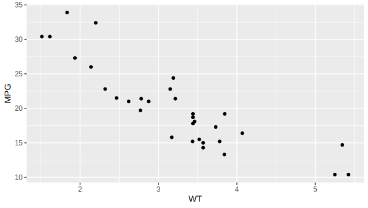

# Interaction with other languages

One of the most significant advantages of Julia is its speed. As we discussed in the [introduction](@ref Why-julia?), Julia is natively fast, and no additional speed-up modifications are required. Therefore, Julia solves the two-language problem:

> Users are programming in a high-level language such as R and Python, but the performance-critical parts of the code have to be rewritten in C/Fortran for performance.

Thus, most Julia libraries are written purely in Julia without using C or Fortran. However, many high-quality libraries for numerical computing are already written in C and Fortran. To use them, Julia makes it simple and efficient to call C and Fortran functions.

Julia follows the **no boilerplate** philosophy: functions can be called directly from Julia without any glue code generation or compilation – even from the interactive prompt. This is accomplished by making calls with the `ccall` syntax, which looks like an ordinary function call. It is also possible to pass Julia functions to native C functions that accept function pointer arguments.

This section shows one example of the interaction between Julia and C. Extensive description of all provided functionality is in the [official manual](https://docs.julialang.org/en/v1/manual/calling-c-and-fortran-code/). Consider the situation where we want to use the `qsort` function from the standard C library. The `qsort` function sorts an array and is declared as follows.

```c
void qsort(void *base, size_t nitems, size_t size,
           int (*compare)(const void*, const void*))
```

The `base` is the pointer to the first element of the input array, `nitems` is the number of elements in this array, and `size` is the size in bytes of each element. Finally, `compare` is the function that compares two elements: it should return a negative integer if the first argument is smaller than the second, a positive integer if the first argument is greater than the second, and zero otherwise. Such a Julia function can be defined as follows.

```julia
mycompare(a, b)::Cint = sign(a - b)
```

Since the `qsort` function expects that the return type of the `compare` function is C `int`, we annotate the return type to be `Cint`. To pass this function to C, we obtain its address using the `@cfunction` macro. It requires three arguments: the Julia function, its return type, and the tuple of its input argument types. 

```julia
mycompare_c = @cfunction(mycompare, Cint, (Ref{Cdouble}, Ref{Cdouble}))
```

Finally, we use the `ccall` function to call the `qsort` function.

```julia
julia> A = [1.3, -2.7, 4.4, 3.1];

julia> ccall(:qsort, Cvoid, (Ptr{Cdouble}, Csize_t, Csize_t, Ptr{Cvoid}),
             A, length(A), sizeof(eltype(A)), mycompare_c)

julia> A
4-element Array{Float64,1}:
 -2.7
  1.3
  3.1
  4.4
```

Besides C and Fortran that can be called directly by the `ccall` function, it is possible to interact with other languages by third-party packages. The following table shows an overview of those packages.

| Language    | Calling from Julia                                         | Calling Julia                                                                       |
| :---        | :---                                                       | :---                                                                                |
| C++         | [Cxx.jl package](https://github.com/JuliaInterop/Cxx.jl)   | ???                                                                                 |
| Python      | [PyCall.jl](https://github.com/JuliaPy/PyCall.jl)          | [PyJulia](https://github.com/JuliaPy/pyjulia)                                       |
| R           | [RCall.jl](https://github.com/JuliaInterop/RCall.jl)       | [JuliaCall](https://github.com/Non-Contradiction/JuliaCall)                         |
| Mathematica | [MathLink.jl](https://github.com/JuliaInterop/MathLink.jl) | [ExternalEvaluate](https://reference.wolfram.com/language/ref/ExternalEvaluate.html)|
| MATLAB      | [MATLAB.jl](https://github.com/JuliaInterop/MATLAB.jl)     | [Mex.jl](https://github.com/jebej/Mex.jl/)                                          |
| Java        | [JavaCall.jl](https://github.com/JuliaInterop/JavaCall.jl) | [JuliaCaller](https://github.com/jbytecode/juliacaller)                             |

Moreover, other Julia packages provide Julia interface for some well-known libraries. We can mention [ScikitLearn.jl](https://github.com/cstjean/ScikitLearn.jl), which provides an interface for the [scikit-learn](https://scikit-learn.org/stable/) library from Python or the [RDatasets.jl](https://github.com/JuliaStats/RDatasets.jl) that provides an easy way to load R datasets.

## RCall.jl

The [RCall.jl](https://github.com/JuliaInterop/RCall.jl) package provides an interface for calling R functions from Julia and passing data between these two languages. The package provides an interactive REPL for the R language that can be accessed from the Julia REPL by the `$` symbol. Consequently, it is possible to switch between these languages and simultaneously use functionalities provided by both languages.

```julia
julia> using RCall, RDatasets

julia> mtcars = dataset("datasets", "mtcars");

R> library(ggplot2)

R> ggplot($mtcars, aes(x = WT, y = MPG)) + geom_point()
```



The package also provides string syntax that allows non-interactive usage. The previous example can be rewritten as follows.

```julia
using RCall, RDatasets
mtcars = dataset("datasets", "mtcars");

R"""
library(ggplot2)
ggplot($mtcars, aes(x = WT, y = MPG)) + geom_point()
"""
```

We used multi-line string syntax, which is helpful to perform multiple operations in R at once.

## MATLAB.jl

[MATLAB.jl](https://github.com/JuliaInterop/MATLAB.jl) provides an easy interface for calling Matlab functions and passing data between Julia and Matlab. Consider the situation that you wrote some Matlab code that is not available in Julia. The MATLAB.jl package provides an interface to call this function directly from Julia.

```julia
using MATLAB, BSON

X = BSON.load("data.bson")[:X]
mxcall(:MakeVideo, 0, X, "video.gif")
```

The `mxcall` function accepts the name of the function as the first argument and the number of its output as the second argument. All other inputs to the `mxcall` function are the input arguments of the Matlab function. The result is the following animation.


Like the RCall.jl package, the MATLAB.jl package also provides string syntax that allows for Matlab syntax. The previous example can be rewritten as follows.

```julia
using MATLAB, BSON

X = BSON.load("data.bson")[:X]
mat"""
MakeVideo($(X), 30, "Video2.gif");
"""
```
