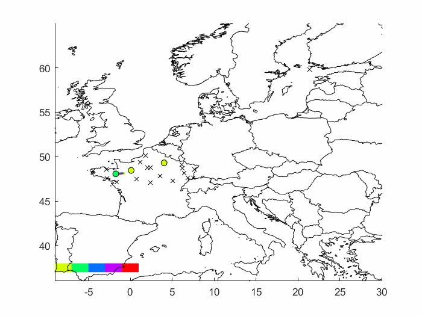

# Interaction with other languages

One of the biggest advantages of Julia is its speed. As we discussed in  the section [Why julia?](@ref Why-julia?), Julia is fast out-of-box without the necessity to do any additional steps. As a result, Julia solves the so-called Two-Language problem: *users are programming in a high-level language such as R and Python, but the performance-critical parts of the code have to be rewritten in C/Fortran for performance.* Since Julia is fast enough, most of the libraries are written in pure Julia and there is no need to use C/Fortran for performance. However, there are many high-quality, mature libraries for numerical computing already written in C and Fortran. It would be a shame if it will not be possible to use them in Julia.

To allow easy use of this existing code, Julia makes it simple and efficient to call C and Fortran functions. Julia has a **no boilerplate** philosophy: functions can be called directly from Julia without any glue code generation, or compilation – even from the interactive prompt. This is accomplished just by making an appropriate call with `ccall` syntax, which looks like an ordinary function call. Moreover, it is possible to pass Julia functions to native C functions that accept function pointer arguments. In this section, we will show one example of the interaction between Julia and C. Extensive description of all provided functionality can be found in the [official manual](https://docs.julialang.org/en/v1/manual/calling-c-and-fortran-code/).

The following example is taken from the official manual. Consider the situation, that we want to use the `qsort` function from the standard C library. The `qsort` function sortrs an array and is edclared as follows

```c
void qsort(void *base, size_t nitems, size_t size,
           int (*compare)(const void*, const void*))
```

The `base` is the pointer to the first element of the array to be sorted. The `nitems` is the number of elements in the array pointed by `base` and the `size` is the size in bytes of each element in the array. Finally, the `compare` is the function that compares two elements. The `compare` function should return a negative integer if the first argument is less than the second, a positive integer if the first argument is greater than the second, and otherwise zero. Such a function can be in Julia defined as follows.

```julia
mycompare(a, b)::Cint = sign(a - b)
```

Since the `qsort` function expects, that the return type of the `compare` function is C `int`, we annotate the return type to be `Cint`. In order to pass this function to C, we obtain its address using the macro `@cfunction`.

```julia
mycompare_c = @cfunction(mycompare, Cint, (Ref{Cdouble}, Ref{Cdouble}))
```

The `@cfunction` macro requires three arguments: the Julia function, the return type, and tuple of the input argument types. Finally we can use the `ccall` function to call the `qsort` function.

```julia
julia> A = [1.3, -2.7, 4.4, 3.1];

julia> ccall(:qsort, Cvoid, (Ptr{Cdouble}, Csize_t, Csize_t, Ptr{Cvoid}),
             A, length(A), sizeof(eltype(A)), mycompare_c)

julia> A
4-element Array{Float64,1}:
 -2.7
  1.3
  3.1
  4.4
```

Besides C and Fortran that can be called directly using `ccall` function, it is possible to interact with other languages. There are many packages that provide an interface to interact with other languages. The following table shows an overview of those packagess

| Language    | Calling from Julia                                         | Calling Julia                                                                       |
| :---        | :---                                                       | :---                                                                                |
| C++         | [Cxx.jl package](https://github.com/JuliaInterop/Cxx.jl)   | ???                                                                                 |
| Python      | [PyCall.jl](https://github.com/JuliaPy/PyCall.jl)          | [PyJulia](https://github.com/JuliaPy/pyjulia)                                       |
| R           | [RCall.jl](https://github.com/JuliaInterop/RCall.jl)       | [JuliaCall](https://github.com/Non-Contradiction/JuliaCall)                         |
| Mathematica | [MathLink.jl](https://github.com/JuliaInterop/MathLink.jl) | [ExternalEvaluate](https://reference.wolfram.com/language/ref/ExternalEvaluate.html)|
| MATLAB      | [MATLAB.jl](https://github.com/JuliaInterop/MATLAB.jl)     | [Mex.jl](https://github.com/jebej/Mex.jl/)                                          |
| Java        | [JavaCall.jl](https://github.com/JuliaInterop/JavaCall.jl) | [JuliaCaller](https://github.com/jbytecode/juliacaller)                             |

Moreover, there are other Julia packages that provide Julia interface for some well-known libraries from other languages. As an example, we can mention ScikitLear.jl which provides an interface for the [scikit-learn](https://scikit-learn.org/stable/) library from Python or the [RDatasets.jl](https://github.com/JuliaStats/RDatasets.jls) that provides an easy way to load famous R datasets.

## RCall.jl

The [RCall.jl](https://github.com/JuliaInterop/RCall.jl) package provides an interface for calling R functions from Julia and passing data between these two languages. The package provides an interactive REPL for the R language that can be accessed from the Julia REPL by typing `$` symbol. As a consequence, it is possible to easily switch between these languages and use functionality provided by both languages simultaneously.

```julia
julia> using RCall, RDatasets

julia> mtcars = dataset("datasets", "mtcars");

R> library(ggplot2)

R> ggplot($mtcars, aes(x = WT, y = MPG)) + geom_point()
```


The package also provides string syntax, that allows non-interactive usage. The previous example can be rewritten as follows.

```julia
using RCall, RDatasets
mtcars = dataset("datasets", "mtcars");

R"""
library(ggplot2)
ggplot($mtcars, aes(x = WT, y = MPG)) + geom_point()
"""
```

Note that we use multiline string syntax, but it is also possible to use standard string syntax as well. This multiline string syntax is very useful especially when we want to perform multiple operations in R at once and then just return the result to Julia.

## MATLAB.jl

The [MATLAB.jl](https://github.com/JuliaInterop/MATLAB.jl) provides an easy interface for calling Matlab functions and passing data between Julia and Matlab. Consider the situation, that you wrote a Matlab function, that uses some special functionality that is not available in Julia. Using the MATLAB.jl package, it is very easy to call this function directly from Julia as can be seen in the following example

```julia
using MATLAB, BSON

X = BSON.load("data.bson")[:X]
mxcall(:MakeVideo, 0, X, "video.gif")
```

The `mxcall` function accepts the name of the function as the first argument and the number of the output variables of that function as the second argument. All other inputs to the `mxcall` function are the input arguments of the Matlab function. The result is the following animation.



The package also provides string syntax, that allows writing the code in Matlab syntax. The previous example can be rewritten as follows.

```julia
using MATLAB, BSON

X = BSON.load("data.bson")[:X]
mat"""
MakeVideo($(X), 30, "Video2.gif");
"""
```

Note that we use multiline string syntax as in the case of R.
