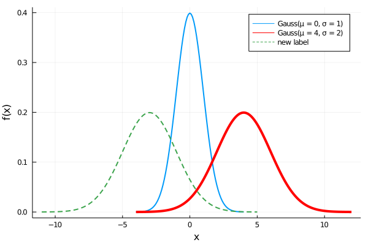

# Abstract types

Julia does not allow abstract types to be instantiated. They can only be used to create a logical hierarchy of types. The following figure shows this hierarchy for numeric types introduced in the first lecture.


All types depicted in blue are abstract types, and all green types are concrete types. For example, `Int8`, `Int16`, `Int32`, `Int64` and `Int128` are signed integer types, `UInt8`, `UInt16`, `UInt32`, `UInt64` and `UInt128` are unsigned integer types, while `Float16`, `Float32` and `Float64` are floating-point types. In many cases, the inputs must be of a specific type. An algorithm to find the greatest common denominator should work any integer types, but it should not work for any floating-point inputs. Abstract types specify these cases and provide a context into which concrete types can fit.

Abstract types are defined by `abstract type` followed by the type name. It is possible to specify a type to be a subtype of another abstract type. The definition of abstract numeric types would be:

```julia
abstract type Number end
abstract type Real <: Number end
abstract type AbstractFloat <: Real end
abstract type AbstractIrrational <: Real end
abstract type Integer <: Real end
abstract type Signed <: Integer end
abstract type Unsigned <: Integer end
```

When no supertype is specified, such as for `Number`, the default supertype is `Any`. The `Any` type is sometimes called the *top* type since all types are its subtypes. The *bottom* type is `Union{}`, and all types are supertypes of `Union{}`.

The `<:` operator can be used to check if the left operand is a subtype of the right operand.

```jldoctest
julia> Signed <: Integer
true

julia> Signed <: Number
true

julia> Signed <: AbstractFloat
false
```

Julia also provides the `isa` function, which checks if a variable is an instance of a type.

```jldoctest
julia> isa(1, Int64) # equivalent to typeof(1) <: Int64
true

julia> isa(1, Integer) # equivalent to typeof(1) <: Integer
true

julia> isa(1, AbstractFloat) # equivalent to typeof(1) <: AbstractFloat
false
```

Other handy functions are `isabstracttype` and `isconcretetype` that check whether a type is abstract and concrete, respectively.

```jldoctest
julia> isabstracttype(Real)
true

julia> isabstracttype(Float64)
false

julia> isconcretetype(Real)
false

julia> isconcretetype(Float64)
true
```

# Composite types

A composite type is a collection of key-value pairs. In many languages, composite types are the only kind of user-definable type. Even though Julia allows defining other types, composite types are used the most.
Their main goal is to collect all information about one object within one structure. We will soon define the `Rectangle` type containing information about the size and the bottom-left point position of a rectangle. Collecting this information into one structure makes it simple to pass all information about the rectangle as arguments and use it for further computation. Moreover, it is possible to use composite types in combination with multiple-dispatch and define specialized functions for custom types.

The `struct` keyword defines composite types. It is followed by the composite type name and field names, where the latter may be annotated with types.

```jldoctest structs; output = false
struct Rectangle
    bottomleft::Vector{Float64}
    width
    height
end

# output

```

If the type annotation is omitted, `Any` is used, and such a field may contain any value. A Julia convention suggests making the first letter in custom type names uppercase. We can create a new instance of the above type by calling `Rectangle` as a function. Its input arguments represent the fields of the `Rectangle` type.

```jldoctest structs
julia> r = Rectangle([1,2], 3, 4)
Rectangle([1.0, 2.0], 3, 4)

julia> isa(r, Rectangle)
true
```

A constructor is calling a type as a function. Two constructors are automatically generated when a type is created. One accepts any arguments and converts them to the field types, and the other accepts arguments that match the field types exactly. If all fields are `Any`, only one constructor is generated. Julia creates these two constructors to make it easier to add new definitions without replacing the default constructor. We can list all constructors by the `methods` function.

```jldoctest structs
julia> methods(Rectangle)
# 2 methods for type constructor:
[1] Rectangle(bottomleft::Array{Float64,1}, width, height) in Main at none:2
[2] Rectangle(bottomleft, width, height) in Main at none:2
```

The fields of composite types can be accessed via the dot notation similarly to named tuples or via the `getproperty` function.

```jldoctest structs
julia> r.width
3

julia> getproperty(r, :width)
3
```

The fields can be then accessed anywhere, for example, within a function.

```jldoctest structs
julia> area(r::Rectangle) = r.width * r.height
area (generic function with 1 method)

julia> function vertices(r::Rectangle)
           x, y = r.bottomleft
           w, h = r.width, r.height
           return [[x, y], [x + w, y], [x + w, y + h], [x, y + h]]
       end
vertices (generic function with 1 method)

julia> area(r)
12

julia> vertices(r)
4-element Array{Array{Float64,1},1}:
 [1.0, 2.0]
 [4.0, 2.0]
 [4.0, 6.0]
 [1.0, 6.0]
```

The convenient function `fieldnames` returns a tuple with names of all structure fields represented as symbols.

```jldoctest structs
julia> fieldnames(Rectangle)
(:bottomleft, :width, :height)

julia> fieldnames(typeof(r))
(:bottomleft, :width, :height)
```

```@raw html
<div class = "info-body">
<header class = "info-header">Comparison with Python</header><p>
```

The same object can be defined in Python in the following way:

```python
class Rectangle:
    def __init__(self, bottomleft, width, height):
        self.bottomleft = bottomleft
        self.width = width
        self.height = height

    def area(self):
        return self.width * self.height

    def vertices(self):
        x, y = self.bottomleft
        w, h = self.width, self.height
        return [[x, y], [x + w, y], [x + w, y + h], [x, y + h]]
```

We can create an instance of this object and call the two functions defined in the class definition.

```python
In [2]: r = Rectangle([1.0, 2.0], 3, 4)

In [3]: r.area()
Out[3]: 12

In [4]: r.vertices()
Out[4]: [[1.0, 2.0], [4.0, 2.0], [4.0, 6.0], [1.0, 6.0]]
```

The declaration of the `Rectangle` class is very similar to the one in Julia. The main difference is that Python defines the functions inside of the class while Julia defines them outside. The Julia approach has several advantages:
1. Julia has more options to logically split the code. This may increase readability.
2. When working with a class defined in an external package, Julia can simply define additional functions to this class. Python needs to use inheritance to modify the class. When a multiple people use inheritance to the same class, it is not clear how to merge the inherited classes together. Therefore, Julia makes it simpler to create packages which combine and modify multiple existing packages.
3. When working with multiple classes, it does not need to be clear to which a function should belong. Python sometimes needs to create an additional class which unites these two classes. Julia does not have this problem as functions are defined externally.


in Julia functions are defined outside of the declaration of the structure. This is very important since Julia uses multiple-dispatch. It means, that functions consist of methods, and Julia decides which method to use based on the number of input arguments and its types. Since all arguments are used for method selection, it would be inappropriate for functions to "belong" to some composite type. As a consequence, we can modify existing methods or add new ones without the necessity to change the composite type definition. This property significantly improves code extensibility and reusability.

```@raw html
</p></div>
```

## Mutable composite types

Composite types declared with `struct` keyword are immutable and cannot be modified after being constructed.

```jldoctest structs
julia> r.bottomleft = [2;2]
ERROR: setfield! immutable struct of type Rectangle cannot be changed
```

However, immutability is not recursive. If an immutable object contains a mutable object, such as an array, elements of this mutable object can be modified. Even though `Rectangle` is an immutable type, its `bottomleft` field is a mutable array and can be changed.

```jldoctest structs
julia> r.bottomleft[1] = 5
5

julia> r.bottomleft
2-element Array{Float64,1}:
 5.0
 2.0

julia> area(r)
12

julia> vertices(r)
4-element Array{Array{Float64,1},1}:
 [5.0, 2.0]
 [8.0, 2.0]
 [8.0, 6.0]
 [5.0, 6.0]
```

To allow changing their fields, we need to define composite types as mutable by adding the `mutable` keyword.

```jldoctest structs; output = false
mutable struct MutableRectangle
    bottomleft::Vector{Float64}
    width
    height
end

# output

```

We can work with mutable and immutable types in the same way.

```jldoctest structs
julia> mr = MutableRectangle([1,2], 3, 4)
MutableRectangle([1.0, 2.0], 3, 4)

julia> isa(mr, MutableRectangle)
true
```

Similarly to accessing field values, we can change them by the dot notation or the `setproperty!` function.

```jldoctest structs
julia> mr.width = 1.5
1.5

julia> setproperty!(mr, :height, 2.5)
2.5

julia> mr
MutableRectangle([1.0, 2.0], 1.5, 2.5)
```

```@raw html
<div class = "info-body">
<header class = "info-header">Type unions</header><p>
```

The `area` function defined earlier will only work for `Rectangle` but not for `MutableRectangle` types. To define it for both types, we need type unions. The `Union` keyword creates a supertype of its inputs.

```jldoctest structs
julia> const AbstractRectangle = Union{Rectangle, MutableRectangle}
Union{MutableRectangle, Rectangle}

julia> Rectangle <: AbstractRectangle
true

julia> MutableRectangle <: AbstractRectangle
true
```

We now create the `perimeter(r::AbstractRectangle)` function. Since we specify that its input is an `AbstractRectangle`, it will work for both mutable `MutableRectangle` and immutable `Rectangle` types.

```jldoctest structs
julia> perimeter(r::AbstractRectangle) = 2*(r.width + r.height)
perimeter (generic function with 1 method)

julia> perimeter(r)
14

julia> perimeter(mr)
8.0
```

```@raw html
</p></div>
```

## Parametric types

An important and powerful feature of the Julia type system is that it is parametric. Types can take parameters, and type declarations introduce a whole family of new types (one for each possible combination of parameter values). Parametric (abstract) types can be defined as follows:

```jldoctest structs; output = false
abstract type AbstractPoint{T} end

struct Point{T <: Real} <: AbstractPoint{T}
    x::T
    y::T
end

# output

```

The example above defines a parametric abstract type `AbstractPoint` and its parametric subtype `Point`. The declaration of the concrete type `Point{T <: Real}` has two fields of type `T`, where `T` can be any subtype of `Real`. This definition ensures that both fields are always of the same type. Note that `Point{Float64}` is a concrete type equivalent to replacing `T` in the definition of `Point` by `Float64`.

```jldoctest structs
julia> isconcretetype(Point{Float64})
true
```

This single declaration declares a concrete type for each type `T` that is a subtype of `Real`.  The `Point` type itself is also a valid type object, containing all instances `Point{Float64}`, `Point{Int64}`, etc., as subtypes.

```jldoctest structs
julia> Point{Float64} <: Point <: AbstractPoint
true

julia> Point{Int64} <: Point <: AbstractPoint
true
```

Concrete `Point` types with different `T` values are never subtypes of each other. Even though `Float64` is a subtype of ` Real`, `Point{Float64}` is not a subtype of  `Point{Real}`.

```jldoctest structs
julia> Point{Float64} <: Point{Real}
false

julia> Point{Float64} <: AbstractPoint{Float64}
true

julia> Point{Float64} <: AbstractPoint{Real}
false
```

This behaviour has important consequences: while any instance of `Point{Float64}` may be represented as an instance of `Point{Real}`, these two types have different representations in memory:

- An instance of `Point{Float64}` can be efficiently represented as a pair of 64-bit values;
- An instance of `Point{Real}` must be able to hold any pair of `Real` values. Since instances of `Real` can have arbitrary size and structure, an instance of `Point{Real}` must be represented as a pair of pointers to individually allocated `Real` objects.

This efficiency gain is magnified for arrays: `Array{Float64}` can be stored as a contiguous memory block of 64-bit floating-point values, whereas `Array{Real}` is an array of pointers to `Real` objects.

Since `Point{Float64}` is not a subtype of `Point{Real}`, the following method cannot be applied to arguments of type `Point{Float64}`.

```julia structs
julia> coordinates(p::Point{Real}) = (p.x, p.y)

julia> coordinates(Point(1,2))
ERROR: MethodError: no method matching coordinates(::Point{Int64})
[...]

julia> coordinates(Point(1.0,2.0))
ERROR: MethodError: no method matching coordinates(::Point{Float64})
[...]
```

The correct way to define a method that accepts all arguments of type `Point{T}` where `T` is a subtype of `Real` is as follows:

```jldoctest structs
julia> coordinates(p::Point{<:Real}) = (p.x, p.y)
coordinates (generic function with 1 method)

julia> coordinates(Point(1,2))
(1, 2)

julia> coordinates(Point(1.0,2.0))
(1.0, 2.0)
```

It is also possible to define a function for all subtypes of some abstract type.

```jldoctest structs
julia> Base.show(io::IO, p::AbstractPoint) = print(io, coordinates(p))

julia> Point(4, 2)
(4, 2)

julia> Point(0.2, 1.3)
(0.2, 1.3)
```

There are two ways how to instantiate the `Point` type.  The first one does not specify the `T` parameter and lets Julia automatically decide the appropriate type. The second one specifies the `T` parameter manually.

```jldoctest structs
julia> Point(1, 2)
(1, 2)

julia> Point{Float32}(1, 2)
(1.0f0, 2.0f0)
```

The first way works only if the arguments have the same type.

```jldoctest structs
julia> Point(1, 2.0)
ERROR: MethodError: no method matching Point(::Int64, ::Float64)
Closest candidates are:
  Point(::T, !Matched::T) where T<:Real at none:3
```

This situation can be handled by defining custom constructors, as we will discuss in the next section.

```@raw html
<div class = "exercise-body">
<header class = "exercise-header">Exercise:</header><p>
```

Define a structure that represents 3D-points. Do not forget to define it as a subtype of the AbstractPoint type. Then add a new method to the `coordinates` function.

```@raw html
</p></div>
<details class = "solution-body">
<summary class = "solution-header">Solution:</summary><p>
```

There are several possibilities for defining the structure. We define it as a structure with three fields. Another option is to use a tuple to store the point coordinates.

```jldoctest structs; output = false
struct Point3D{T <: Real} <: AbstractPoint{T}
    x::T
    y::T
    z::T
end

coordinates(p::Point3D) = (p.x, p.y, p.z)

# output

coordinates (generic function with 2 methods)
```

Since the `show` function was defined for the abstract type `AbstractPoint` and uses the `coordinates` function, the custom print is applied to `Point3D` without the need for further changes.

```jldoctest structs
julia> Point3D(1, 2, 3)
(1, 2, 3)

julia> Point3D{Float32}(1, 2, 3)
(1.0f0, 2.0f0, 3.0f0)
```

```@raw html
</p></details>
```

## Constructors

Constructors are functions that create new instances of composite types. When a user defines a new composite type,  Julia creates the default constructors. Sometimes it is helpful to add additional constructors. In the example from the previous section, we may want to create an instance of `Point` from two numbers with different types. This can be achieved by defining the following constructor.

```jldoctest structs; output = false
Point(x::Real, y::Real) = Point(promote(x, y)...)

# output

Point
```

The `promote` function converts its arguments to the supertype that can represent both inputs. For example, `promote(1, 2.3)` results in the tuple `(1.0, 2.3)` because it is possible to represent `Int64` by `Float64`, but not the other way round. We can test the new constructor on the example from the end of the previous section. As expected, the result has the type `Point{Float64}`.

```jldoctest structs
julia> Point(1, 2.0)
(1.0, 2.0)

julia> typeof(Point(1, 2.0))
Point{Float64}
```

The constructor defined above is the outer constructor because it is defined outside of the type definition. A constructor behaves like any other function in Julia and may have multiple methods. We can define new methods to add additional functionality to a constructor. On the other hand, outer constructors cannot construct self-referential objects or instances with some special properties. In such a case, we have to use inner constructors, which differ from outer constructors in two aspects:

1. They are declared inside the composite type declaration rather than outside of it.
2. They have access to the local function `new` that creates new instances of the composite type.

For example, one may want to create a type with two real numbers, where the first number cannot be greater than the second one. The inner constructor can ensure this.

```jldoctest ordered; output = false
struct OrderedPair{T <: Real}
    x::T
    y::T

    function OrderedPair(x::Real, y::Real)
        x > y && error("the first argument must be less than or equal to the second one")
        xp, yp = promote(x, y)
        return new{typeof(xp)}(xp, yp)
    end
end

# output

```

If an inner constructor method is provided, **no default constructor method is constructed**.  The example above ensures that any instance of the `OrderedPair` satisfies `x <= y`.

```jldoctest ordered
julia> OrderedPair(1,2)
OrderedPair{Int64}(1, 2)

julia> OrderedPair(2,1)
ERROR: the first argument must be less than or equal to the second one
[...]
```

Inner constructors have an additional advantage. Since outer constructors create the object by calling an appropriate inner constructor, even if we define any number of outer constructors, the resulting instances of the `OrderedPair` type will always satisfy `x <= y`.

```@raw html
<div class = "exercise-body">
<header class = "exercise-header">Exercise:</header><p>
```

Define a structure that represents ND-points and stores their coordinates as `Tuple`. Do not forget to define it as a subtype of the `AbstractPoint` type. Redefine the default inner constructor to create an instance of `PointND` from different types. Then add a new method to the `coordinates` function, and define function `dim` that returns the dimension of the point.

**Hints:** use the `new` function in the definition of the new inner constructor.

**Bonus:** Tuples with elements of the same type can be described by the special type `NTuple{N, T}`, where `N` is the number of elements and `T` their type.

```jldoctest
julia> NTuple{2, Int64} <: Tuple{Int64, Int64}
true
```

```@raw html
</p></div>
<details class = "solution-body">
<summary class = "solution-header">Solution:</summary><p>
```

In this case, we can use an inner constructor with the optional number of input arguments. In the definition below, we use type annotation to set these arguments to be real numbers. Since we use the `new` function and our type is parametric, we have to specify `N` and type `T`.

```jldoctest structs; output = false
struct PointND{N, T <: Real} <: AbstractPoint{T}
    x::NTuple{N, T}

    function PointND(args::Real...)
        vals = promote(args...)
        return new{length(args), eltype(vals)}(vals)
    end
end

coordinates(p::PointND) = p.x
dim(p::PointND{N}) where N = N

# output

dim (generic function with 1 method)
```

Note that we use the parameter `N` in the definition of the `dim` function.

Since the `show` function was defined for the abstract type `AbstractPoint` and uses the `coordinates` function, the custom printing function is immediately applied to the new type. Since we redefined the default constructors, we can create an instance of the `PointND` type from inputs of mixed types.

```jldoctest structs
julia> p = PointND(1, 2)
(1, 2)

julia> dim(p)
2

julia> p = PointND(1, 2.2, 3, 4.5)
(1.0, 2.2, 3.0, 4.5)

julia> dim(p)
4
```

```@raw html
</p></details>
```

## Default field values

It may be beneficial to define custom types with default field values. Since a constructor is a function, one way to achieve this is to use optional or keyword arguments in its declaration. Another option is to use the `@kwdef` macro from `Base` that automatically defines keyword-based constructors.

```jldoctest structs; output = false
Base.@kwdef struct MyType
    a::Int # required keyword
    b::Float64 = 2.3
    c::String = "hello"
end

# output

MyType
```

The `methods` function shows that Julia created three constructors.  The `@kwdef` macro creates the first constructor; the other two constructors are the default constructors.

```jldoctest structs
julia> methods(MyType)
# 3 methods for type constructor:
[1] MyType(; a, b, c) in Main at util.jl:438
[2] MyType(a::Int64, b::Float64, c::String) in Main at none:2
[3] MyType(a, b, c) in Main at none:2
```

A `MyType` instance can be created by the default constructors.

```jldoctest structs
julia> MyType(1, 2.3, "aaa")
MyType(1, 2.3, "aaa")
```

The other way is to use the constructor with predefined field values. Then all values have to be passed as keyword arguments. The fields without default values are mandatory keyword arguments: we have to specify them.

```jldoctest structs
julia> MyType(; a = 3)
MyType(3, 2.3, "hello")

julia> MyType(; a = 5, b = 4.5)
MyType(5, 4.5, "hello")
```

```@raw html
<div class = "info-body">
<header class = "info-header">Function-like objects</header><p>
```
Methods are associated with types; therefore, it is possible to make an arbitrary Julia object "callable" by adding methods to its type. Such "callable" objects are sometimes called functors. Using this technique to the `MyType` defined above, we can define a method that returns values of all its fields.

```jldoctest structs
julia> (m::MyType)() = (m.a, m.b, m.c)

julia> m = MyType(; a = 5, b = 4.5)
MyType(5, 4.5, "hello")

julia> m()
(5, 4.5, "hello")
```

Moreover, we can use multiple-dispatch for functors. We show an example, where the functor has a different behaviour when it is called with a number and a string.

```jldoctest structs; output = false
(m::MyType)(x::Real) = m.a*x + m.b
(m::MyType)(x::String) = "$(m.c), $(x)"

# output

```

These two methods give different results.

```jldoctest structs
julia> m(1)
9.5

julia> m("world")
"hello, world"
```

```@raw html
</p></div>
```


```@raw html
<div class = "exercise-body">
<header class = "exercise-header">Exercise:</header><p>
```

[Gaussian distribution](https://en.wikipedia.org/wiki/Normal_distribution) is uniquely represented by its mean ``\mu`` and variance ``\sigma^2>0``. Write a structure `Gauss` with the proper fields and an inner constructor that checks if the input parameters are correct. Initialization without arguments `Gauss()` should return the standardized normal distribution (`` \mu = 0`` and `` \sigma = 1``).  Define a functor that computes the probability density function at a given point defined by

```math
f_{\mu, \sigma}(x) = \frac{1}{\sigma \sqrt{ 2\pi }} \exp\left\{ -\frac{1}{2} \left( \frac{x - \mu}{\sigma} \right) ^2 \right\},
```

Verify that the probability density function is defined correctly, i.e., its integral equals 1.

```@raw html
</p></div>
<details class = "solution-body">
<summary class = "solution-header">Solution:</summary><p>
```

One possible way to define this structure is the `@kwdef` macro, where we specify the default parameters. We also define an inner constructor that promotes the inputs to a same type, and checks if the variance is positive.

```jldoctest structs_gauss; output = false
Base.@kwdef struct Gauss{T<:Real}
    μ::T = 0
    σ::T = 1

    function Gauss(μ::Real, σ::Real)
        σ^2 > 0 || error("the variance `σ^2` must be positive")
        pars = promote(μ, σ)
        return new{eltype(pars)}(pars...)
    end
end

# output

```

We specified the parameter `T` by `eltype(pars)` in the call of the `new` function. The probability density function can be defined as a functor in the following way:


```jldoctest structs_gauss; output = false
(d::Gauss)(x::Real) = exp(-1/2 * ((x - d.μ)/d.σ)^2)/(d.σ * sqrt(2*π))

# output

```

We use type annotation to ensure that all input arguments are real numbers.

```jldoctest structs_gauss
julia> gauss = Gauss()
Gauss{Int64}(0, 1)

julia> gauss(0)
0.3989422804014327
```

The integral of the probability density function over the real line should equal one. We check it numerically by discretizing the integral into a finite sum.

```jldoctest structs_gauss
julia> step = 0.01
0.01

julia> x = -100:step:100;

julia> sum(Gauss(), x) * step
1.0000000000000002

julia> sum(Gauss(0.1, 2.3), x) * step
1.0
```

We use `sum` with a function as the first input argument and apply it to each value of the second argument. This is possible because we defined a functor for `Gauss`. The result is the same as `sum(Gauss().(x))`. The difference is that the former, similarly to generators, does not allocate an array.

```@raw html
</p></details>
```

```@raw html
<div class = "info-body">
<header class = "info-header">Plot recipes</header><p>
```

The previous exercise defined a new type representing the Gaussian distribution. We also defined a functor that computes the probability density function of this distribution. It makes sense to visualize the probability density function using the [Plots](@ref Plots.jl) package. Unfortunately, it is not possible to use [Function plotting](@ref Function-plotting), i.e., the following will not work even though the `Gauss` type is callable.

```julia
plot(x, Gauss())
```

Using the system of Julia types, it is possible to obtain special behaviour for a certain type only by defining a new method for this type. For example, if we use the `plot` function, all input data and plot attributes are preprocessed to some standard format and then the final graph is created. Due to the Julia type system, we can easily change how this preprocessing happens and define special behaviour for custom types.

For plotting, this is done by the `@recipe` macro from the [RecipesBase](https://github.com/JuliaPlots/RecipesBase.jl) package. The RecipesBase package provides the functionality related to creating custom plots and the Plots package uses this functionality. Moreover, since the RecipesBase package is much smaller, its first run is faster. The syntax is straightforward. In the function head, we define two inputs: our type and input `x`. In the function body, we define plot attributes in the same way as if we pass them into the `plot` function. Finally, we define the output of the function.

```julia
using RecipesBase

@recipe function f(d::Gauss, x = (d.μ - 4d.σ):0.1:(d.μ + 4d.σ))
    seriestype  :=  :path
    label --> "Gauss(μ = $(d.μ), σ = $(d.σ))"
    xguide --> "x"
    yguide --> "f(x)"
    linewidth --> 2
    return x, d.(x)
end
```

The operators `:=` and `-->` are specific for this package. Both set default values for plotting attributes. The difference is that the default values can be changed for `-->` but cannot be changed for `:=`.

The recipe above is equivalent to calling the `plot` function.

```julia
d = Gauss()
plot(x, d.(x);
    seriestype := :path,
    label = "Gauss(μ = $(d.μ), σ = $(d.σ))",
    xguide = "x",
    yguide = "f(x)",
    linewidth = 2
)
```

With the new plot recipe, we can plot the probability density function of the Gaussian distribution with different parameters.

```julia
using Plots

plot(Gauss())
plot!(Gauss(4, 2); linewidth = 4, color = :red)
plot!(Gauss(-3, 2); label = "new label", linestyle = :dash)
```



```@raw html
</p></div>
```
