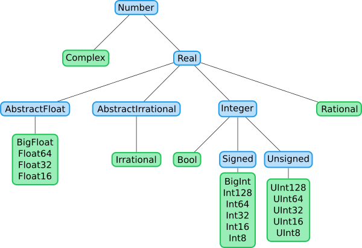

# Abstract types

In Julia, abstract types cannot be instantiated and are used to create a logical hierarchy of types. This can be seen in the hierarchy of numeric types introduced in the first lecture



All types depicted in blue are abstract types. Note that Julia provides a variety of concrete types of numeric values. Although they have different representation sizes, `Int8`, `Int16`, `Int32`, `Int64`, and `Int128` all have in common that they are signed integer types. Likewise, `UInt8`, `UInt16`, `UInt32`, `UInt64`, and `UInt128` are all unsigned integer types, while `Float16`, `Float32`, and `Float64` are distinct in being floating-point types rather than integers. It is common for a piece of code to make sense, for example, only if its arguments are some kind of integer, but not really depend on what particular kind of integer. For example, the greatest common denominator algorithm works for all kinds of integers, but will not work for floating-point numbers. Abstract types allow the construction of a hierarchy of types, providing a context into which concrete types can fit. This allows you, for example, to easily program to any type that is an integer, without restricting an algorithm to a specific type of integer.

Abstract types can be defined using the `abstract type` keyword followed by the name of the type. Optionally, it is possible to specify that the type is a subtype of another existing abstract type. For example, the hierarchy of numeric types presented above can be defined as follows

```julia
abstract type Number end
abstract type Real <: Number end
abstract type AbstractFloat <: Real end
abstract type AbstractIrrational <: Real end
abstract type Integer <: Real end
abstract type Signed <: Integer end
abstract type Unsigned <: Integer end
```

When no supertype is given, the default supertype is Any, i.e., in our example, the `Number` type is a subtype of `Any`. The `Any` type is sometimes called the *top* type since all types are subtypes of it. In Julia, there is also the *bottom* type `Union{}`.  It is the exact opposite of the `Any` type since no object is an instance of `Union{}` and all types are supertypes of `Union{}`.

The `<:` operator can be used in expressions as a subtype operator that returns true when its left operand is a subtype of its right operand

```@repl
Signed <: Integer
Signed <: Number
Signed <: AbstractFloat
```

Julia also provides the `isa` function, which can be used to test if the given variable is an instance of some type or subtype of some abstract type

```@repl
isa(1, Int64) # equivalent to typeof(1) <: Int64
isa(1, Integer) # equivalent to typeof(1) <: Integer
isa(1, AbstractFloat) # equivalent to typeof(1) <: AbstractFloat
```

Julia also provides the `isabstracttype` function that checks whether the given type is abstract or not

```@repl
isabstracttype(Real)
isabstracttype(Float64)
```

and the `isconcretetype` function that checks  whether the given type is concrete or not

```@repl
isconcretetype(Real)
isconcretetype(Float64)
```

# Composite types

Composite types are called *records*, *structs*, or *objects* in various languages. A composite type is a collection of named fields, an instance of which can be treated as a single value. In many languages, composite types are the only kind of user-definable type, and they are by far the most commonly used user-defined type in Julia as well.

In object-oriented languages, such as Python or Java, composite types also have named functions associated with them, and the combination is called an *object*.  In Julia, all values are objects, but functions are not bundled with the objects they operate on. This is necessary since Julia chooses which method of a function to use by multiple-dispatch. It means that the types of all of a function's arguments are considered when selecting a method, rather than just the first one. Thus, it would be inappropriate for functions to "belong" to only their first argument. Organizing methods into function objects rather than having named bags of methods "inside" each object ends up being a highly beneficial aspect of the language design.

Composite types can be defined using the `struct` keyword followed by the type name and  field names that can be optionally annotated with types

```@example structs
struct Foo
    a
    b::Int
end
nothing # hide
```

Fields with no type annotation default to `Any`, and can accordingly hold any type of value. Note that there is a convention in Julia, that the first letters in custom type names are in uppercase. We can create a new instance of the above type by calling `Foo` as a function with input arguments representing fields of the `Foo` type

```@repl structs
foo = Foo([1,2,3], 4)
isa(foo, Foo)
```

When a type is applied like a function it is called a constructor. Two constructors are generated automatically. One accepts any arguments and calls convert to convert them to the types of the fields, and the other accepts arguments that match the field types exactly. The reason both of these are generated is that this makes it easier to add new definitions without inadvertently replacing a default constructor.

The fields of composite types can be accessed via dot notation similarly to named tuples

```@repl structs
foo.a
foo.b
```

Internally `foo.a` is just a shortcut for the `getproperty(foo, :a)`

```@repl structs
getproperty(foo, :a)
getproperty(foo, :b)
```

There is also a very handy function `fieldnames` that returns a tuple with names of all fields of a given structure. Note that all field names are represented as symbols

```@repl structs
fieldnames(Foo)
```

Composite objects declared with `struct` are immutable, i.e., they cannot be modified after construction.

```@repl structs
foo.a = 1
```

However, the immutability is not recursive. It means, that if an immutable object contains a mutable object (for example array), the elements of the mutable object can be modified. This can be seen in the following example. The `Foo` type is defined as immutable, but we instantiate the `foo` object with a vector as a first argument. Since vectors are mutable, we can modify the elements of the field `foo.a`

```@repl structs
foo.a[1] = 5
foo.a
```

Mutable composite types can be declared in the same way as immutable ones. The only difference is, that we have to add the `mutable` keyword before the `struct` keyword.

```@example structs
mutable struct MutableFoo
    a
    b::Int
end
nothing # hide
```

Instances of mutable types are created in the same way as in the case of the immutable types

```@repl structs
mfoo = MutableFoo([1,2,3], 4)
isa(mfoo, MutableFoo)
```

There are two ways how to change fields of mutable types. The first one is to use the `setproperty!` function. The second one is to use the shorthand dot syntax to access the field and the `=` operator to assign a new value

```@repl structs
mfoo.a = 2.345
setproperty!(mfoo, :a, 2)
mfoo
```

Note that the syntax `mfoo.a = 2.345` is only shorthand and internally the `setproperty!` function is called.

```@raw html
<div class = "info-body">
<header class = "info-header">Type unions</header><p>
```

A type union is a special abstract type which includes as objects all instances of any of its argument types, constructed using the special `Union` keyword

```@repl structs
AbstractFoo = Union{Foo, MutableFoo}
Foo <: AbstractFoo
MutableFoo <: AbstractFoo
```

The `Union` type can be very useful in many cases. For example, if there is no connection between multiple types, but we want to write a specialized function that is shared for all these types, we can use the type `Union` and write one function with type annotation to all of them at once

```@repl structs
geta(foo::AbstractFoo) = foo.a
geta(foo) == foo.a
geta(mfoo) == mfoo.a
```

```@raw html
</p></div>
```

## Parametric types

## Constructors

## Functors
