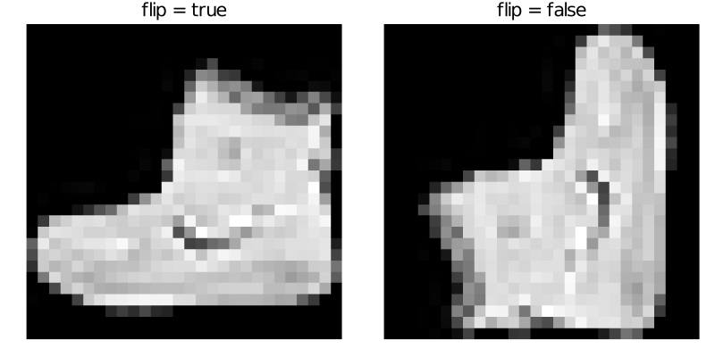
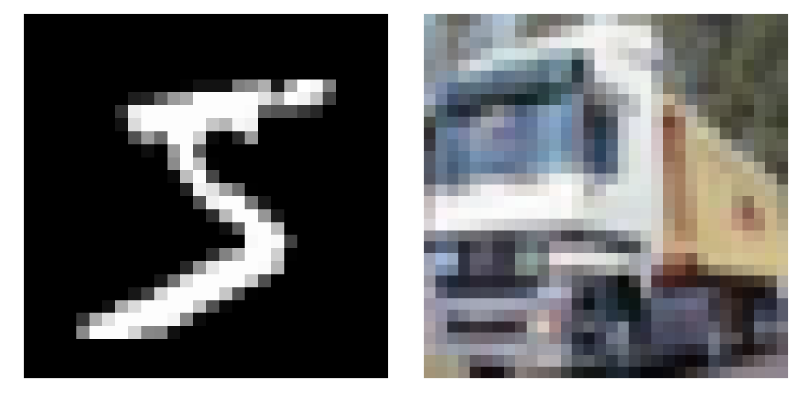

# Package Development

The very nice thing about Julia is that it is simple to create a package that can then be easily installed and used by other users. This section contains a step-by-step tutorial on how to build a new package from scratch.

## Pkg templates

The very first step is to generate a new empty package. There is a built-in function `generate` in the Pkg REPL that allows generating a new package in an easy way. The `generate` function can be used as follows from the Pkg REPL

```julia
(@v1.5) pkg> generate PackageName
 Generating  project PackageName:
    PackageName/Project.toml
    PackageName/src/PackageName.jl
```

Note that in the case above, a new package with the name `PackageName` is generated in the current folder. However, it is also possible to use an absolute/relative path to generate a new package in a specific folder. The `generate` function creates a new folder with the name that matches the package name and with the following content

```julia
├── Project.toml
└── src
    └── PackageName.jl
```

We can see that the new package consists of the `Project.toml` file and the `src` folder with one `.jl` file. The `src/PackageName.jl` file contains a module `PackageName` as can be seen in the following code

```julia
module PackageName

greet() = print("Hello World!")

end # module
```

Since the `generate` function creates an empty package, the `Project.toml` file is also almost empty. It only contains the name of the package, its unique UUID, its version and the the authors

```toml
name = "PackageName"
uuid = "fa38fd22-11d6-48c8-ae38-ef06258216d8"
authors = ["UserName <UserEmail>"]
version = "0.1.0"
```
The built-in `generate` function provides only basic functionality for generating packages. In many cases it is sufficient, however, there is the [PkgTemplates](https://github.com/invenia/PkgTemplates.jl) packages that offers a very easy, repeatable, and customizable way to generate the files for a new package.


```@raw html
<div class = "exercise-body">
<header class = "exercise-header">Exercise:</header><p>
```

The goal of this exercise is to create a new package using the PkgTemplates package. Install PkgTemplates and then use the following code to generate a new package template

```julia
using PkgTemplates

template = Template(;
    user = "GithubUserName",            # github user name
    authors = ["Author1", "Author2"],   # list of authors
    dir = "/Path/To/Dir/",              # dir in which the package will be created
    julia = v"1.5",                     # compat version of Julia
    plugins = [
        !CompatHelper,                  # disable CompatHelper
        !TagBot,                        # disable TagBot
        Readme(; inline_badges = true), # added readme file with badges
        Tests(; project = true),        # added Project.toml file for unit tests
        Git(; manifest = true),         # remove manifest.toml from .gitignore
        License(; name = "MIT")         # addedMIT licence
    ],
)
```

Do not forget to change the following keywords: `user`, `authors` and `dir`.

In the rest of the lecture, we will try to write a code that will help us to visualize gray and color images. This package we will use later in the lectures focused on machine learning. The package will provide the following functionality:

- Converting array representation of image to gray or RGB representation.
- Converting array representation of multiple images to an array of gray or RGB images.
- Plotting multiple images at once in a grid.

Try to come up with a suitable package name that will describe the functionality described above (for some tips on package naming see the official [package naming guidelines](https://julialang.github.io/Pkg.jl/v1/creating-packages/#Package-naming-guidelines). Change the package name in the following code and then use it to generate a new package.

```julia
template("PackageName")
```

```@raw html
</p></div>
<details class = "solution-body">
<summary class = "solution-header">Solution:</summary><p>
```

There is no best way to choose the correct package name. In this example we can for example use the `ImageInspector` name. With the appropriately changed and created template, the package can be generated using the following code

```julia
template("ImageInspector")
```

If we look into the generated folder, we see that it contains more files than the folder generated by the built-in `generate` function.

```julia
├── .git
├── .gitignore
├── LICENSE
├── Manifest.toml
├── Project.toml
├── README.md
├── src
│   └── ImageInspector.jl
└── test
    ├── Manifest.toml
    ├── Project.toml
    └── runtests.jl
```

```@raw html
</p></details>
```

```@raw html
<div class = "info-body">
<header class = "info-header">Interactive package generation</header><p>
```

The PkgTemplate provides an interactive way how to generate a new package. The template can be created interactively using the following command

```julia
Template(; interactive=true)
```

or it is possible to create a package directly as follows

```julia
Template(; interactive=true)("PackageName")
```

Note that we use a really simple template in the above exercise. However, PkgTemplates provides many additional features to simplify the package generation process. There are plugins that add documentation or integration with some GitHub features. See the official [PkgTemplates documentation](https://invenia.github.io/PkgTemplates.jl/stable/) for more information.

```@raw html
</p></div>
```

## Development mode

In the previous section, we created a new empty package. The goal of this section is to show how to create the content of the package. Now we are in a situation, that we created only a folder with some Julia related content. The first thing we have to do is to tell Julia, that the folder is a package and we want to start the development of it. This can be done using the `dev` (or `develop`) command in the Pkg REPL followed by the path to the main folder of our new package.

```julia
(@v1.5) pkg> dev /..../ImageInspector/
```

Similar to the `add` command, the `dev` command allows us to load the package using the `using` or `import` keyword.

```julia
using ImageInspector
```

The difference between `add` and `dev` commands is, that the `dev` command tracks the current state of the package folder and not the concrete git commit in some branch. It means that we do not have to update the package to get the latest functionality. But there is a problem: a package can only be loaded once per Julia session. It means, that once we run `using` or `import` command for some package in development mode and then we make some changes in the code these changes will not be applied (even if we run `using` or `import` again). As an example, we can add the `greet` function to the` ImageInspector` package, which is already loaded in the current Julia session.

```julia
module ImageInspector

export greet

greet() = print("Hello World!")

end
```

If we now call the `greet` function, we will get the `UndefVarError` error as can be seen below

```julia
julia> greet()
ERROR: UndefVarError: greet not defined
```

In this case, we have to restart Julia and start with a fresh Julia session to get the latest functionality.

```julia
julia> using ImageInspector

julia> greet()
Hello World!
```

This is very annoying and it prevents developing packages in a pleasant way. Luckily, there is a very handy package [Revise](https://github.com/timholy/Revise.jl) that can make this process significantly more pleasant. The Revise package provides a lot of handy functionality, however, we will present only the basic usage. More advanced usage cases can be found in the [documentation](https://timholy.github.io/Revise.jl/stable/) of the Revise package.

The basic use case is as follows. If we want to develop a package and we have a fresh Julia session, we first load the Revise package, and then we load any other packages that we want to use or develop.

```julia
julia> using Revise # importantly, this must come before `using ImageInspector`

julia> using ImageInspector

julia> greet()
Hello World!
```

Now if we decided that we want to add new functionality to the `Image Inspector` package, we can do it and the Revise package ensures that the new functionality will be available immediately. For example, we can add the `greet2` function as follows.

```julia
module ImageInspector

export greet, greet2

greet() = print("Hello World!")
greet2() = print("Hello World!!!!")

end
```

Since we are using the `Revise` package, it should be possible to call the `greet2` function without restarting Julia session.

```julia
julia> greet2()
Hello World!!!!
```

```@raw html
<div class = "exercise-body">
<header class = "exercise-header">Exercise:</header><p>
```

The goal of this exercise is to define a `image` function that converts a given matrix of real numbers to a matrix of Gray points. The real number can be converted to a Gray point using the `Gray` constructor from the Colors package. Use the following code to test the function

```julia
using MLDatasets, Plots

x = MNIST.traintensor(1)
plot(image(x); axis = nothing, border = :none)
```

**Hint:** Each Julia package contains its environment for tracking package dependencies. Use proper commands in the Pkg REPL to install the Colors package as a dependency of the ImageInspector package.

```@raw html
</p></div>
<details class = "solution-body">
<summary class = "solution-header">Solution:</summary><p>
```

Since we want to add the `image` function to the ImageInspector package, we have to install the Colors package.  The first step is to activate the environment in the ImageInspector package. Then we can use the `add Colors` to install the Colors package

```julia
(@v1.5) pkg> activate /..../ImageInspector
 Activating environment at `/..../ImageInspector/Project.toml`

(ImageInspector) pkg> add Colors
```

With the Colors package installed, we have to add `using Colors` into the ImageInspector package. Then we can define the `image` as follows

```julia
module ImageInspector

using Colors

export image

image(x::AbstractMatrix{<:Real}) = Gray.(x)

end
```

Note that we also add `export image`. It is not necessary and only functions that will be used outside of the module should be exported.

```@raw html
</p></details>
```

The testing code in the previous exercise uses the MLDatasets package. This package provides many well-known datasets used in machine learning. One of them is the `MNIST` dataset of hand-written digits. When we run the testing code from the previous exercise, we get the following result


Even though the dataset should contain only images of hand-written digits, the resulting image does not seem to be a digit. The reason is, that images in the MNIST dataset are stored in the **width x height** format and the Plots package assumes **height x width** format. We can simply solve this issue by redefining the `image` function as follows

```julia
function image(x::AbstractMatrix{<:Real}; flip = true)
    xx = flip ? PermutedDimsArray(x, (2, 1)) : x
    return Gray.(xx)
end
```

Note that we use the `PermutedDimsArray`  that creates a view such that the dimensions appear to be permuted. There is also the `permutedims` function, that does the same but creates a copy. Now we can check if the function works as we wanted.

```julia
plot(
    plot(image(x; flip = true); title = "flip = true"),
    plot(image(x; flip = false); title = "flip = false");
    axis = nothing,
    border = :none,
)
```




```@raw html
<div class = "exercise-body">
<header class = "exercise-header">Exercise:</header><p>
```

Follow the same logic as in the previous exercise and define a new method for the `image` function that converts a given 3D array of real numbers to a matrix of RGB points. Assume that the third dimension represents color channels. Three real numbers can be converted to an RGB point using the `RGB` constructor from the Colors package. Make sure, that the input array is of the proper size. If the size of the third dimension is

- `1` the function should return a gray image,
- `3` the function should return a color image,
- otherwise, the function should throw an error.

Use the following code to test the `image` function

```julia
using MLDatasets, Plots

x1 = MNIST.traintensor(1)
x2 = CIFAR10.traintensor(2)
plot(
    plot(image(x1)),
    plot(image(x2));
    axis = nothing,
    border = :none
)
```

**Hint:** Use the `eachslice` function to split the given array along the third dimension.

```@raw html
</p></div>
<details class = "solution-body">
<summary class = "solution-header">Solution:</summary><p>
```

The new method can be defined in the almost same way as the previous exercise. The main difference is in the way how we create the resulting array of RGB points. Firstly, we have to split the input array along the third dimension to get the matrices representing red/green/blue channels. Then we can use broadcasting to create the array of RGB points from these three matrices.

```julia
function image(x::AbstractArray{T,3}; flip = true) where {T <: Real}
    s = size(x, 3)
    if s == 1
        return image(dropdims(x; dims = 3); flip)
    elseif s == 3
        xx = flip ? PermutedDimsArray(x, (2, 1, 3)) : x
        return RGB.(eachslice(xx; dims= 3)...)
    else
        throw(ArgumentError("unsupported size of the third dimension $(s) ∉ [1,3]."))
    end
end
```

Note that we use the `eachslice` function that returns a generator, where each element represents one color channel. We also use the three-dot syntax to unpack the generator as separate input arguments to the `RGB` constructor.


```@raw html
</p></details>
```




```@raw html
<div class = "exercise-body">
<header class = "exercise-header">Exercise:</header><p>
```

Images are usually stored in multidimensional arrays for computational purposes. For example, gray images are often stored as 3D or 4D arrays, where the last dimension represents individual images. Similarly, color images are usually stored as a 4D array. Add new methods for the `image` function with the following properties:

- New methods should accept two arguments:
    - `x`: 3D or 4D array of real numbers that represents images,
    - `inds`: one or more indices of images that we want to extract and convert to Gray/RGB representation.
- If only one index is provided, the method should return a single image, i.e. array of Gray or RGB points.
- If more indices are provided, the method should return an array of images.

Use the following code to test the `image` function

```julia
using MLDatasets, Plots

x = MNIST.traintensor(1:10)

plot(plot.(image(x, [1,2]))...; axis = nothing, border = :none)
```

**Hint:** use the `selectdim` function to select an individual image from an array of images.

```@raw html
</p></div>
<details class = "solution-body">
<summary class = "solution-header">Solution:</summary><p>
```

We have four possible combinations of the input arguments:

1. 3D array and one index,
2. 3D array and mutliple indices,
3. 4D array and one index,
4. 4D array and mutliple indices.

It means that we should define a method for each combination of the input arguments. It can be done in the following way

```julia
image(x::AbstractArray{T,3}, inds) where {T} = [image(selectdim(x, 3, i)) for i in inds]
image(x::AbstractArray{T,4}, inds) where {T} = [image(selectdim(x, 4, i)) for i in inds]
image(x::AbstractArray{T,3}, ind::Int) where {T} = image(x, [ind])[1]
image(x::AbstractArray{T,4}, ind::Int) where {T} = image(x, [ind])[1]
```

However, we can use the `Union` type and reduce the number of methods to two

```julia
const ImArray{T<:Real} = Union{AbstractArray{T,3}, AbstractArray{T,4}}

image(x::ImArray, inds) = [image(selectdim(x, ndims(x), i)) for i in inds]
image(x::ImArray, ind::Int) = image(x, [ind])[1]
```

Note that we use the `const` keyword to create a constant that represents a union type for the abstract 3D and 4D arrays of real numbers. Such a constant can be used in a normal type for multiple-dispatch.

```@raw html
</p></details>
```


## [Unit testing](@id unit-testing)

In the previous section, we added two new functions to our package and we also tested manually if these functions work properly. However, it is not an optimal way how to test the code, especially for large projects. The standard way for testing code is to use so-called [unit testing](https://en.wikipedia.org/wiki/Unit_testing).


## Optional dependencies
