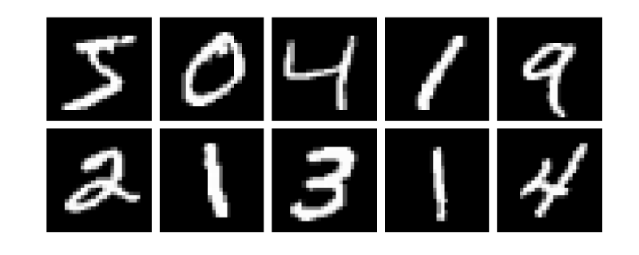

# Package development

The very nice thing about Julia is that it is simple to create a package and share it with other users. This section contains a step-by-step tutorial on how to build a new package from scratch. Moreover, the package that is described in this section, will be used later in the course.

## Pkg templates

The very first step is to generate a new empty package. There is a built-in function `generate` in the Pkg REPL that allows generating a new package in an easy way. The `generate` function can be used as follows from the Pkg REPL

```julia
(@v1.5) pkg> generate PackageName
 Generating  project PackageName:
    PackageName/Project.toml
    PackageName/src/PackageName.jl
```

Note that in the case above, a new package with the name `PackageName` is generated in the current folder. However, it is also possible to use an absolute/relative path to generate a new package in a specific folder. The `generate` function creates a new folder (with the name that matches the package name) with the following content

```julia
├── Project.toml
└── src
    └── PackageName.jl
```

We can see that the new package consists of the `Project.toml` file and the `src` folder with one `.jl` file. The `src/PackageName.jl` file contains a module `PackageName` as can be seen in the following code. Note that the package, the `.jl` file, and the module in the `.jl` file share the same name.

```julia
module PackageName

greet() = print("Hello World!")

end # module
```

Since the `generate` function creates an empty package, the `Project.toml` file is also almost empty. It only contains the name of the package, its unique UUID, its version and the the authors

```toml
name = "PackageName"
uuid = "fa38fd22-11d6-48c8-ae38-ef06258216d8"
authors = ["Author Name"]
version = "0.1.0"
```

Note that the package in Julia has to contain only two things: `Project.toml` file and `.jl` (in `src` subfolder) file with a module that contains a source code. So in fact, packages are modules with their own environment.

The built-in `generate` function provides only basic functionality for generating packages. In many cases it is sufficient, however, there is the [PkgTemplates](https://github.com/invenia/PkgTemplates.jl) packages that offers a very easy, repeatable, and customizable way to generate the files for a new package.


```@raw html
<div class = "exercise-body">
<header class = "exercise-header">Exercise:</header><p>
```

The goal of this exercise is to create a new package using the PkgTemplates package. Install PkgTemplates and then use the following code to generate a new package template.

```julia
using PkgTemplates

template = Template(;
    user = "GithubUserName",            # github user name
    authors = ["Author1", "Author2"],   # list of authors
    dir = "/Path/To/Dir/",              # dir in which the package will be created
    julia = v"1.5",                     # compat version of Julia
    plugins = [
        !CompatHelper,                  # disable CompatHelper
        !TagBot,                        # disable TagBot
        Readme(; inline_badges = true), # added readme file with badges
        Tests(; project = true),        # added Project.toml file for unit tests
        Git(; manifest = true),         # remove manifest.toml from .gitignore
        License(; name = "MIT")         # addedMIT licence
    ],
)
```

Do not forget to change the following keywords: `user`, `authors` and `dir`.

In the rest of the lecture, we will try to write a code that will help us to visualize gray and color images. The package will provide the following functionality:

- Converting array representation of image to gray or RGB representation.
- Converting array representation of multiple images to an array of gray or RGB images.
- Plotting multiple images at once in a grid.

Try to come up with a suitable package name that will describe the functionality described above (for some tips on package naming see the official [package naming guidelines](https://julialang.github.io/Pkg.jl/v1/creating-packages/#Package-naming-guidelines). Change the package name in the following code and then use it to generate a new package.

```julia
template("PackageName")
```

```@raw html
</p></div>
<details class = "solution-body">
<summary class = "solution-header">Solution:</summary><p>
```

There is no best way to choose the correct package name. In this example we can for example use the `ImageInspector` name. With the appropriately changed and created template, the package can be generated using the following code

```julia
template("ImageInspector")
```

If we look into the generated folder, we see that it contains more files than the folder generated by the built-in `generate` function.

```julia
├── .git
├── .gitignore
├── LICENSE
├── Manifest.toml
├── Project.toml
├── README.md
├── src
│   └── ImageInspector.jl
└── test
    ├── Manifest.toml
    ├── Project.toml
    └── runtests.jl
```

```@raw html
</p></details>
```

```@raw html
<div class = "info-body">
<header class = "info-header">Interactive package generation</header><p>
```

The PkgTemplate provides an interactive way how to generate a new package. The template can be created interactively using the following command.

```julia
Template(; interactive=true)
```

Note that we use a really simple template in the above exercise. However, PkgTemplates provides many additional features to simplify the package generation process. There are plugins that add documentation or integration with some GitHub features. See the official [PkgTemplates documentation](https://invenia.github.io/PkgTemplates.jl/stable/) for more information.

```@raw html
</p></div>
```

## Development mode

In the previous section, we created a new empty package. The goal of this section is to show how to create the content of the package. Now we are in a situation, that we created only a folder with some Julia related content. The first thing we have to do is to tell Julia, that the folder is a package and we want to start the development of it. This can be done using the `dev` (or `develop`) command in the Pkg REPL followed by the (absolute or relative) path to the main folder of our new package.

```julia
(@v1.5) pkg> dev /absolute/or/relative/path/ImageInspector/
```

Similar to the `add` command, the `dev` command allows us to load the package using the `using` or `import` keyword.

```julia
using ImageInspector
```

The difference between `add` and `dev` commands is, that the `dev` command tracks the current state of the package folder and not the concrete git commit in some branch. It means that we do not have to update the package to get the latest functionality. But there is a problem: a package can only be loaded once per Julia session. It means, that once we run `using` or `import` command for some package in development mode and then we make some changes in the code these changes will not be applied (even if we run `using` or `import` again). As an example, we can add the `greet` function to the` ImageInspector` package, which is already loaded in the current Julia session.

```julia
module ImageInspector

export greet

greet() = print("Hello World!")

end
```

If we now call the `greet` function, we will get the `UndefVarError` error as can be seen below

```julia
julia> greet()
ERROR: UndefVarError: greet not defined
```

In this case, we have to restart Julia and start with a fresh Julia session to get the latest functionality.

```julia
julia> using ImageInspector

julia> greet()
Hello World!
```

This is very annoying and it prevents developing packages in a pleasant way. Luckily, there is a very handy package [Revise](https://github.com/timholy/Revise.jl) that can make this process significantly more pleasant. The Revise package provides a lot of handy functionality, however, we will present only the basic usage. More advanced use cases can be found in the [documentation](https://timholy.github.io/Revise.jl/stable/) of the Revise package.

The basic use case is as follows. If we want to develop a package and we have a fresh Julia session, we first load the Revise package, and then we load any other packages that we want to use or develop.

```julia
julia> using Revise # importantly, this must come before `using ImageInspector`

julia> using ImageInspector

julia> greet()
Hello World!
```

Now if we decided that we want to add new functionality to the `Image Inspector` package, we can do it and the Revise package ensures that the new functionality will be available immediately. For example, we can add the `greet2` function as follows.

```julia
module ImageInspector

export greet, greet2

greet() = print("Hello World!")
greet2() = print("Hello World!!!!")

end
```

Since we are using the `Revise` package, it should be possible to call the `greet2` function without restarting Julia session.

```julia
julia> greet2()
Hello World!!!!
```

```@raw html
<div class = "exercise-body">
<header class = "exercise-header">Exercise:</header><p>
```

The goal of this exercise is to define a `image` function that converts a given matrix of real numbers to a matrix of Gray points. The real number can be converted to a Gray point using the `Gray` constructor from the Colors package. Use the following code to test the function

```julia
using ImageInspector, MLDatasets, Plots

x = MNIST.traintensor(1);
plot(image(x); axis = nothing, border = :none)
```

**Hint:** Each Julia package contains its environment for tracking package dependencies. Use proper commands in the Pkg REPL to install the Colors package as a dependency of the ImageInspector package.

```@raw html
</p></div>
<details class = "solution-body">
<summary class = "solution-header">Solution:</summary><p>
```

Since we want to add the `image` function to the ImageInspector package, we have to install the Colors package.  The first step is to activate the environment in the ImageInspector package. Then we can use the `add Colors` to install the Colors package

```julia
(@v1.5) pkg> activate /path/ImageInspector
 Activating environment at `/path/ImageInspector/Project.toml`

(ImageInspector) pkg> add Colors
```

With the Colors package installed, we have to add `using Colors` into the ImageInspector package. Then we can define the `image` as follows

```julia
module ImageInspector

using Colors

export image

image(x::AbstractMatrix{<:Real}) = Gray.(x)

end
```

Note that we also add `export image`. It is not necessary and only functions that will be used outside of the module should be exported.

```@raw html
</p></details>
```

The testing code in the previous exercise uses the MLDatasets package. This package provides many well-known datasets used in machine learning. One of them is the `MNIST` dataset of hand-written digits. When we run the testing code from the previous exercise, we get the following result


Even though the dataset should contain only images of hand-written digits, the resulting image does not seem to be a digit. The reason is, that images in the MNIST dataset are stored in the **width x height** format and the Plots package assumes **height x width** format. We can simply solve this issue by redefining the `image` function as follows

```julia
function image(x::AbstractMatrix{T}; flip = true) where {T <: Real}
    xx = flip ? PermutedDimsArray(x, (2, 1)) : x
    return Gray.(xx)
end
```

Note that we use the `PermutedDimsArray`  that creates a view such that the dimensions appear to be permuted. There is also the `permutedims` function, that does the same but creates a copy. Now we can check if the function works as we wanted.

```julia
plot(
    plot(image(x; flip = true); title = "flip = true"),
    plot(image(x; flip = false); title = "flip = false");
    axis = nothing,
    border = :none,
)
```


```@raw html
<div class = "exercise-body">
<header class = "exercise-header">Exercise:</header><p>
```

Follow the same logic as in the previous exercise and define a new method for the `image` function that converts a given 3D array of real numbers to a matrix of RGB points. Assume that the third dimension represents color channels. Three real numbers can be converted to an RGB point using the `RGB` constructor from the Colors package. Make sure, that the input array is of the proper size. If the size of the third dimension is

- `1` the function should return a gray image,
- `3` the function should return a color image,
- otherwise, the function should throw an error.

Use the following code to test the `image` function

```julia
using ImageInspector, MLDatasets, Plots

x1 = MNIST.traintensor(1);
x2 = CIFAR10.traintensor(2);
plot(
    plot(image(x1)),
    plot(image(x2));
    axis = nothing,
    border = :none
)
```

**Hint:** Use the `eachslice` function to split the given array along the third dimension. Use the `dropdims` function to drop dimension if necessary.

```@raw html
</p></div>
<details class = "solution-body">
<summary class = "solution-header">Solution:</summary><p>
```

In this case, we have three options as said in the description of exercises. If the size of the third dimension is

- `1` we use the `dropdims` function to drop the third dimension and recursively call the `image` function.
- `2` we firstly use the `PermutedDimsArray` if `flip` is true and then the `eachslice` function to split the input array along the third dimension to get the matrices representing red/green/blue channels. Then we can use broadcasting to create the array of RGB points from these three matrices.
- `3` we throw and `ArgumentError`.

Altogether, the new method can be defined as follows.

```julia
function image(x::AbstractArray{T,3}; flip = true) where {T <: Real}
    s = size(x, 3)
    if s == 1
        return image(dropdims(x; dims = 3); flip)
    elseif s == 3
        xx = flip ? PermutedDimsArray(x, (2, 1, 3)) : x
        return RGB.(eachslice(xx; dims= 3)...)
    else
        throw(ArgumentError("unsupported size of the third dimension $(s) ∉ [1,3]."))
    end
end
```

Note that we use the `eachslice` function that returns a generator, where each element represents one color channel. We also use the three-dot syntax to unpack the generator as separate input arguments to the `RGB` constructor.


```@raw html
</p></details>
```


```@raw html
<div class = "exercise-body">
<header class = "exercise-header">Exercise:</header><p>
```

Images are usually stored in multidimensional arrays for computational purposes. For example, gray images are often stored as 3D or 4D arrays, where the last dimension represents individual images. Similarly, color images are usually stored as a 4D array. Add new methods for the `image` function with the following properties:

- New methods should accept two arguments:
    - `x`: 3D or 4D array of real numbers that represents images,
    - `inds`: one or more indices of images that we want to extract and convert to Gray/RGB representation.
- If only one index is provided, the method should return a single image, i.e. array of Gray or RGB points.
- If more indices are provided, the method should return an array of images.

Use the following code to test the `image` function

```julia
using ImageInspector, MLDatasets, Plots

x = MNIST.traintensor(1:10);

plot(plot.(image(x, [1,2]))...; axis = nothing, border = :none)
```

**Hint:** use the `selectdim` function to select an individual image from an array of all images.

```@raw html
</p></div>
<details class = "solution-body">
<summary class = "solution-header">Solution:</summary><p>
```

We have four possible combinations of the input arguments:

1. 3D array and one index,
2. 3D array and mutliple indices,
3. 4D array and one index,
4. 4D array and mutliple indices.

It means that we should define a method for each combination of the input arguments. It can be done in the following way

```julia
image(x::AbstractArray{T,3}, inds) where {T} = [image(selectdim(x, 3, i)) for i in inds]
image(x::AbstractArray{T,4}, inds) where {T} = [image(selectdim(x, 4, i)) for i in inds]
image(x::AbstractArray{T,3}, ind::Int) where {T} = image(x, [ind])[1]
image(x::AbstractArray{T,4}, ind::Int) where {T} = image(x, [ind])[1]
```

However, these function definitions are redundant. In fact, we can reduce the number of methods to only two. It can be done as follows.

```julia
const ImArray{T<:Real} = Union{AbstractArray{T,3}, AbstractArray{T,4}}

image(x::ImArray, inds) = [image(selectdim(x, ndims(x), i)) for i in inds]
image(x::ImArray, ind::Int) = image(x, [ind])[1]
```

Note that we use the `const` and `Union` type keyword to create a constant that represents a union type for the abstract 3D and 4D arrays of real numbers. Such a constant can be used in a normal type for multiple-dispatch.

```@raw html
</p></details>
```


## [Unit testing](@id unit-testing)

In the previous section, we added a new function with four methods to our package and we also tested manually if these functions work properly. However, it is not an optimal way how to test the code, especially for large projects. The standard way for testing code is to use so-called [unit testing](https://en.wikipedia.org/wiki/Unit_testing).

The `Test` package from Julia's standard library provides utility functions to simplify the process of writing unit tests. The core of the package is the `@test` macro that tests if the given expression evaluates as `true`.

```@repl tests
using Test

@test 1 = 1
@test 1 = 3
```

It is also possible to pass additional arguments to the `@test` macro. In such a case the following syntax is used.

```@repl tests
@test π ≈ 3.14 atol=0.01
```

If we go back to our package, we can start writing tests for the methods of the `image` function. To do that, we have to first import all necessary packages: `Test`, `ImageInspector` and `Colors`.

```julia
using ImageInspector, Test
using ImageInspector.Colors
```

Note, that we import `Colors` from the `ImageInspector` to use the same version. Now we can define the input and corresponding expected output for the `image` function.

```julia
x = [0.1 0.2; 0.3 0.4];
img = Gray.(x);
img_flipped = Gray.(x');
```

Since the input to the `image` function is a matrix, our intention is to test the first method of the `image` function that creates gray images. The tests themselves can be performed as follows.

```julia
julia> @test image(x) == img_flipped
Test Passed

julia> @test image(x; flip = false) == img
Test Passed

julia> @test image(x; flip = true) == img_flipped
Test Passed
```

Since all tests passed correctly, after each test the message `Test Passed` is printed. It is fine to write tests in this way if there is only a small number of tests. However, in practice, it is better to group tests in some logical way. The `Test` package provides the `@testset` macro designed for such cases. The basic usage of the `@testset` macro is the following.

```julia
julia> @testset "image function" begin
           @test image(x) == img_flipped
           @test image(x; flip = false) == img
           @test image(x; flip = true) == img_flipped
       end
Test Summary:  | Pass  Total
image function |    3      3
```

Note that we use the `begin ... end` block to specify which tests should be grouped together. Moreover, it is possible to use the `@testset` macro in combination with the `for` loop to perform more tests in a simple way. For example, we may want to test the `image` function for different input images.

```julia
x1 = [0.1 0.2];
x2 = [0.1 0.2; 0.3 0.4];
x3 = [0.1 0.2 0.3; 0.4 0.5 0.6];
x4 = [0.1 0.2; 0.3 0.4; 0.5 0.6];
x5 = [0.1, 0.2];
```

In such a case the tests can be performed in the following way. We use nested test sets to group all tests together, since each iteration of the `for` loop after the `@testset` is treated as a separate group of tests.

```julia
julia> @testset "image function" begin
           @testset "size(x) = $(size(x))" for x in [x1, x2, x3, x4, x5]
               img = Gray.(x);
               img_flipped = Gray.(x');
               @test image(x) == img_flipped
               @test image(x; flip = false) == img
               @test image(x; flip = true) == img_flipped
           end
       end
size(x) = (2,): Error During Test
[...]
Test Summary:      | Pass  Error  Total
image function     |   12      3     15
  size(x) = (1, 2) |    3             3
  size(x) = (2, 2) |    3             3
  size(x) = (2, 3) |    3             3
  size(x) = (3, 2) |    3             3
  size(x) = (2,)   |           3      3
ERROR: Some tests did not pass: 12 passed, 0 failed, 3 errored, 0 broken.
```

Note that not all tests passed. The reason is, that the variable `x5` is a vector and not a matrix. From the list of all methods defined for the `image` function, we can see that there is no method for the vector.

```julia
julia> methods(image)
# 4 methods for generic function "image":
[1] image(x::AbstractArray{T,2}; flip) where T<:Real in ImageInspector at [...]
[2] image(x::AbstractArray{T,3}; flip) where T<:Real in ImageInspector at [...]
[3] image(x::Union{AbstractArray{T,3}, AbstractArray{T,4}} where T<:Real, ind::Int64) in ImageInspector at [...]
[4] image(x::Union{AbstractArray{T,3}, AbstractArray{T,4}} where T<:Real, inds) in ImageInspector at [...]
```

It means, that if we pass a vector as an argument, the `MethodError` will appear. The `Test` package provides the `@test_throw` macro that can be used to test if the expression throws the correct exception.

```julia
julia> @test_throws MethodError image(x5)
Test Passed
      Thrown: MethodError
```

There are other handy macros provided by the `Test` package besides the ones above For more details see the [documentation](https://docs.julialang.org/en/v1/stdlib/Test/).

The last thing that we have to do to allow automated testing is to copy the tests into the `/test/runtests.jl` file in the `ImageInspector` project folder. The contect of the `/test/runtests.jl` should be similar to the following one.

```julia
using ImageInspector
using ImageInspector.Colors
using Test

@testset "ImageInspector.jl" begin
    x1 = [0.1 0.2]
    x2 = [0.1 0.2; 0.3 0.4]
    x3 = [0.1 0.2 0.3; 0.4 0.5 0.6]
    x4 = [0.1 0.2; 0.3 0.4; 0.5 0.6]
    x5 = [0.1, 0.2]

    @testset "size(x) = $(size(x))" for x in [x1, x2, x3, x4]
        img = Gray.(x);
        img_flipped = Gray.(x');
        @test image(x) == img_flipped
        @test image(x; flip = false) == img
        @test image(x; flip = true) == img_flipped
    end

    @test_throws MethodError image(x5)
end
```

Now we can run tests directly from the Pkg REPL using the `test` command.

```julia
(@v1.5) pkg> test ImageInspector
    Testing ImageInspector
Status `.../Project.toml`
  [...]
Status `.../Manifest.toml`
  [...]
Test Summary:     | Pass  Total
ImageInspector.jl |   13     13
    Testing ImageInspector tests passed
```

Note that it is possible to test the activated package using the `test` command without the package name. In our case, if we activate the environment corresponding to the `ImageInspector`, we can run tests as follows.

```julia
(@v1.5) pkg> activate ImageInspector

(ImageInspector) pkg> test
    Testing ImageInspector
Status `.../Project.toml`
  [...]
Status `.../Manifest.toml`
  [...]
Test Summary:     | Pass  Total
ImageInspector.jl |   13     13
    Testing ImageInspector tests passed
```


```@raw html
<div class = "exercise-body">
<header class = "exercise-header">Exercise:</header><p>
```

Follow the same logic as we in the examples above and write tests for the rest of the methods of the `image` function. Since there are many ways to write tests, we will leave this exercise without a solution.

```@raw html
</p></div>
```

## Image grid

Now we have the basic functionality of the `ImageInspector` package defined. However, we want to plot multiple images at once in a simple way to be able to inspect loaded data. To do so, we will define two functions that will allow us to group multiple images into a grid. The first function defined blow computes grid size for the given number of images.

```julia
function gridsize(n::Int; nrows::Int = -1, ncols::Int = - 1)
    if nrows < 1
        if ncols < 1
            nrows = round(Int, sqrt(n))
            ncols = ceil(Int, n / nrows)
        else
            nrows = ceil(Int, n / ncols)
        end
    else
        ncols = ceil(Int, n / nrows)
    end
    return nrows, ncols
end
```

Note that we can control the number of rows or columns using keyword arguments `nrows` and `ncols`. The second function consists of two methods and converts a given array of real numbers to one big image of the appropriate color type.

```julia
imagegrid(x, ind::Int; kwargs...) = image(x, ind)

function imagegrid(x, inds; sep = 1, kwargs...)
    imgs = image(x, inds)
    n = length(imgs)
    nrows, ncols = gridsize(n; kwargs...)

    h, w = size(imgs[1])
    A = fill(
        eltype(imgs[1])(1), # white color in proper color type
        nrows*h + (nrows + 1)*sep, # height of the reculting image
        ncols*w + (ncols + 1)*sep, # width of the reculting image
    )

    for i in 1:nrows, j in 1:ncols
        k = j + (i - 1) * ncols
        k > n && break

        rows = (1:h) .+ (i - 1)*h .+ i*sep
        cols = (1:w) .+ (j - 1)*w .+ j*sep
        A[rows, cols] = imgs[k]
    end
    return A
end
```

Note that we use the `sep` keyword argument to specify the width of the separator between images. With all functions defined, we can test them on real images.

```julia
using ImageInspector, MLDatasets, Plots

x = MNIST.traintensor(1:10);
plot(imagegrid(x, 1:10; n_rows = 2, sep = 2); axis = nothing, border = :none)
```



```@raw html
<div class = "info-body">
<header class = "info-header">Optional dependencies</header><p>
```

We can notice, that in all previous examples, we use the same settings for the `plot` function. So it makes sense to write an auxiliary function that sets desired attributes for the `plot` function. However, such a function will depend on the `Plots` package. It means, that if we add the `Plots` package to the `ImageInspector` package it will significantly slow down the load time. It can be annoying if we want to use some functionality that does not depends on the `Plots` package and still we have to load that package. Luckily, there is the `Required` that allows loading of the code automatically when another package is loaded, so that explicit dependencies (and long load times) can be avoided. In our case, we can add `Requires` to the `ImageInspector` and write a new file `/src/imageplot.jl` with the following content.

```julia
using .Plots

export imageplot

function imageplot(x, ind; nrows = -1, ncols = -1, sep = 1, kwargs...)
    return plot(imagegrid(x, ind; nrows, ncols, sep);
        legend = false,
        axis = nothing,
        border = :none,
        kwargs...
    )
end
```

Note that we only defined a wrapper function for the `plot` function and exported this function. Also note, that we have to use a relative path to the `Plots` package when using it. The last thing we have to do is to specify on what package the code depends. To do that we have to define the `__init__()` function in the `/src/ImageInspector.jl` file.

```julia
function __init__()
    @require Plots="91a5bcdd-55d7-5caf-9e0b-520d859cae80" include("imageplot.jl")
end
```

The `__init__` function has to contain the `@require` macro followed by the package name and its unique UUID (can be found in the [JuliaRegistries](https://github.com/JuliaRegistries/General) for public packages) and the code that should be included.

Now we can start a new Julia session and test if the loading works properly. If we do not load `Plots`, the `imageplot` function will not be available as can be seen below.

```julia
julia> using ImageInspector, MLDatasets

julia> x = CIFAR10.traintensor(1:10);

julia> imageplot(x, 1:10; nrows = 2, sep = 2)
ERROR: UndefVarError: imageplot not defined
```

Now we can load the `Plots` package and the `imageplot` function will start working.

```julia
julia> using Plots

julia> imageplot(x, 1:10; nrows = 2, sep = 1, background = RGB(184/255, 223/255, 250/255))
```


```@raw html
</p></div>
```
