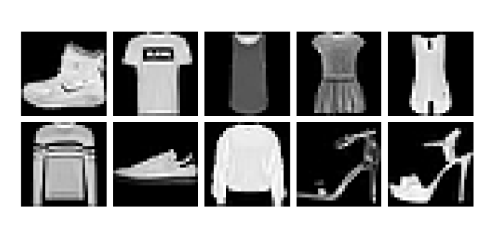

# [Package development](@id development)

The cool thing about Julia is the simplicity of creating packages and sharing them with others. This section contains a step-by-step tutorial on how to build a package from scratch. Moreover, we will use this package later in the course.

## Pkg templates

We first generate an empty package `PackageName` by the built-in function `generate` in the Pkg REPL.

```julia
(@v1.7) pkg> generate PackageName
 Generating  project PackageName:
    PackageName/Project.toml
    PackageName/src/PackageName.jl
```

This way generates the new package in the working directory. However, we may also specify an absolute or relative path to generate it elsewhere. The `generate` function creates a new folder (with the name matching the package name) with the following content.

```julia
├── Project.toml
└── src
    └── PackageName.jl
```

The new package consists of the `Project.toml` file and the `src` folder with one `.jl` file. The `src/PackageName.jl` file contains a module `PackageName`. The package, the `.jl` file, and the module share the same name. **Since we will modify multiple files during this lecture, we will often specify which file we work with.**

```julia
# /src/PackageName.jl
module PackageName

greet() = print("Hello World!")

end # module
```

Since the `generate` function creates an empty package, the `Project.toml` contains only information describing the package name, its unique UUID, version, and author list.

```toml
name = "PackageName"
uuid = "fa38fd22-11d6-48c8-ae38-ef06258216d8"
authors = ["Author Name"]
version = "0.1.0"
```

Since the `Project.toml` file `src/*.jl` files are sufficient for determining a  package, packages are modules with their own environment.

The built-in `generate` function provides only basic functionality for generating packages. Even though it is sufficient in many cases, the [PkgTemplates](https://github.com/invenia/PkgTemplates.jl) package offers a straightforward and customizable way for creating packages.

```@raw html
<div class="admonition is-category-exercise">
<header class="admonition-header">Exercise:</header>
<div class="admonition-body">
```

The goal of this exercise is to create a new package by the PkgTemplates package. Install PkgTemplates and then use the following code to generate a new package template.

```julia
using PkgTemplates

template = Template(;
    user = "GithubUserName",            # github user name
    authors = ["Author1", "Author2"],   # list of authors
    dir = "/Path/To/Dir/",              # dir in which the package will be created
    julia = v"1.7",                     # compat version of Julia
    plugins = [
        !CompatHelper,                  # disable CompatHelper
        !TagBot,                        # disable TagBot
        Readme(; inline_badges = true), # added readme file with badges
        Tests(; project = true),        # added Project.toml file for unit tests
        Git(; manifest = false),        # add manifest.toml to .gitignore
        License(; name = "MIT")         # addedMIT licence
    ],
)
```

Do not forget to change `user`, `authors` and `dir`.

In the rest of the lecture, we will write code to visualize grayscale and colour images. Come up with a proper package name and use the following code to generate a new package.

```julia
template("PackageName")
```

For naming conventions, see the official [package naming guidelines](https://julialang.github.io/Pkg.jl/v1/creating-packages/#Package-naming-guidelines). Finally, create the folder `examples` in the main package folder.

```@raw html
</div></div>
<details class = "solution-body">
<summary class = "solution-header">Solution:</summary><p>
```

There is no best way to choose the correct package name. We decided to use `ImageInspector` and create the package by the following code:

```julia
template("ImageInspector")
```

After creating the `ImageInspector` package, we can add the `examples` folder manually or use the `mkdir` function to create it. For the latter, we use the `joinpath` function to specify the correct path.

```julia
mkdir(joinpath("/Path/To/Dir/", "ImageInspector", "examples"))
```

The generated folder contains more files than the folder generated by the built-in `generate` function.

```julia
├── .git
├── .gitignore
├── LICENSE
├── Manifest.toml
├── Project.toml
├── README.md
├── examples
├── src
│   └── ImageInspector.jl
└── test
    ├── Manifest.toml
    ├── Project.toml
    └── runtests.jl
```

```@raw html
</p></details>
```

!!! bonus "Interactive package generation:"
    PkgTemplate provides an interactive way to generate a new package. The template can be created interactively by the following command:

    ```julia
    Template(; interactive=true)
    ```

    The exercise above used a simple template. However, PkgTemplates provides many additional features to simplify the package generation process. Some plugins add documentation or integration with GitHub features. See the official [PkgTemplates documentation](https://invenia.github.io/PkgTemplates.jl/stable/) for more information.

## Development mode

In the previous section, we created a new empty package. In this section, we will fill the package with content. **Before we continue, open the main folder of the ImageInspector package in a new VS Code window.** One can access it from `File -> Open folder`.

The content of the `ImageInspector` folder can be divided into four parts:
- *Root folder* contains information about the package and git.
- *Folder src* contains the package source code.
- *Folder tests* contains the testing scripts for verifying the code correctness.
- *Folder examples* is used to run examples.
The first three are standard, while we added the last folder manually. We can add more folders, such as `data`.

We first activate a new environment in the `examples` folder.

```julia
(ImageInspector) pkg> activate ./examples

(examples) pkg>
```

Then we use the `dev` (or `develop`) command to tell Julia that the `ImageInspector` folder is a package, and we want to start its development. The important thing to realize is that the *working directory* is `.../ImageInspector`, while the *working environment* is `.../ImageInspector/examples`. Since the dot in `dev .` specifies the working directory, this command will add the package from the working directory into the working environment.

```julia
julia> pwd()
.../ImageInspector

(examples) pkg> dev . # or dev /absolute/or/relative/path/ImageInspector/

(examples) pkg> st
Status `.../ImageInspector/examples/Project.toml`
  [5c9991e7] ImageInspector v0.1.0 `..`
```

Like the `add` command, the `dev` command allows us to load the package by `using` or `import`. The difference between `add` and `dev` is that the `dev` command tracks the package current state and not a concrete git commit in some branch.

!!! warning "Default Julia enviroment in VS Code:"
    The VS Code allows setting a default Julia environment that is activated when Julia REPL is opened. We can do this by pressing `Julia env: ` located at the bottom info bar and selecting the desired environment.

We now create a script `/examples/example.jl` for testing the package functionality. In the rest of the lecture, we will use relative paths from the main folder of the `ImageInspector` package to specify the code location.

```julia
# /examples/example.jl
using ImageInspector
```

Julia can load a package only once per Julia session. If we load a package by the `using` or `import` commands and then make changes in the code, these changes will not be reloaded. This holds even if we try to reload the package by running `using` or `import` again. For example, we add the `greet` function to the `ImageInspector` package.

```julia
# /src/ImageInspector.jl
module ImageInspector

export greet

greet() = print("Hello World!")

end
```

Since we have already loaded the package, this change is not reloaded. If we call the `greet` function, we get the `UndefVarError` error.

```julia
julia> greet()
ERROR: UndefVarError: greet not defined
```

In this case, we have to restart Julia. There are two ways how to exit Julia interactive session: using keyword shortcut `ctrl + D` or using the `exit()` function. Even though we can use the `greet()` function after the restart, we will not do it yet. The reason is that we would have to restart Julia again after making any changes to the package. Since this is not a convenient way to code, we will use the [Revise](https://github.com/timholy/Revise.jl) package. Even though it provides lots of convenient features, we will present only its basic use. First, we install it.

```julia
(examples) pkg> add Revise
```

If we develop a package and load the Revise package first, all package changes will be reloaded without restarting Julia.

```julia
# /examples/example.jl
using Revise # this must come before `using ImageInspector`
using ImageInspector

greet()
```

```julia
Hello World!
```

We now add the `greet2` function.

```julia
# /src/ImageInspector.jl
module ImageInspector

export greet, greet2

greet() = print("Hello World!")
greet2() = print("Hello World!!!!")

end
```

Since we are using the `Revise` package, it should be possible to call the `greet2` function without restarting Julia session.

```julia
julia> greet2()
Hello World!!!!
```

## Adding content 1

This section adds content to the package.

```@raw html
<div class="admonition is-category-exercise">
<header class="admonition-header">Exercise:</header>
<div class="admonition-body">
```

This exercise defines the `image` function that converts a matrix of real numbers to a matrix of Gray points. Real numbers can be converted to Gray points by the `Gray` constructor from the Colors package. Use the following code to test the function.

```julia
# /examples/example.jl
using Revise # this must come before `using ImageInspector`
using ImageInspector, MLDatasets, Plots

X = MLDatasets.FashionMNIST(Float64, :train)[:][1];
x = selectdim(X, ndims(X), 1)

plot(image(x); axis = nothing, border = :none)
```

**Hint:** Each Julia package contains its environment for tracking package dependencies. Use proper commands in the Pkg REPL to add `Colors` as a dependency of the ImageInspector package. Do not forget to add `MLDatasets` and `Plots` to the `examples` environment.

```@raw html
</div></div>
<details class = "solution-body">
<summary class = "solution-header">Solution:</summary><p>
```

First, we need to install all necessary packages. Since we set the `examples` environment as the default one for this project, we first install `MLDatasets` and `Plots`.

```julia
(examples) pkg> add MLDatasets Plots
```

Since we want to add the `image` function to the ImageInspector package, we have to install the Colors package. However, we do not want to add it to `examples` but to `ImageInspector`. Printing the working directory by `pwd()`, we realize that we are in the correct folder and activate the working environment by `activate .` The dot represents the current working directory.

```julia
julia> pwd()
".../ImageInspector"

(examples) pkg> activate .
 Activating environment at `/path/ImageInspector/Project.toml`
```

Now we use `add Colors` to install the Colors package.

```julia
(ImageInspector) pkg> add Colors
```

Since we want to work in `examples`, we change the environment back.

```julia
(ImageInspector) pkg> activate ./examples

(examples)
```

With the Colors package installed, we have to add `using Colors` into the ImageInspector module. Then we can define the `image` function and `export` it.

```julia
# /src/ImageInspector.jl
module ImageInspector

using Colors

export image

image(x::AbstractMatrix{<:Real}) = Gray.(x)

end
```

```@raw html
</p></details>
```


The previous exercise used the MLDatasets package that provides many well-known datasets used in machine learning. One of them is the `FashionMNIST` dataset of gray images of clothes. However, the resulting image is rotated 90 degrees. The reason is that images in the FashionMNIST dataset are stored in the **width x height** format, but the Plots package assumes the **height x width** format. We solve this issue by redefining the `image` function.

```julia
function image(x::AbstractMatrix{T}; flip = true) where {T <: Real}
    xx = flip ? PermutedDimsArray(x, (2, 1)) : x
    return Gray.(xx)
end
```

In the definition of `image`, we use `PermutedDimsArray` that creates a permuted view without making a copy. There is also the `permutedims` function that does the same but creates a copy. Now we plot both images.

```julia
# /examples/example.jl
plot(
    plot(image(x; flip = true); title = "flip = true"),
    plot(image(x; flip = false); title = "flip = false");
    axis = nothing,
    border = :none,
)
```


The `image` function also used `AbstractMatrix` to specify that the input must be a matrix. In general, we can specify the types of multi-dimensional input arrays in multiple ways:
- `AbstractArray` specifies that the input must be an array.
- `AbstractArray{T}` specifies that the input must be an array with elements of type `T`.
- `AbstractArray{T, N}` specifies that the input must be an array of dimension `N` with elements of type `T`.
- `AbstractMatrix` or `AbstractMatrix{T}` is equivalent to  `AbstractArray` with `N=2`.
- `AbstractVector` or `AbstractVector{T}` is equivalent to  `AbstractArray` with `N=1`.
We will now extend the `image` function to three-dimensional inputs. The third dimension represents the colour channels.

```@raw html
<div class="admonition is-category-exercise">
<header class="admonition-header">Exercise:</header>
<div class="admonition-body">
```

Write a method for the `image` function that converts a 3D array of real numbers to its image representation. Assume that the third dimension represents the colour channels. Three channels should be converted to an RGB point extracting the RGB channels and `RGB.(r, g, b)`. If the size of the third dimension is:

- `1` the function should return a grayscale image,
- `3` the function should return a colour image,
- otherwise, the function should throw an error.

Use the following code to test the `image` function.

```julia
# /examples/example.jl
X1 = MLDatasets.FashionMNIST(Float64, :train)[:][1];
X2 = MLDatasets.CIFAR10(Float64, :train)[:][1];

x1 = selectdim(X1, ndims(X1), 1)
x2 = selectdim(X2, ndims(X2), 1)

plot(
    plot(image(x1)),
    plot(image(x2));
    axis = nothing,
    border = :none
)
```

**Hint:** use the `eachslice` function to split the array along the third dimension and the `dropdims` function to drop a dimension slice.

```@raw html
</div></div>
<details class = "solution-body">
<summary class = "solution-header">Solution:</summary><p>
```

The functionality depends on the size of the third dimension.
- If the size of the third dimension is 1, we use the `dropdims` to remove the third dimension. Then we call the `image` method from the previous exercise.
- If the dimension size is 3, we use `PermutedDimsArray` if `flip` is true. We can extract the three channels manually, or we can use the `eachslice` function.
- Otherwise, we throw an `ArgumentError`.
Altogether, the new method can be defined as follows.

```julia
# /src/ImageInspector.jl
function image(x::AbstractArray{T,3}; flip = true) where {T <: Real}
    s = size(x, 3)
    if s == 1
        return image(dropdims(x; dims = 3); flip)
    elseif s == 3
        xx = flip ? PermutedDimsArray(x, (2, 1, 3)) : x
        r, g, b = eachslice(xx; dims=3)
        return RGB.(r, g, b)
    else
        throw(ArgumentError("unsupported size of the third dimension $(s) ∉ [1,3]."))
    end
end
```

```@raw html
</p></details>
```


Multiple images are usually stored in multi-dimensional arrays. For example, grayscale images are stored as 3D or 4D arrays, where the last dimension represents individual images. Similarly, colour images are stored as a 4D array.

```@raw html
<div class="admonition is-category-exercise">
<header class="admonition-header">Exercise:</header>
<div class="admonition-body">
```

Add new methods for the `image` function with the following properties:

- New methods should accept two arguments:
    - `x`: 3D or 4D array of real numbers that represents images,
    - `inds`: one or more image indices to extract and convert to Gray/RGB representation.
- If only one index is provided, the method should return a single image in its representation.
- If more indices are provided, the method should return an array of images.

Use the following code to test the `image` function.

```julia
# /examples/example.jl
X = MLDatasets.FashionMNIST(Float64, :train)[:][1];

plot(plot.(image(X, [1,2]))...; axis = nothing, border = :none)
```

```@raw html
</div></div>
<details class = "solution-body">
<summary class = "solution-header">Solution:</summary><p>
```

We have four possible combinations of the input arguments:

1. 3D array and one index,
2. 3D array and multiple indices,
3. 4D array and one index,
4. 4D array and multiple indices.

We should, therefore, define a method for each combination of input arguments. We can do this in the following way:

```julia
# /src/ImageInspector.jl
image(x::AbstractArray{T,3}, inds; flip = true) where {T <: Real} = [image(x[:,:,i]; flip) for i in inds]
image(x::AbstractArray{T,4}, inds; flip = true) where {T <: Real} = [image(x[:,:,:,i]; flip) for i in inds]
image(x::AbstractArray{T,3}, ind::Int; flip = true) where {T <: Real} = image(x, [ind]; flip)[1]
image(x::AbstractArray{T,4}, ind::Int; flip = true) where {T <: Real} = image(x, [ind]; flip)[1]
```

Since `x[:,:,i]` creates a new copy, it can be replaced by `selectdim(x, 3, i)`, which creates a view.

```@raw html
</p></details>
```


## [Unit testing](@id unit-testing)

The previous section added the `image` function with multiple methods. We also manually tested if these methods work correctly. Even though this practice works for small projects, it is not optimal for code testing and should be automized by [unit testing](https://en.wikipedia.org/wiki/Unit_testing). The `Test` package from the standard library provides utility functions to simplify writing unit tests. Its core is the `@test` macro that tests if an expression evaluates as `true`.

```@repl tests
using Test

@test 1 == 1
@test 1 == 3
```

It is possible to pass additional arguments to the `@test` macro.

```@repl tests
@test π ≈ 3.14 atol=0.01
```

If we go back to our package, we can start writing tests for the methods of the `image` function. All tests should be located in the ` /test` folder with its own environment. First, we have to import all necessary packages: `Test`, `ImageInspector` and `Colors`. Since we used `PkgTemplates` to generate the package, the `test` folder and the environment are both already generated. Moreover, the environment already contains the `Test` package. We do not have to add the `ImageInspector` package because it is added automatically. For simplicity, we use the environment from the `examples` folder.

```julia
# /test/runtests.jl
using ImageInspector
using Test
using ImageInspector.Colors
```

We import `Colors` from the `ImageInspector` to use the same version. Now we define inputs and expected outputs for the `image` function.

```julia
# /test/runtests.jl
x = [0.1 0.2; 0.3 0.4];
img = Gray.(x);
img_flipped = Gray.(x');
```

Since the input to the `image` function is a matrix, we test the first method of the `image` function that creates grayscale images.

```julia
julia> @test image(x) == img_flipped
Test Passed

julia> @test image(x; flip = false) == img
Test Passed

julia> @test image(x; flip = true) == img_flipped
Test Passed
```

Since all tests passed correctly, the message `Test Passed` is printed after each test. It is a good idea to group tests logically by the `@testset` macro.

```julia
# /test/runtests.jl
julia> @testset "image function" begin
           @test image(x) == img_flipped
           @test image(x; flip = false) == img
           @test image(x; flip = true) == img_flipped
       end
Test Summary:  | Pass  Total
image function |    3      3
```

We use the `begin ... end` block to specify which tests should be grouped. Moreover, it is possible to combine the `@testset` macro and the `for` loop to perform multiple tests at once. For example, we may want to test the `image` function for different input images.

```julia
# /test/runtests.jl
x1 = [0.1 0.2];
x2 = [0.1 0.2; 0.3 0.4];
x3 = [0.1 0.2 0.3; 0.4 0.5 0.6];
x4 = [0.1 0.2; 0.3 0.4; 0.5 0.6];
x5 = [0.1, 0.2];
```

In such a case, we use nested test sets to group all tests. This approach has the advantage that each iteration of the loop is treated as a separate test set.

```julia
julia> @testset "image function" begin
           @testset "size(x) = $(size(x))" for x in [x1, x2, x3, x4, x5]
               img = Gray.(x);
               img_flipped = Gray.(x');
               @test image(x) == img_flipped
               @test image(x; flip = false) == img
               @test image(x; flip = true) == img_flipped
           end
       end
size(x) = (2,): Error During Test
[...]
Test Summary:      | Pass  Error  Total
image function     |   12      3     15
  size(x) = (1, 2) |    3             3
  size(x) = (2, 2) |    3             3
  size(x) = (2, 3) |    3             3
  size(x) = (3, 2) |    3             3
  size(x) = (2,)   |           3      3
ERROR: Some tests did not pass: 12 passed, 0 failed, 3 errored, 0 broken.
```

Not all tests passed. The reason is that the variable `x5` is a vector. From the list of all methods defined for the `image` function, we see that there is no method for a vector.

```julia
julia> methods(image)
# 6 methods for generic function "image":
[1] image(x::AbstractArray{var"#s1",2} where var"#s1"<:Real) in ImageInspector at [...]
[2] image(x::AbstractArray{T,3}; flip) where T<:Real in ImageInspector at [...]
[3] image(x::AbstractArray{T,3}, ind::Int64; flip) where T<:Real in ImageInspector at [...]
[4] image(x::AbstractArray{T,3}, inds; flip) where T<:Real in ImageInspector at [...]
[5] image(x::AbstractArray{T,4}, ind::Int64; flip) where T<:Real in ImageInspector at [...]
[6] image(x::AbstractArray{T,4}, inds; flip) where T<:Real in ImageInspector at [...]
```

If we pass a vector as an argument, the `MethodError` will appear. The `Test` package provides the `@test_throw` macro to test if the expression throws the correct exception.

```julia
julia> @test_throws MethodError image(x5)
Test Passed
      Thrown: MethodError
```

The final testing file should be similar to the following one.

```julia
# /test/runtests.jl
using ImageInspector
using ImageInspector.Colors
using Test

@testset "ImageInspector.jl" begin
    x1 = [0.1 0.2]
    x2 = [0.1 0.2; 0.3 0.4]
    x3 = [0.1 0.2 0.3; 0.4 0.5 0.6]
    x4 = [0.1 0.2; 0.3 0.4; 0.5 0.6]
    x5 = [0.1, 0.2]

    @testset "size(x) = $(size(x))" for x in [x1, x2, x3, x4]
        img = Gray.(x);
        img_flipped = Gray.(x');
        @test image(x) == img_flipped
        @test image(x; flip = false) == img
        @test image(x; flip = true) == img_flipped
    end

    @test_throws MethodError image(x5)
end
```

There is `Project.toml` and `Manifest.toml` files in the `test` folder. Creating a different environment has the advantage that it may contain packages needed only for testing. We can run tests directly from the Pkg REPL by the `test` command.

```julia
(examples) pkg> test ImageInspector
    Testing ImageInspector
Status `.../Project.toml`
  [...]
Status `.../Manifest.toml`
  [...]
Test Summary:     | Pass  Total
ImageInspector.jl |   13     13
    Testing ImageInspector tests passed
```


## Writing documentation

Writing documentation is a good coding practice. It helps others to understand your code. It may even help the author after working on the code after an extended break. The most used documentation type is the [docstring](https://docs.julialang.org/en/v1/manual/documentation/), a multiline string describing the functionality.

````julia
# /src/ImageInspector.jl
"""
    image(x::AbstractMatrix{T}; flip = true)

Converts a matrix of real numbers to a matrix of `Gray` points. If the keyword argument
`flip` is true, the matrix is transposed.

# Example

```julia-repl
julia> x = [0.1 0.25; 0.4 0.6]
2×2 Matrix{Float64}:
 0.1  0.25
 0.4  0.6

julia> image(x)
2×2 Array{Gray{Float64},2} with eltype Gray{Float64}:
 Gray{Float64}(0.1)   Gray{Float64}(0.4)
 Gray{Float64}(0.25)  Gray{Float64}(0.6)

julia> image(x; flip = false)
2×2 Array{Gray{Float64},2} with eltype Gray{Float64}:
 Gray{Float64}(0.1)  Gray{Float64}(0.25)
 Gray{Float64}(0.4)  Gray{Float64}(0.6)
```
"""
function image(x::AbstractMatrix{T}; flip = true) where {T <: Real}
    xx = flip ? PermutedDimsArray(x, (2, 1)) : x
    return Gray.(xx)
end
````

We first wrote a function header, and then we used one tab as an indentation. Then we wrote a short description of the function. Finally, we wrote usage examples. To get a well-looking format of the docstring, we use [markdown](https://en.wikipedia.org/wiki/Markdown) `# Example` to represents a title. We use the `julia-repl` block to write code. Now we type the function name into the Julia help.


```julia
help?> image
search: image imag

  image(x::AbstractMatrix{T}; flip = true)

  Converts a matrix of real numbers to a matrix of `Gray` points. If the keyword argument
  `flip` is true, the matrix is transposed.

  Example
  ≡≡≡≡≡≡≡≡≡

  julia> x = [0.1 0.25; 0.4 0.6]
  2×2 Matrix{Float64}:
   0.1  0.25
   0.4  0.6

  julia> image(x)
  2×2 Array{Gray{Float64},2} with eltype Gray{Float64}:
   Gray{Float64}(0.1)   Gray{Float64}(0.4)
   Gray{Float64}(0.25)  Gray{Float64}(0.6)

  julia> image(x; flip = false)
  2×2 Array{Gray{Float64},2} with eltype Gray{Float64}:
   Gray{Float64}(0.1)  Gray{Float64}(0.25)
   Gray{Float64}(0.4)  Gray{Float64}(0.6)
```

!!! info "Creating reports:"
    Reports may be written externally in Latex. However, when we want to show some code, it may be advantageous to write them directly in Julia and export them to [Jupyter notebooks](https://jupyter.org/). The [Literate](https://fredrikekre.github.io/Literate.jl/v2/) package allows combining Julia code with the [Markdown syntax](https://www.markdownguide.org/cheat-sheet) in a script. We mention the following code, which should be read with the soft wrapping on, as an example:

    ```julia
    # # ImageInspector

    # ImageInspector is a small package for educational purposes. Its main goal is not presenting functionality, but presenting package structure. This is its short documentation created in the package [Literate](https://fredrikekre.github.io/Literate.jl/v2) which uses the [Markdown](https://www.markdownguide.org/cheat-sheet) syntax.

    # To use the package, we need to load first the required packages.

    using ImageInspector
    using Plots

    # ## Grayscale images

    # As a test example, we create the real matrix `img1` representing a circle. We first discretize the domain $[-1,1]$ in `xs`. We assign black colour whenever $x^2 + y^2 \le 1$. Since the white colour is represented by `[1; 1; 1]` and the black colour by `[0; 0; 0]`, we can do it by the following code:

    xs = -1:0.001:1
    img1 = [x^2+y^2>1 for x in xs, y in xs];

    # This is a two-dimensional matrix, which represents a grayscale image. We convert it to an image by calling `image` and then we plot it.

    plot(image(img1); axis = nothing, border = :none)

    ```

    The Markdown syntax starts with `#`. Among others, it allows to use:
    - Links such as `[Literate](https://fredrikekre.github.io/Literate.jl/v2)`.
    - Variables or latex syntax such as `$[-1,1]$`.

    Exporting the script into a notebook is simple.

    ```julia
    julia> Literate.notebook("report.jl"; execute=false)
    ```

    The resulting notebook can be found at our [Github](https://github.com/JuliaTeachingCTU/ImageInspector.jl/blob/master/report/report.ipynb). All required data are in the [report folder](https://github.com/JuliaTeachingCTU/ImageInspector.jl/tree/master/report).

## Adding content 2

We will add more functions to the `ImageInspector` package. To plot multiple images at once, we will define two functions. The first one computes an optimal grid size for a given number of images.

```julia
# /src/ImageInspector.jl
function gridsize(n::Int; nrows::Int = -1, ncols::Int = - 1)
    if nrows < 1
        if ncols < 1
            nrows = round(Int, sqrt(n))
            ncols = ceil(Int, n / nrows)
        else
            nrows = ceil(Int, n / ncols)
        end
    else
        ncols = ceil(Int, n / nrows)
    end
    return nrows, ncols
end
```

The second function consists of two methods and converts an array of real numbers to one big image of the appropriate colour type.

```julia
# /src/ImageInspector.jl
imagegrid(x, ind::Int; flip = true, kwargs...) = image(x, ind; flip)

function imagegrid(x, inds; flip = true, sep = 1, kwargs...)
    imgs = image(x, inds; flip)
    n = length(imgs)
    nrows, ncols = gridsize(n; kwargs...)

    h, w = size(imgs[1])
    A = fill(
        eltype(imgs[1])(1), # white color in proper color type
        nrows*h + (nrows + 1)*sep, # height of the reculting image
        ncols*w + (ncols + 1)*sep, # width of the reculting image
    )

    for i in 1:nrows, j in 1:ncols
        k = j + (i - 1) * ncols
        k > n && break

        rows = (1:h) .+ (i - 1)*h .+ i*sep
        cols = (1:w) .+ (j - 1)*w .+ j*sep
        A[rows, cols] = imgs[k]
    end
    return A
end
```

We use the `sep` keyword argument to specify the separator width between images. With all functions defined, we can test them.

```julia
# /examples/example.jl
X = MLDatasets.FashionMNIST(Float64, :train)[:][1];

plot(imagegrid(X, 1:10; nrows = 2, sep = 2); axis = nothing, border = :none)
```



!!! bonus "Optional dependencies:"
    We used the same settings for the `plot` function in all previous examples. Therefore, it makes sense to write an auxiliary function setting attributes for the `plot` function. However, this function will depend on the `Plots` package, and if we add `Plots` to `ImageInspector`, it will significantly slow the loading time. The `Requires` package prevents explicit dependencies (and long load times) by allowing conditional code loading. In our case, we first add `Requires` to the `ImageInspector`.

    ```julia
    julia> pwd()
    ".../ImageInspector"

    (examples) pkg> activate .
    Activating environment at `/path/ImageInspector/Project.toml`

    (ImageInspector) pkg> add Requires
    [...]

    (ImageInspector) pkg> activate

    (examples)
    ```

    Then we create a new file `/src/imageplot.jl` with the following content:

    ```julia
    # /src/imageplot.jl
    using .Plots

    export imageplot

    imageplot(x; flip = true, kwargs...) =  imageplot(image(x; flip); kwargs...)

    function imageplot(x, ind; flip = true, nrows = -1, ncols = -1, sep = 1, kwargs...)
        img = imagegrid(x, ind; flip, nrows, ncols, sep)
        return imageplot(img; kwargs...)
    end

    function imageplot(
        x::AbstractMatrix{<:Color};
        legend = false,
        axis = nothing,
        border = :none,
        kwargs...
    )
        return plot(x; legend, axis, border, kwargs...)
    end
    ```

    We only defined a wrapper function for the `plot` function and exported this function. We use a relative path to the `Plots` package. Then we specify on which package the code depends by defining the `__init__()` function in the `/src/ImageInspector.jl` file.

    ```julia
    # /src/ImageInspector.jl
    using Requires

    function __init__()
        @require Plots="91a5bcdd-55d7-5caf-9e0b-520d859cae80" include("imageplot.jl")
    end
    ```

    The `__init__` function has to contain the `@require` macro followed by the package name and its unique UUID (can be found in the [JuliaRegistries](https://github.com/JuliaRegistries/General) for public packages) and the code that should be included.

    Now we can start a new Julia session and test if the loading works properly. If we do not load `Plots`, the `imageplot` function will not be available, as can be seen below.

    ```julia
    julia> x = MLDatasets.CIFAR10(Float64, :train)[1:10][1]

    julia> imageplot(x, 1:10; nrows = 2, sep = 2)
    ERROR: UndefVarError: imageplot not defined
    ```

    After loading the `Plots` package, the `imageplot` function will start working.

    ```julia
    julia> using Plots

    julia> imageplot(x, 1:10; nrows = 2, sep = 1)
    ```

    
