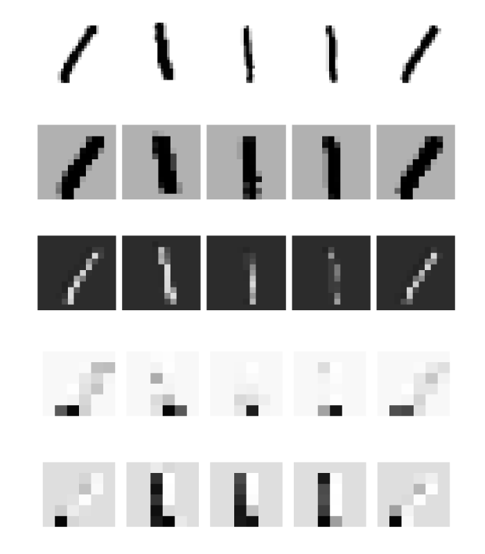

```@setup gpuu
using BSON
using Flux
using Flux: onehotbatch, onecold
using MLDatasets

Core.eval(Main, :(using Flux)) # hide
ENV["DATADEPS_ALWAYS_ACCEPT"] = true
MNIST.traindata()

function reshape_data(X::AbstractArray{T, 3}, y::AbstractVector) where T
    s = size(X)
    return reshape(X, s[1], s[2], 1, s[3]), reshape(y, 1, :)
end

function train_or_load!(file_name, m, X, y; force=false, kwargs...)
    
    !isdir(dirname(file_name)) && mkpath(dirname(file_name))

    if force || !isfile(file_name)
        train_model!(m, X, y; file_name=file_name, kwargs...)
    else
        m_loaded = BSON.load(file_name)[:m]
        Flux.loadparams!(m, params(m_loaded))
    end
end

function load_data(dataset; T=Float32, onehot=false, classes=0:9)    
    X_train, y_train = reshape_data(dataset.traindata(T)...)
    X_test, y_test = reshape_data(dataset.testdata(T)...)
    y_train = T.(y_train)
    y_test = T.(y_test)

    if onehot
        y_train = onehotbatch(y_train[:], classes)
        y_test = onehotbatch(y_test[:], classes)
    end

    return X_train, y_train, X_test, y_test
end

using Plots

plot_image(x::AbstractArray{T, 2}) where T = plot(Gray.(1 .-x'), axis=nothing)

function plot_image(x::AbstractArray{T, 3}) where T
    size(x,3) == 1 || error("Image is not grayscale.")
    plot_image(x[:,:,1])
end


T = Float32
dataset = MLDatasets.MNIST

X_train, y_train, X_test, y_test = load_data(dataset; T=T, onehot=true)
```


# Exercises

The first two exercises handle training neural networks on GPUs instead of CPUs. Even though this is extremely important for reducing the training time, we postponed it to the exercises because some course participants may not have a compatible GPU for training. If you are not able to do these two exercises for this reason, we apologize.


```@raw html
<div class = "exercise-body">
<header class = "exercise-header">Exercise 1: Operations on GPUs</header><p>
```
While most computer operations are performed on CPUs (central processing unit), neural networks are trained on other hardware such as GPUs (graphics processing unit) or specialized hardware such as TPUs. 

To use GPUs, include packages Flux and CUDA. Then generate a random matrix ``A\in \mathbb{R}^{100\times 100}`` and a random vector ``b\in \mathbb{R}^{100}``. They will be stored in the memory (RAM) and the computation will be performed on CPU. To move them to the GPU memory and allow computations on GPU, use ```gpu(A)``` or the more commonly used ```A |> gpu```.

Investigate how long it takes to perform multiplication ``Ab`` if both objects are on CPU, GPU or if they are saved differently. Check that both multiplications resulted in the same vector.
```@raw html
</p></div>
<details class = "solution-body">
<summary class = "solution-header">Solution:</summary><p>
```
The beginning is simple
```julia
using Flux
using CUDA

A = randn(100,100)
b = randn(100)
A_g = A |> gpu
b_g = b |> gpu
```
To test the time, we measure the time for multiplication
```julia
@time A*b;
@time A_g*b_g;
@time A_g*b;
```
```julia
0.069785 seconds (294.76 k allocations: 15.585 MiB, 14.75% gc time)
0.806913 seconds (419.70 k allocations: 22.046 MiB)
0.709140 seconds (720.01 k allocations: 34.860 MiB, 1.53% gc time)
```
We see that all three times are different. Can we infer anything from it? No! The problem is that during a first call to a function, some compilation usually takes place. We should always compare only the second time.
```julia
@time A*b;
@time A_g*b_g;
@time A_g*b;
```
```julia
0.000083 seconds (1 allocation: 896 bytes)
0.000154 seconds (11 allocations: 272 bytes)
0.475280 seconds (10.20 k allocations: 957.125 KiB)
```
We conclude that while the computation on CPU and GPU takes approximately the same time, when using the mixed types, it takes much longer. 

To compare the results, the first idea would be to run
```julia
norm(A*b - A_g*b_g)
```
which would result in an error. We cannot use any operations on arrays stored both on CPU and GPU. The correct way is to move the GPU array to CPU and only then to compute the norm
```julia
using LinearAlgebra

norm(A*b - cpu(A_g*b_g))
```
```julia
1.2004562847861718e-5
```
The norm is surprisingly large. Checking the types
```julia
(typeof(A), typeof(A_g))
```
```julia
(Array{Float64,2}, CUDA.CuArray{Float32,2})
```
we realize that one of the arrays is stored in ```Float64``` while the second one in ```Float32```. Due to the different number of saved digits, the multiplication results in this error.
```@raw html
</p></details>
```


The previous exercise did not show any differences when performing a matrix-vector multiplication. The probable reason was that the running times were too short. The next exercise shows the time difference when applied to a larger problem.  


```@raw html
<div class = "exercise-body">
<header class = "exercise-header">Exercise:</header><p>
```
Load the MNIST dataset and the model saved in ```data/mnist.bson```. Compare the evaluation of all samples from the testing set when done on CPU and GPU. For the latter, you need to convert the model to GPU.
```@raw html
</p></div>
<details class = "solution-body">
<summary class = "solution-header">Solution:</summary><p>
```
We load the data, model and convert everything to GPU
```julia
using CUDA

m = Chain(
    Conv((2,2), 1=>16, relu),
    MaxPool((2,2)),
    Conv((2,2), 16=>8, relu),
    MaxPool((2,2)),
    flatten,
    Dense(288, size(y_train,1)),
    softmax,
)

file_name = joinpath("data", "mnist.bson")
train_or_load!(file_name, m, X_train, y_train)

m_g = m |> gpu
X_test_g = X_test |> gpu
```
Now we can measure the evaluation time. Remember that before doing so, we need to compile all the functions by evaluating at least one sample.
```julia
m(X_test[:,:,:,1:1])
m_g(X_test_g[:,:,:,1:1])

@time m(X_test);
@time m_g(X_test_g);
```
```julia
1.190033 seconds (40.24 k allocations: 1.069 GiB, 21.73% gc time)
0.071805 seconds (789 allocations: 27.641 KiB)
```
Using GPU speeded the computation by more than ten times. 
```@raw html
</p></details>
```


```@raw html
<div class = "info-body">
<header class = "info-header">Computation on GPU</header><p>
```
Using GPUs speeds up the training of neural networks in orders of magnitude. However, one needs to be aware of some pitfalls.

Make sure that all computation is performed either on CPU or GPU. Do not mix them. When computing on GPU, make sure that all computations are fast. One important example is
```julia
accuracy(x, y) = mean(onecold(cpu(m(x))) .== onecold(cpu(y)))
```
Because ```onecold``` accesses individual elements of an array, it is extremely slow on GPU. For this reason, we need to move the arrays on CPU first.

Another thing to remember is to always convert all objects to CPU before saving them.
```@raw html
</p></div>
```


Exercises which do not require GPUs start here.


```@raw html
<div class = "exercise-body">
<header class = "exercise-header">Exercise 3:</header><p>
```
Load the network from ```data/mnist.bson```. Then create a ``10\times 10`` table, where the ``(i+1,j+1)`` entry is the number of samples, where digit ``i`` was misclassified as digit ``j``.

Convert the table into a dataframe and add labels.
```@raw html
</p></div>
<details class = "solution-body">
<summary class = "solution-header">Solution:</summary><p>
```
First, we load the data as many times before
```@example gpuu
m = Chain(
    Conv((2,2), 1=>16, relu),
    MaxPool((2,2)),
    Conv((2,2), 16=>8, relu),
    MaxPool((2,2)),
    flatten,
    Dense(288, size(y_train,1)),
    softmax,
)

file_name = joinpath("data", "mnist.bson")
train_or_load!(file_name, m, X_train, y_train)
```
When creating a table, we specify that its entries are ```Int```. We save the predictions ```y_hat``` and labels ```y```. Since we do not use the second argument to ```onecold```, the entries of ```y_hat``` and ```y``` are between 1 and 10. Then we run a for loop over all misclassified samples and add to the error counts. 
```@example gpuu
y_hat = onecold(m(X_test))
y = onecold(y_test)

errors = zeros(Int, 10, 10)
for i in findall(y_hat .!= y)
    errors[y[i], y_hat[i]] += 1
end
```
To create the dataframe, we use ```df = DataFrame(errors)```. It prints correctly integers and not strings. We change labels x1 to miss0, ... Similarly we add the labels as the first column. 
```@example gpuu
using DataFrames

df = DataFrame(errors)

rename!(df, [Symbol("miss$(i)") for i in 0:9])
insertcols!(df, 1, :label => string.(0:9))

nothing # hide
```
```@raw html
</p></details>
```

```@example gpuu
df # hide
```


It is surprising that the largest number of misclassifications is 9 into 7. One would expect 8 to 0, 5 to 6 or 8 to 9. We investigate this in the next exercise.


```@raw html
<div class = "exercise-body">
<header class = "exercise-header">Exercise 4:</header><p>
```
Plot all images which are ``9`` but were classified as ``7``.
```@raw html
</p></div>
<details class = "solution-body">
<summary class = "solution-header">Solution:</summary><p>
```
To plot all these misclassified images, we find their indices and use the function ```plot_image```. Since ```y``` are stored in the 1:10 format, we need to shift the indices by one. Since there are 11 of these images, and since 11 is a prime number, we cannot plot it in a ```layout```. We use a hack and add an empty plot ```p_empty```. When plotting, we specigy the ```layout``` and to minimize the empty space between images also ```size```.
```@example gpuu
i1 = 9
i2 = 7

p = [plot_image(X_test[:,:,:,i]) for i in findall((y.==i1+1) .& (y_hat.==i2+1))]
p_empty = plot(legend=false,grid=false,foreground_color_subplot=:white) 

plot(p..., p_empty; layout=(3,4), size=(800,600)) 

savefig("miss.svg") # hide
```
```@raw html
</p></details>
```


We see that some of the nines could be recognized as a seven even by humans. 

The last exercise visualizes hidden layers of neural networks.


```@raw html
<div class = "exercise-body">
<header class = "exercise-header">Exercise 5: Visualization of neural networks 1</header><p>
```
From the theoretical part we know that output of convolutional layers have the same dimension as inputs. If the activation function is a sigmoid, the output values stay in the interval ``[0,1]`` and can, therefore, be also interpreted as images. The following two exercises will depict how images are propagated through the network.

Use the same network as before but replace ReLU by sigmoid activation functions. Load the model from ```data/mnist_sigmoid.bson```. 

(you can check the accuracy of the model is 0.9831)

???


```@raw html
</p></div>
<details class = "solution-body">
<summary class = "solution-header">Solution:</summary><p>
```


```@example gpuu
m = Chain(
    Conv((2,2), 1=>16, sigmoid),
    MaxPool((2,2)),
    Conv((2,2), 16=>8, sigmoid),
    MaxPool((2,2)),
    flatten,
    Dense(288, size(y_train,1)),
    softmax,
)

file_name = joinpath("data", "mnist_sigmoid.bson")
train_or_load!(file_name, m, X_train, y_train)
```


```@example gpuu
for i in 0:9
    ii = findall(onecold(y_train, 0:9) .== i)[1:5]

    z1 = X_train[:,:,:,ii]
    z2 = m[1:2](X_train[:,:,:,ii])
    z3 = m[1:4](X_train[:,:,:,ii])

    p1 = [plot_image(z1[:,:,1,i]) for i in 1:size(z1,4)]
    p2a = [plot_image(z2[:,:,1,i]) for i in 1:size(z2,4)]
    p3a = [plot_image(z3[:,:,1,i]) for i in 1:size(z3,4)]
    p2b = [plot_image(z2[:,:,end,i]) for i in 1:size(z2,4)]
    p3b = [plot_image(z3[:,:,end,i]) for i in 1:size(z3,4)]
    
    plot(p1..., p2a..., p3a..., p2b..., p3b...; layout=(5,5), size=(600,600))
    savefig("Layers_$(i).svg")
end
```


```@raw html
</p></details>
```





