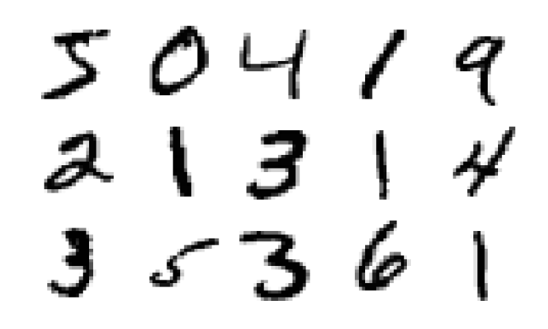
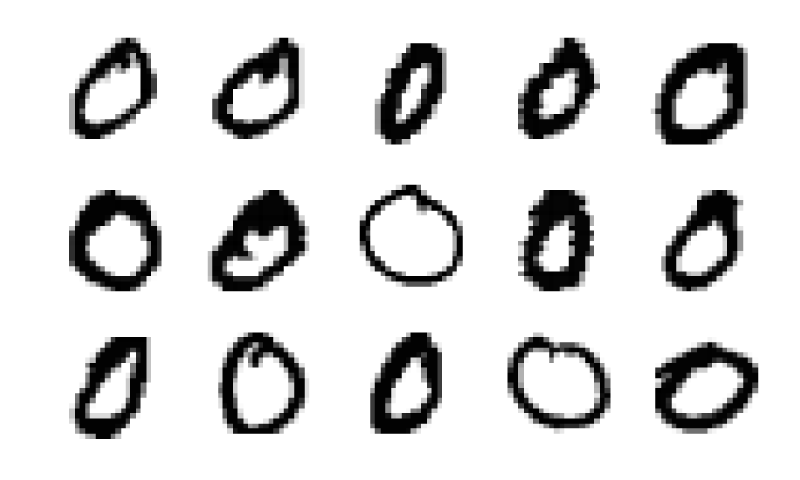

```@setup nn
using Plots
using MLDatasets
# using ImageInspector

Core.eval(Main, :(using Flux)) # hide
ENV["DATADEPS_ALWAYS_ACCEPT"] = true
X_train = MNIST.traindata()[1]

# imageplot(1 .- X_train, 1:15; nrows = 3, size=(800,480))

# savefig("mnist_intro.svg")
```

# More complex networks

This lecture shows how to train more complex networks using stochastic gradient descent. We will use the MNIST dataset containing 60000 images of digits 0-9. Each image is represented by 28 pixels in each dimension.




## Preparing data

During the last lecture, we implemented everything from scratch. This lecture will introduce the package [Flux](https://fluxml.ai/Flux.jl/stable/models/basics/) which automizes most of the things needed for neural networks.
- It creates many layers, including convolutional layers.
- It creates the model by chaining layers together.
- It efficiently represents model parameters.
- It automatically computes gradients and trains the model by updating the parameters.
This functionality requires inputs in a specific format.
- Images must be stored in `Float32` instead of the commonly used `Float64` to speed up operations.
- Convolutional layers require that the input has dimension ``n_x\times n_y\times n_c\times n_s``, where ``(n_x,n_y)`` is the number of pixels in each dimension, ``n_c`` is the number of channels (1 for grayscale, and 3 for coloured images) and ``n_s`` is the number of samples.
- In general, samples are always stored in the last dimension.

We use the package [MLDatasets](https://juliaml.github.io/MLDatasets.jl/stable/) to load the data.

```@example nn
using MLDatasets

T = Float32
X_train, y_train = MLDatasets.MNIST.traindata(T)
X_test, y_test = MLDatasets.MNIST.testdata(T)

nothing # hide
```


The first two exercises visualize the data and transform it into the correct input shape required by Flux.

```@raw html
<div class="admonition is-category-exercise">
<header class="admonition-header">Exercise:</header>
<div class="admonition-body">
```
Plot the first 15 images of the digit 0 from the training set.

**Hint**: The `ImageInspector` package written earlier provides the function `imageplot(X_train, inds; nrows=3)`, where `inds` are the desired indices.

**Hint**: To find the correct indices, use the function `findall`.
```@raw html
</div></div>
<details class = "solution-body">
<summary class = "solution-header">Solution:</summary><p>
```

The unique elements in `y_train` show that it represents the digits.

```@example nn
unique(y_train)
```

Then we use the `findall` function to find the indices of the first 15 images of the digit zero.

```@example nn
inds = findall(y_train .== 0)[1:15]

nothing # hide
```

We use the `imageplot` function to plot the images. To invert the colours, we need to call it with `1 .- X_train` instead of `X_train`.

```julia
using Plots
using ImageInspector

imageplot(1 .- X_train, inds; nrows=3, size=(800,480))

savefig("mnist_intro2.svg") # hide
```

```@raw html
</p></details>
```




```@raw html
<div class="admonition is-category-exercise">
<header class="admonition-header">Exercise:</header>
<div class="admonition-body">
```
Write function `reshape_data`, which reshapes `X_train` and `X_test` into the correct size required by Flux.

**Hint**: The function should work only on inputs with the correct size. This can be achieved by specifying the correct input type `X::AbstractArray{<:Real, 3}`.
```@raw html
</div></div>
<details class = "solution-body">
<summary class = "solution-header">Solution:</summary><p>
```

As we have never worked with MLDatasets, we do not know in which format the loading function returns the data.

```@example nn
typeof(X_train)
```

The variable `X_train` stores a three-dimensional array of images.

```@example nn
size(X_train)
```

Its size shows that the first two dimensions are the number of pixels and the last dimension are the samples. Since the images are grayscale, the dimension representing channels is missing. We need to add it.

```@example nn
function reshape_data(X::AbstractArray{<:Real, 3})
    s = size(X)
    return reshape(X, s[1], s[2], 1, s[3])
end

nothing # hide
```

We specify that the input array has three dimensions via `X::AbstractArray{T, 3}`. This may prevent surprises when called with different input size.

```@raw html
</p></details>
```


We write now the function `load_data`, which loads the data and transform it into the correct shape. The keyword argument `onehot` specifies whether the labels should be converted into their one-hot representation. The `dataset` keyword specifies which dataset to load. It can be any dataset from the MLDatasets package, or we can even use datasets outside of this package provided that we define the `traindata` and `testdata` functions for it.

```@example nn
using Flux
using Flux: onehotbatch, onecold

function load_data(dataset; T=Float32, onehot=false, classes=0:9)
    X_train, y_train = dataset.traindata(T)
    X_test, y_test = dataset.testdata(T)

    X_train = reshape_data(X_train)
    X_test = reshape_data(X_test)

    if onehot
        y_train = onehotbatch(y_train, classes)
        y_test = onehotbatch(y_test, classes)
    end

    return X_train, y_train, X_test, y_test
end

nothing # hide
```

Now we use this function to load the data and modify them into the correct form.

```@example nn
X_train, y_train, X_test, y_test = load_data(MLDatasets.MNIST; T=T, onehot=true)

nothing # hide
```


The previous example mentioned that `load_data` is rather general. The next exercise makes it work for datasets with coloured images.

```@raw html
<div class="admonition is-category-exercise">
<header class="admonition-header">Exercise:</header>
<div class="admonition-body">
```
Try to load the CIFAR10 dataset via the `load_data` function and fix the error in one line of code.

**Hint**: Use ` dataset = MLDatasets.CIFAR10`.
```@raw html
</div></div>
<details class = "solution-body">
<summary class = "solution-header">Solution:</summary><p>
```

We first load the data in the same way as before.

```julia
load_data(MLDatasets.CIFAR10; T=T, onehot=true)
```
```julia
│  MethodError: no method matching reshape_data(::Array{Float32,4})
│  Closest candidates are:
│    reshape_data(::AbstractArray{T,3} where T) where T
```

It results in an error which states that the `reshape_function` functon is not defined for inputs with 4 dimensions. We did not implement it because MNIST contains grayscale images, which leads to arrays with 3 dimensions. To fix the problem, it suffices to add a method to the `reshape_data` function.

```@example nn
reshape_data(X::AbstractArray{<:Real, 4}) = X

nothing # hide
```

Now we can load the data.

```julia
typeof(load_data(MLDatasets.CIFAR10; T=T, onehot=true))
```

```julia
Tuple{Array{Float32,4},Flux.OneHotMatrix{Array{Flux.OneHotVector,1}},Array{Float32,4},Flux.OneHotMatrix{Array{Flux.OneHotVector,1}}}
```

We see that it correctly returned a tuple of four items.

```@raw html
</p></details>
```


## Training and storing the network

We recall that machine learning minimizes the discrepancy between the predictions ``\operatorname{predict}(w; x_i)`` and labels ``y_i``. Mathematically, this amount to minimizing the following objective function.

```math
L(w) = \frac1n\sum_{i=1}^n \operatorname{loss}(y_i, \operatorname{predict}(w; x_i)).
```

The gradient descent works with the derivative ``\nabla L(w)``, which contains the mean over all samples. Since the MNIST training set size is 50000, evaluating one full gradient is costly. For this reasons, the gradient is approximated by a mean over a small number of samples. This small set is called a minibatch, and this accelerated method stochastic gradient descent.


The following exercise splits the dataset into minibatches. While we can do it manually, Flux provides a simple way to do so.

```@raw html
<div class="admonition is-category-exercise">
<header class="admonition-header">Exercise:</header>
<div class="admonition-body">
```
Use the help of the function `DataLoader` to split the dataset into minibatches.

**Hint**: It needs to be imported from Flux via `using Flux.Data: DataLoader`.
```@raw html
</div></div>
<details class = "solution-body">
<summary class = "solution-header">Solution:</summary><p>
```

We first load the function `DataLoader`.

```@example nn
using Flux.Data: DataLoader
```

The in-built help shows us how to call this function. It also includes multiple examples.

```julia
help?> DataLoader
search:

  DataLoader(data; batchsize=1, shuffle=false, partial=true)
```

We use the following code to split the dataset into minibatches. We need to include both `X_train` and `y_train` to perform the partition for the data and the labels.

```@example nn
batchsize = 32
batches = DataLoader((X_train, y_train); batchsize, shuffle = true)

nothing # hide
```

```@raw html
</p></details>
```


```@raw html
<div class="admonition is-category-bonus">
<header class="admonition-header">BONUS: Manually splitting the dataset</header>
<div class="admonition-body">
```
We can do the same procedure manually. To create minibatches, we create a random partition of all indices `randperm(size(y, 2))` and use function `partition` to create an iterator, which creates the minibatches in the form of tuples ``(X,y)``.

```julia
using Base.Iterators: partition
using Random

batches = map(partition(randperm(size(y, 2)), batchsize)) do inds
    return (X[:, :, :, inds], y[:, inds])
end
```

This procedure is equivalent to the `map` function.

```julia
[(X[:, :, :, inds], y[:, inds]) for inds in partition(randperm(size(y, 2)), batchsize)]
```

The type of `batches` is a one-dimensional array (vector) of tuples.
```@raw html
</div></div>
```


To build the objective ``L``, we first specify the prediction function ``\operatorname{predict}``. We keep the usual convention and denote it by model `m`. It is a composition of seven layers:
- Two convolutional layers extract low-level features from the images.
- Two pooling layers reduce the size of the previous layer.
- One flatten layer converts multi-dimensional arrays into one-dimensional vectors.
- One dense layer is usually applied at the end of the chain.
- One softmax layer is usually the last one and results in probabilities.

```@example nn
using Random

Random.seed!(666)
m = Chain(
    Conv((2,2), 1=>16, relu),
    MaxPool((2,2)),
    Conv((2,2), 16=>8, relu),
    MaxPool((2,2)),
    flatten,
    Dense(288, size(y_train,1)),
    softmax,
)

nothing # hide
```

The objective function ``L`` then applies the cross-entropy loss to the predictions and labels.

```@example nn
using Flux: crossentropy

L(X, y) = crossentropy(m(X), y)

nothing # hide
```

We now write the function `train_model!` to train the neural network `m`. Since this function modifies the input model `m`, its name should contain the exclamation mark. Besides the loss function `L`, data `X` and labels `y`, it also contains as keyword arguments optimizer the optimizer `opt`, the minibatch size `batchsize`, the number of epochs `n_epochs`, and the file name `file_name` to which the model should be saved.

```@example nn
using BSON

function train_model!(m, L, X, y;
        opt = Descent(0.1),
        batchsize = 128,
        n_epochs = 10,
        file_name = "")

    batches = DataLoader((X, y); batchsize, shuffle = true)

    for _ in 1:n_epochs
        Flux.train!(L, params(m), batches, opt)
    end

    !isempty(file_name) && BSON.bson(file_name, m=m)

    return
end

nothing # hide
```

The function `train_model!` first splits the datasets into minibatches `batches` and then uses the optimizer for `n_epochs` epochs. In one epoch, the model `m` evaluates all samples exactly once. Therefore, the optimizer performs the same number of gradient updates as the number of minibatches during one epoch. On the other hand, the standard gradient descent makes only one gradient update during one epoch. The default optimizer is the stochastic gradient descent with stepsize ``0.1``. Since we do not need an index in the loop, we use `_`. Finally, if `file_name` is non-empty, the function saves the trained model `m`.


```@raw html
<div class="admonition is-category-exercise">
<header class="admonition-header">Exercise:</header>
<div class="admonition-body">
```
Train the model for one epoch and save it to `MNIST_simple.bson`. Print the accuracy on the testing set.
```@raw html
</div></div>
<details class = "solution-body">
<summary class = "solution-header">Solution:</summary><p>
```

To train the model, it suffices to call the previously written function.

```@example nn
file_name = "mnist_simple.bson"
train_model!(m, L, X_train, y_train; n_epochs=1, file_name=file_name)

nothing # hide
```

The accuracy has been computed many times during the course.

```@example nn
using Statistics

accuracy(x, y) = mean(onecold(m(x)) .== onecold(y))

"Test accuracy = " * string(accuracy(X_test, y_test))

nothing # hide
```

We defined ```accuracy``` in a different way than before. Can you spot the difference and explain why they are equivalent?

```@raw html
</p></details>
```

```@example nn
println("Test accuracy = ", accuracy(X_test, y_test)) # hide
```


The accuracy is over 93%, which is not bad for training for one epoch only. Let us recall that training for one epoch means that the classifier evaluates each sample only once. To obtain better accuracy, we need to train the model for more epochs. Since that may take some time, it is not good to train the same model repeatedly. The following exercise determines automatically whether the trained model already exists. If not, it trains it.

```@raw html
<div class="admonition is-category-exercise">
<header class="admonition-header">Exercise:</header>
<div class="admonition-body">
```
Write a function `train_or_load!(file_name, m, args...; ???)` checking whether the file `file_name` exists.
- If it exists, it loads it and then copies its parameters into `m` using the function `Flux.loadparams!`.
- If it does not exist, it trains it using `train_model!`.
In both cases, the model `m` should be modified inside the `train_or_load!` function. Pay special attention to the optional arguments `???`.

Use this function to load the model from `data/mnist.bson` and evaluate the performance at the testing set.
```@raw html
</div></div>
<details class = "solution-body">
<summary class = "solution-header">Solution:</summary><p>
```

The optional arguments should contain `kwargs...`, which will be passed to `train_model!`. Besides that, we include `force` which enforces that the model is trained even if it already exists.

First, we should check whether the directory exists ```!isdir(dirname(file_name))``` and if not, we create it ```mkpath(dirname(file_name))```. Then we check whether the file exists (or whether we want to enforce the training). If yes, we train the model, which already modifies ```m```. If not, we ```BSON.load``` the model and copy the loaded parameters into ```m``` by ```Flux.loadparams!(m, params(m_loaded))```. We cannot load directly into ```m``` instead of ```m_loaded``` because that would create a local copy of ```m``` and the function would not modify the external ```m```.

```@example nn
function train_or_load!(file_name, m, args...; force=false, kwargs...)

    !isdir(dirname(file_name)) && mkpath(dirname(file_name))

    if force || !isfile(file_name)
        train_model!(m, args...; file_name=file_name, kwargs...)
    else
        m_weights = BSON.load(file_name)[:m]
        Flux.loadparams!(m, params(m_weights))
    end
end

nothing # hide
```

To load the model, we should use `joinpath` to be compatible with all operating systems. The accuracy is evaluated as before.

```@example nn
file_name = joinpath("data", "mnist.bson")
train_or_load!(file_name, m, L, X_train, y_train)

"Test accuracy = " * string(accuracy(X_test, y_test))

nothing # hide
```

```@raw html
</p></details>
```

```@example nn
println("Test accuracy = " * string(accuracy(X_test, y_test))) # hide
```

The externally trained model has an accuracy of more than 98% (it has the same architecture as the one defined above, but it was trained for 50 epochs.). Even though there are perfect models (with accuracy 100%) on MNIST, we are happy with this result. We will perform further analysis of the network in the exercises.


```@setup nn
using Plots

plot_image(x::AbstractArray{T, 2}) where T = plot(Gray.(1 .-x'), axis=false, ticks=false)

function plot_image(x::AbstractArray{T, 3}) where T
    size(x,3) == 1 || error("Image is not grayscale.")
    plot_image(x[:,:,1])
end

ii = [1;2;54]

p1 = plot_image(X_train[:,:,:,ii[1]])
p2 = plot_image(X_train[:,:,:,ii[2]])
p3 = plot_image(X_train[:,:,:,ii[3]])

plot(p1, p2, p3; layout=(1,3), size=(900,300))

savefig("nn_intro.svg")

m_val = m(X_train[:,:,:,ii])
p = maximum(m_val, dims=1)
y_hat = onecold(m_val, 0:9)
```
