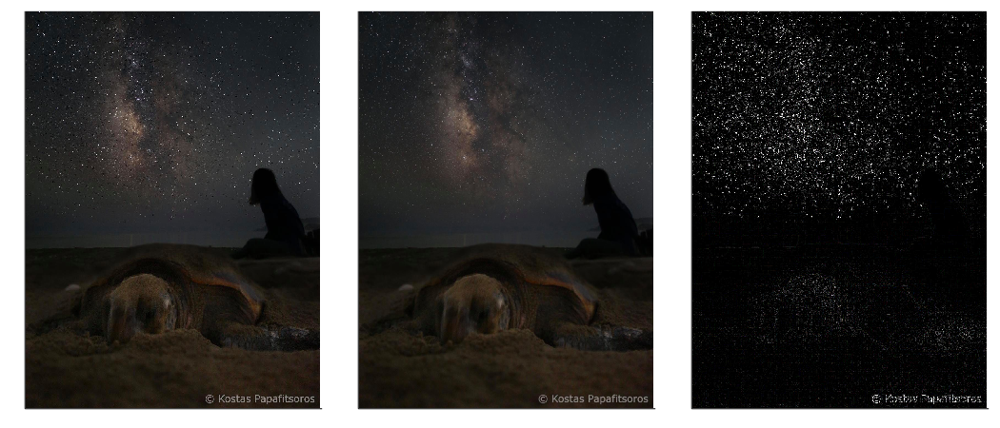

# Theory of neural networks

In the previous lecture, we presented basic layers for neural networks, activation functions. We also showed how to train neural networks using the gradient descent. This lecture is going to show more layers and a more enhanced sophisticated way of training.
## Layers

We know only the dense layer. Even though it is widely used due to its simplicity, it suffers from several disadvantages, especially in the domain of visual recognition. These include:
- Large number of parameters. For an image with ``500\times 500\times 3`` pixels and the output layer of only ``1000`` neurons, the dense layer would contain ``750`` million parameters. This is too much to optimize.
- No structural information. Dense layer assign a weight to every pixel and then adds the weighted values. This means that information from the top-leftmost and bottom-rightmost pixels of the image will be combined together. Since a combination of these two pixels should carry no meaningful information, redundant computation is performed.
Due to these reasons, special layers were designed.

#### Convolutional layer: Motivation

To understand the convolutional neural network, we need to go back to the definition of convolution. Having a function ``f`` and  a kernel ``g``, their convolution is defined by
```math
(f\ast g)(x) = \int_{-\infty}^{\infty} f(x - t)g(t) dt.
```
Let us consider the simplest case when
```math
g(t) = \begin{cases} \frac{1}{2\varepsilon} &\text{if }t\in[-\varepsilon,\varepsilon], \\ 0 &\text{otherwise.} \end{cases}
```
Then 
```math
(f\ast g)(x) = \int_{-\infty}^{\infty} f(x - t)g(t) dt = \frac{1}{2\varepsilon}\int_{-\varepsilon}^{\varepsilon}f(x - t)dt.
```
Then ``(f\ast g)(x)`` does not take the value of ``f`` at ``x`` but it integrates ``f`` over a small neighborhood of ``x``. Applying this kernel results in a smoothening of ``f``.  

In image processing, the image ``f`` is not represented as a function but as a collection of pixels. Then the kernel ``g`` is represented by a small matrix. For the most commonly used ``3\times 3`` matrix, the convolution has the form
```math
(f\ast g)(x,y) = \sum_{i=-1}^1\sum_{j=1}^1 g(i,j)f(x+i,y+j).
``` 

The following kernels
```math
K_1 = \begin{pmatrix} 0 & 0 & 0 \\ 0 & 1 & 0 \\ 0 & 0 & 0 \end{pmatrix}, \qquad
K_2 = \frac 19\begin{pmatrix} 1 & 1 & 1 \\ 1 & 1 & 1 \\ 1 & 1 & 1 \end{pmatrix}, \qquad
K_3 = \begin{pmatrix} -1 & -1 & -1 \\ -1 & 8 & -1 \\ -1 & -1 & -1 \end{pmatrix}
```
perform identity, image smoothening and edge detection, respectively.



#### Convolutional layer: Formulas

Traditional techniques for image detection, use a bunch of fixed kernels and combine their results. The idea of convulutional layers is to remove all man-made assumptions and to learn the parameters of the kernels based purely on data. Even though it gives superb results, it also removes any insight or interpretation humans have. 


The input of a convolutional layer has dimension ``I_1\times J_1\times C_1``, where ``I_1\times J_1`` is the size of the image and ``C_1`` is the number of channels (1 for grayscale, 3 for coloured, anything for layers inside the network). Its input is also the kernel ``K``, which is usually symmetric. The oput of the convolutional layer has dimension ``I_2\times J_2\times C_2`` and its value at some ``(i_0,j_0,c_0)`` equals to
```math
\text{output}(i_0,j_0,c_0) = l\left(\sum_{c=1}^C\sum_{i=-a}^{a}\sum_{j=-b}^b \Big( K_{c_0}(i,j,c) \text{input}(i_0+a,j_0+b,c) + b(c)\Big)\right).
```
After the linear operation inside, an activation function ``l`` is applied. Without it, the whole network would a product of linear function and therefore linear function (written in a very complicated form).

The natural question is the interpretation of the linear operator and the number of parameters:
- The kernel matrix ``K`` has dimension ``(2a+1)(2b+1)C_1C_2``. What does it mean? First, there is a separate kernel for each output channels. Second, the kernel also averages (or better computes a linear combination) over all input channels. However, the coefficients of this linear combination do not depend on the position ``(i_0,j_0)``. 
- The bias ``b`` has dimension ``C_2``. Again, it does not depend on the position ``(i_0,j_0)``.
The imporant thing to realize is that the number of parameters do not depend on the size of image (or hidden layers). For example, even for an input image ``500\times 500\times 3``, the convolutional layer contains only 448 parameters for ``3\times 3`` kernel and ``16`` output channels (do the computations).

This results in fixing the two issues mentioned above.
- The number of parameters or convolutional layers stays relatively small.
- Using kernels means that only local information from neighbouring pixels is propagated to further layers.

Practical convolutional layers involve additional comlexities such as padding (should zeros be added or should the output image be smaller) or stride (should there be any distance between convolutions). This goes, however, beyond the lecture.


#### Recurrent layer

Recurrent layers are designed to handle one-dimensional data. They are similar to convolutional layers with ``J_1=J_2=C_1=C_2=1``. Unlike convolutional layers, they store additional hidden variables. The most-known representative is the long short-term memory (LSTM) cell.


#### Pooling layer

The goal of pooling layers is to reduce the size of the network. They take a small (such as ``2\times 2``) window and perform a simple operation on this window (such as maximum or mean). Since the pooled windows do not overlap, this reduces the size of each dimension in half Pooling layers do not have any trainable parameters. 

#### Skip connections

From the previous lesson we know that the gradient is computed via the chain rule
```math
\nabla f = \nabla f_M\nabla f_{M-1}\dots\nabla f_1.
```
Since the formula contains multiplication, it means that if any one the gradients is too small, then the whole gradient will be too small. Specifically, the deeper the network, the higher the chance that the initial point will be in a point with a small gradient and the training will progress too slowly. This phenomenon is called vanishing gradients.

To solve the issue with vanishing gradients, skip connections are sometimes added. Even though it is not a layer, we include it here. They do precisely what their name suggest: They skip one or more layers. This makes the network more flexible: Due to its deep structure, it can approximate complicated functions and due to its shallow structure (because of skip connections), the initial training can be fast.

#### Network structure

When an input is an image, the usual structure of the neural network is the following:
- Convolutional layer followed by a pooling layer.
- This is repeated many times.
- Flatten layer (which only reshapes the three-dimensional tensor into a vector).
- Dense layer.
- Objective function.

## Stochastic gradient descent

We recall that machine learning problems minimize the loss function
```math
L(w) = \frac1n\sum_{i=1}^n \operatorname{loss}(f(w; x_i), y_i).
```
Its gradient equals to
```math
\nabla L(w) = \frac1n\sum_{i=1}^n \operatorname{loss}'(f(w; x_i), y_i)\nabla_w f(w; x_i).
```
It the dataset contains many samples (``n`` is large), the gradient is difficult to compute. Then the full gradient is replaced by a stochastic (random) approximation
```math
\frac1{|I|}\sum_{i\in I} \operatorname{loss}'(f(w; x_i), y_i)\nabla_w f(w; x_i).
```
Here, the minibatch``I`` is a small (``32, 64, 128, \dots,``) subset of all samples ``\{1,\dots,n\}``. Then the standard gradient update is perform. Sometimes the gradient descent is replaced by other options such as ADAM or RMSprop, which in some way consider the history of gradients.

This technique is called stochastic gradient descent. During one epoch (the time during which the optimizer evaluates each sample once), it performs many gradient updates (unlike the standard gradient which performs only one). Even though these updates are imprecise, numerical experiments show that stochastic gradient descent is much faster that standard gradient descent. The probable reason is that the full dataset contains lots of duplicate information and the full gradient therefore performs unnecessary computation, which slows it down.  
