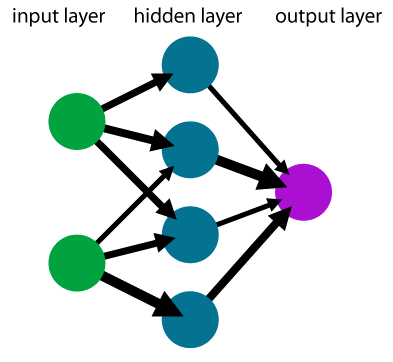

# Theory of neural networks

Neural networks appeared for the first time decades ago but were almost forgotten after a few years. Their resurgence in the last one or two decades is mainly due to available computational power. Their impressive list of applications include:
- One of the first applications was reading postal codes to automate the sorting of letters. Since only ten black and white digits can appear at five predetermined locations, simple networks were used.
- A similar type of neural (convolutional) networks is used in autonomous vehicles to provide information about cars, pedestrians or traffic signs. These networks may also use bounding boxes to specify the position of the desired object.
- While the previous techniques used the 2D structure of the input (image), recurrent neural networks are used for series-type data (text, sound). The major application is automatic translators.
- Another application includes generating new content. While practical applications such as artistic composition exist, these networks are often used to generate fake content (news, images).


## Neural networks

The first three bullets from the previous paragraph are all used for classification. The idea is the same as for linear networks. For an input ``x`` with a label ``y``, the classifier minimizes the loss between the prediction ``\operatorname{predict}(w;x)`` and the label ``y``. The ``\operatorname{predict}`` function has two parameters: ``w`` is to be trained (weights) while ``x`` is input (data). Having ``n`` samples (data points), the minimization problem reads

```math
\operatorname{minimize}_w\qquad \frac1n\sum_{i=1}^n \operatorname{loss}(y_i, \operatorname{predict}(w;x_i)).
```

The previous lecture used the linear classifier ``\operatorname{predict}(w;x)=w^\top x`` and the cross-entropy loss for classification and the mean squared error for regression.

Neural networks use more complex function than linear for better prediction power. At the same time, this function must satisfy: 
- It has good approximative quality.
- It does not contain many parameters to learn (train).
- The computation of derivatives (training) is simple.

## Layers

The previous bullets are elegantly achieved by representing the neural network via layers. The input ``x`` enters the first layers, the output of the first layer goes into the second layer and so on. Mathematically speaking, a network with ``M`` layers has the structure

```math
\hat y = \operatorname{predict}(w;x) = (f_M \circ \dots \circ f_1)(x),
```

where ``f_1,\dots,f_M`` are individual layers. Most of these layers depend on the weights ``w``, but we omit this dependence for simplicity. On the other hand, only the first layer ``f_1`` depends directly on the input ``x``. Since two layers that are not next to each other (such as the first and the third layer) are not directly connected, this allows for the simple propagation of function values and derivatives.



#### Dense layer

The dense layer is the simplest layer which has the form

```math
f_m(a) = l_m(W_ma + b_m),
```

where ``W_m`` is a matrix of appropriate dimensions, ``b_m`` is the bias (shift) and ``l_m`` is an activation function. The weights of the neural network, which need to be trained, would be ``w=(W_m,b_m)_m`` in this case.

The activation function is usually written as ``l_m:\mathbb{R}\to\mathbb{R}`` and its operation on the vector ``W_mz + b_m`` is understood componentwise. Examples of activation functions include:

```math
\begin{aligned}
&\text{Sigmoid:}&l(z) &= \frac{1}{1+e^{-z}} ,\\
&\text{ReLU:}&l(z) &= \operatorname{max}\{0,z\}, \\
&\text{Softplus:}&l(z) &= \log(1+e^z), \\
&\text{Swish:}&l(z) &= \frac{z}{1+e^{-z}} ,\\
\end{aligned}
```

```@setup nn
using Plots

sigmoid(x) = 1 / (1 + exp(-x))
ReLU(x) = max(0, x)
softplus(x) = log(1 + exp(x))
swish(x) = x / (1 + exp(-x))

x = -4:0.01:4

plot(
    plot(x, sigmoid; title = "Sigmoid"),
    plot(x, ReLU; title = "ReLU"),
    plot(x, softplus; title = "Softplus"),
    plot(x, swish; title = "Swish");
    linewidth = 2,
    ylims = (-1, 4),
    legend = false,
)

savefig("Activation.svg")
```


#### Softmax layer

The cross-entropy loss function (see below) requires that its input is a probability distribution. To achieve this, the softmax layer is applied directly before the loss function. Its formulation is

```math
\operatorname{softmax}(a_1,\dots,a_K) = \frac{1}{\sum_{k=1}^K e^{a_k}}(e^{a_1}, \dots, e^{a_K}).
```

The exponential ensures that all outputs are positive. The normalization ensures that the sum of the outputs is one. Therefore, it is a probability distribution. When a dense layer precedes the softmax layer, it is used without any activation function (as, for example, ReLU would result in many probabilities being the same).

#### One-hot and one-cold representation

One-hot and one-cold representations are directly connected with the softmax layer. The one-cold representation is "the normal one", while the one-hot representation is its probability distribution. For example, for the iris dataset, we encode virginica as ``(1,0,0)``, versicolor as ``(0,1,0)`` and setosa as ``(0,0,1)``.

#### Other layers

There are many other layers (convolutional, recurrent, pooling), which we will go through in the next lesson.

## Loss functions

The most commonly used loss functions are:
- (Mean) squared error
  ```math
  \operatorname{loss}(y,\hat y) = (y-\hat y)^2.
  ```
- Cross-entropy
  ```math
  \operatorname{loss}(y,\hat y) = - \sum_{k=1}^K y_k\log \hat y_k.
  ```
- Binary cross-entropy
  ```math
  \operatorname{loss}(y,\hat y) = - y\log \hat y - (1-y)\log(1- \hat y).
  ```

Mean squared error is usually used for regression problems while both cross-entropies for classification problem. The former for multi-class (``K>2``) and the latter for binary (``K=2``) problems.

## Making predictions

For classification with ``K`` classes, the classifier predicts a probability distribution of ``K`` classes. The hard prediction is the label with the highest probability. Using the above terminology, the classifier output has the one-hot form, while the actual prediction has the one-cold form.

The most common metric for evaluating classifiers is the accuracy defined by

```math
\operatorname{accuracy} = \frac 1n\sum_{i=1}^n I(y_i = \hat y_i),
```

where ``I`` is the characteristic (0/1) function which counts how often the argument is satisfied. With abuse of notation, we use both the label ``y_i`` and the prediction ``\hat y_i`` in the one-cold representation. Therefore, accuracy measures the fraction of samples with correct predictions.


## Overfitting and regularization

While large neural networks may fit arbitrarily precisely, this is usually not preferred as overfitting may occur. This is especially true for large networks with more parameters than samples.

```@setup overfit
using Plots
using Random

Random.seed!(666)

n = 10
x = rand(n)
y = x.^2 .+ 0.01*randn(n)

scatter(x,y)

X = zeros(n, n)
for i in 1:n
    X[:,i] = x.^(i-1)
end

w = X \ y

f(x) = sum([w[i]*x^(i-1) for i in 1:n])

x_plot = 0:0.001:1

scatter(x, y, label="Data", ylim=(-0.01,1.01), legend=:topleft)
plot!(x_plot, f.(x_plot), label="Prediction")
plot!(x_plot, x_plot.^2, label="True dependence")

savefig("Overfit.svg")
```


This figure shows data with quadratic dependence and a small added error. While the complex classifier (a polynomial of order 9) fits the data perfectly, the correct classifier (a polynomial of order 2) fits the data slightly worse, but it is much better at predicting unseen samples. The more complicated classifier overfits the data. 

#### Preventing overfitting

Multiple techniques were developed to prevent overfitting.
- *Early stopping* stops the algorithm before it finds an optimum. This goes against the spirit of optimization as the loss function is actually not optimized.
- *Regularization* adds a term to the objective function, usually the squared ``l_2`` norm of weights
  ```math
  \operatorname{minimize}\qquad \frac1n\sum_{i=1}^n \operatorname{loss}(y_i, \operatorname{predict}(w;x_i)) + \frac{\lambda}{2}\|w\|^2.
  ```
  The more complicated classifier from the figure above contains (among others) the term ``20222x^9``. Since the coefficient is huge, its ``l_2`` norm would be huge as well. Regularization prevents such classifiers. Another possibility is the (non-differentiable) ``l_1`` norm, which induces sparsity (many weights should be zero).
- *Simple networks* cannot approximate overly complicated functions, and they can also prevent overfitting.

#### Train-test split

How should the classifier be evaluated? The figure above suggests that it is a bad idea to evaluate it on the same data where it was trained. The dataset is usually split into training and testing sets. The classifier is trained on the training and evaluated on the testing set. The classifier is not allowed to see the testing set during training. When the classifier contains many hyperparameters, which need to be tuned, the dataset is split into training, validation and testing sets. Then multiple classifiers are trained on the training set, the best values of hyperparameters are selected on the validation set, and the classifier performance is evaluated on the testing set.

## Additional topics

The following result shows that even shallow neural networks (not many layers) can approximate any continuous function well. As the proof suggests (Exercise 5), the price to pay is that the network needs to be extremely wide (lots of hidden neurons).

!!! compat "BONUS: Universal approximation of neural networks"
    Let ``g:[a,b]\to \mathbb{R}`` be a continuous function defined on an interval. Then for every ``\varepsilon>0``, there is a neural network ``f`` such that ``\|f-g\|_{\infty}\le \varepsilon``. Moreover, this network can be chosen as a chain of the following two layers:
    - Dense layer with the ReLU activation function.
    - Dense layer with the identity activation function.

A prerequisite for training neural networks is the efficient computation of derivatives. We derive this computation in the next box. Even though it looks complicated, it is just a simple application of the chain rule. It consists of forward and backward passes. The forward pass starts with the input, computes the values at each neuron and finishes with evaluating the loss function. The backward pass starts with the loss function, computes the partial derivatives in a backward way and chains them together to obtain the composite derivative.

This computation is highly efficient because the forward pass (computing function value) and the backward pass (computing derivatives) have the same complexity. This is in sharp contrast with the finite difference method, where the computation of derivatives is much more expensive.

!!! compat "BONUS: Computation of gradients"
    For simplicity, we denote ``f = \operatorname{predict}`` and consider
    ```math
    L(w) := \sum_{i=1}^n \operatorname{loss}(y_i, f(w;x_i)).
    ```
    If the classifier has only a single output (as in regression or binary classification), then the chain rule yields
    ```math
    \nabla L(w) = \sum_{i=1}^n \operatorname{loss}'(y_i, f(w;x_i))\nabla_w f(w;x_i).
    ```
    The most difficult term to compute is ``\nabla_w f(w;x_i)``. All neural networks presented in this course have a layered structure. For an input ``x``, the evaluation of ``f(w;x)`` is initialized by ``a_0=x`` and then the iterative update
    ```math
    \begin{aligned}
    z_m &= W_ma_{m-1} + b_m, \\
    a_m &= l_m(z_m)
    \end{aligned}
    ```
    for ``m=1,\dots,M`` is performed. The first equation ``z_m = W_ma_{m-1} + b_m`` performs a linear mapping, while ``a_m = l_m(z_m)`` applies the activation function ``l_m`` to each component of ``z_m``. The parameters of the network are ``(W_m,b_m)_m``. Since ``a_M=f(w;x)``, the chain rule implies
    ```math
    \begin{aligned}
    \nabla_{W_m} f &= \nabla_{W_m}a_M = \nabla_{z_M}a_M\nabla_{z_{M-1}}a_{M-1}\nabla_{a_{M-1}}z_{M-1}\dots \nabla_{z_m}a_m\nabla_{W_m}z_m, \\
    \nabla_{b_m} f &= \nabla_{b_m}a_M = \nabla_{z_M}a_M\nabla_{z_{M-1}}a_{M-1}\nabla_{a_{M-1}}z_{M-1}\dots \nabla_{z_m}a_m\nabla_{b_m}z_m.
    \end{aligned}
    ```
    Care needs to be taken with this expression; for example ``\nabla_{W_m}z_m`` differentiates a vector with respect to a matrix. The computation of ``\nabla_{W_m} f`` and ``\nabla_{b_m} f`` is almost the same and only the last term differs.

    Now we need to compute the individual derivatives
    ```math
    \begin{aligned}
    \nabla_{a_{m-1}} z_m &= W_m, \\
    \nabla_{z_m} a_m &= \operatorname{diag}(l_m'(z_m)).
    \end{aligned}
    ```
    The derivative in ``l_m'(z_m)`` is understood componentwise, and ``\operatorname{diag}`` makes a diagonal matrix from the vector.

    Combining all these relations allow computing the derivative of the whole network.
