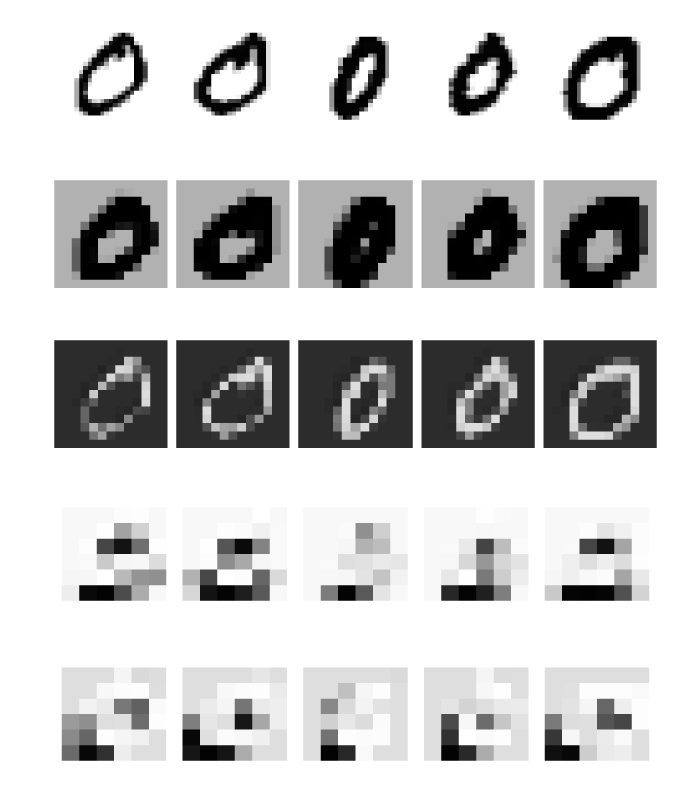
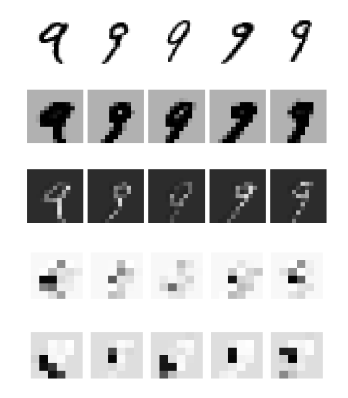

```@setup gpuu
using BSON
using Flux
using MLDatasets
using DataFrames
using Plots
using Flux: onehotbatch, onecold, flatten, params

Core.eval(Main, :(using Flux)) # hide
ENV["DATADEPS_ALWAYS_ACCEPT"] = true
MNIST(Float32, :train)

function reshape_data(X::AbstractArray{<:Real, 3})
    s = size(X)
    return reshape(X, s[1], s[2], 1, s[3])
end

function train_or_load!(file_name, m, args...; force=false, kwargs...)

    !isdir(dirname(file_name)) && mkpath(dirname(file_name))

    if force || !isfile(file_name)
        train_model!(m, args...; file_name=file_name, kwargs...)
    else
        m_weights = BSON.load(file_name)[:m]
        Flux.loadparams!(m, params(m_weights))
    end
end

function load_data(dataset; T=Float32, onehot=false, classes=0:9)
    X_train, y_train = dataset(T, :train)[:]
    X_test, y_test = dataset(T, :test)[:]

    X_train = reshape_data(X_train)
    X_test = reshape_data(X_test)

    if onehot
        y_train = onehotbatch(y_train, classes)
        y_test = onehotbatch(y_test, classes)
    end

    return X_train, y_train, X_test, y_test
end

T = Float32
X_train, y_train, X_test, y_test = load_data(MLDatasets.MNIST; T=T, onehot=true)
```

# Exercises

The first two exercises handle training neural networks on GPUs instead of CPUs. Even though this is extremely important for reducing the training time, we postponed it to the exercises because some course participants may not have a compatible GPU for training. If anyone is not able to do these two exercises, we apologize.

```@raw html
<div class="admonition is-category-exercise">
<header class="admonition-header">Exercise 1: Operations on GPUs</header>
<div class="admonition-body">
```

While most computer operations are performed on CPUs (central processing unit), neural networks are trained on other hardware such as GPUs (graphics processing unit) or specialized hardware such as TPUs.

To use GPUs, include packages Flux and CUDA. Then generate a random matrix ``A\in \mathbb{R}^{100\times 100}`` and a random vector ``b\in \mathbb{R}^{100}``. They will be stored in the memory (RAM), and the computation will be performed on CPU. To move them to the GPU memory and allow computations on GPU, use ```gpu(A)``` or the more commonly used ```A |> gpu```.

Investigate how long it takes to perform multiplication ``Ab`` if both objects are on CPU, GPU or if they are saved differently. Check that both multiplications resulted in the same vector.

```@raw html
</div></div>
<details class = "admonition is-category-solution">
<summary class = "admonition-header">Solution:</summary>
<div class = "admonition-body">
```

The beginning is simple

```julia
using Flux
using CUDA

A = randn(100,100)
b = randn(100)
A_g = A |> gpu
b_g = b |> gpu
```

To test the time, we measure the time for multiplication

```julia
julia> @time A*b;
0.069785 seconds (294.76 k allocations: 15.585 MiB, 14.75% gc time)

julia> @time A_g*b_g;
0.806913 seconds (419.70 k allocations: 22.046 MiB)

julia> @time A_g*b;
0.709140 seconds (720.01 k allocations: 34.860 MiB, 1.53% gc time)
```

We see that all three times are different. Can we infer anything from it? No! The problem is that during the first call to a function, some compilation usually takes place. We should always compare only the second time.

```julia
julia> @time A*b;
0.000083 seconds (1 allocation: 896 bytes)

julia> @time A_g*b_g;
0.000154 seconds (11 allocations: 272 bytes)

julia> @time A_g*b;
0.475280 seconds (10.20 k allocations: 957.125 KiB)
```

We conclude that while the computation on CPU and GPU takes approximately the same time, it takes much longer when using the mixed types.

To compare the results, the first idea would be to run

```julia
norm(A*b - A_g*b_g)
```

which would result in an error. We cannot use any operations on arrays stored both on CPU and GPU. The correct way is to move the GPU array to CPU and only then to compute the norm

```julia
julia> using LinearAlgebra

julia> norm(A*b - cpu(A_g*b_g))
1.2004562847861718e-5
```
The norm is surprisingly large. Checking the types

```julia
julia> (typeof(A), typeof(A_g))
(Matrix{Float64}, CUDA.CuMatrix{Float32})
```

we realize that one of the arrays is stored in ```Float64``` while the second one in ```Float32```. Due to the different number of saved digits, the multiplication results in this error.

```@raw html
</div></details>
```

The previous exercise did not show any differences when performing a matrix-vector multiplication. The probable reason was that the running times were too short. The following exercise shows the time difference when applied to a larger problem.

```@raw html
<div class="admonition is-category-exercise">
<header class="admonition-header">Exercise:</header>
<div class="admonition-body">
```

Load the MNIST dataset and the model saved in ```data/mnist.bson```. Compare the evaluation of all samples from the testing set when done on CPU and GPU. For the latter, you need to convert the model to GPU.

```@raw html
</div></div>
<details class = "admonition is-category-solution">
<summary class = "admonition-header">Solution:</summary>
<div class = "admonition-body">
```

We load the data, model and convert everything to GPU

```julia
using CUDA

m = Chain(
    Conv((2,2), 1=>16, relu),
    MaxPool((2,2)),
    Conv((2,2), 16=>8, relu),
    MaxPool((2,2)),
    flatten,
    Dense(288, size(y_train,1)),
    softmax,
)

file_name = joinpath("data", "mnist.bson")
train_or_load!(file_name, m)

m_g = m |> gpu
X_test_g = X_test |> gpu
```

Now we can measure the evaluation time. Remember that we need to compile all the functions by evaluating at least one sample before doing so.

```julia
m(X_test[:,:,:,1:1])
m_g(X_test_g[:,:,:,1:1])
```

```julia
julia> @time m(X_test);
1.190033 seconds (40.24 k allocations: 1.069 GiB, 21.73% gc time)

julia> @time m_g(X_test_g);
0.071805 seconds (789 allocations: 27.641 KiB)
```
Using GPU speeded the computation by more than ten times.

```@raw html
</div></details>
```

!!! info "Computation on GPU:"
    Using GPUs speeds up the training of neural networks in orders of magnitude. However, one needs to be aware of some pitfalls.

    Make sure that all computation is performed either on CPU or GPU. Do not mix them. When computing on GPU, make sure that all computations are fast. One important example is

    ```julia
    accuracy(x, y) = mean(onecold(cpu(m(x))) .== onecold(cpu(y)))
    ```

    Because ```onecold``` accesses individual elements of an array, it is extremely slow on GPU. For this reason, we need to move the arrays on CPU first.

    Another thing to remember is to always convert all objects to CPU before saving them.

Exercises which do not require GPUs start here.

```@raw html
<div class="admonition is-category-exercise">
<header class="admonition-header">Exercise 3:</header>
<div class="admonition-body">
```

Load the network from ```data/mnist.bson```. Then create a ``10\times 10`` table, where the ``(i+1,j+1)`` entry is the number of samples, where digit ``i`` was misclassified as digit ``j``. This matrix is called the [confusion matrix](https://en.wikipedia.org/wiki/Confusion_matrix).

Convert the confusion matrix into a dataframe and add labels.

```@raw html
</div></div>
<details class = "admonition is-category-solution">
<summary class = "admonition-header">Solution:</summary>
<div class = "admonition-body">
```

First, we load the data as many times before

```@example gpuu
m = Chain(
    Conv((2,2), 1=>16, relu),
    MaxPool((2,2)),
    Conv((2,2), 16=>8, relu),
    MaxPool((2,2)),
    flatten,
    Dense(288, size(y_train,1)),
    softmax,
)

file_name = joinpath("data", "mnist.bson")
train_or_load!(file_name, m)
```

When creating a table, we specify that its entries are ```Int```. We save the predictions ```y_hat``` and labels ```y```. Since we do not use the second argument to ```onecold```, the entries of ```y_hat``` and ```y``` are between 1 and 10. Then we run a for loop over all misclassified samples and add to the error counts.

```@example gpuu
y_hat = onecold(m(X_test))
y = onecold(y_test)

errors = zeros(Int, 10, 10)
for i in findall(y_hat .!= y)
    errors[y[i], y_hat[i]] += 1
end
```

To create the dataframe, we use ```df = DataFrame(errors)```. It prints correctly integers and not strings. We change labels x1 to miss0, ... Similarly, we add the labels as the first column.

```@example gpuu
using DataFrames

df = DataFrame(errors, :auto)

rename!(df, [Symbol("miss$(i)") for i in 0:9])
insertcols!(df, 1, :label => string.(0:9))

nothing # hide
```

```@raw html
</div></details>
```

```@example gpuu
df # hide
```

Surprisingly, the largest number of misclassifications is 9 into 7. One would expect 8 to 0, 5 to 6 or 8 to 9. We investigate this in the next exercise.

```@raw html
<div class="admonition is-category-exercise">
<header class="admonition-header">Exercise 4:</header>
<div class="admonition-body">
```

Plot all images which are ``9`` but were classified as ``7``.

```@raw html
</div></div>
<details class = "admonition is-category-solution">
<summary class = "admonition-header">Solution:</summary>
<div class = "admonition-body">
```

To plot all these misclassified images, we find their indices and use the function `imageplot`. Since `y` are stored in the 1:10 format, we need to specify `classes`.

```julia
using ImageInspector

classes = 0:9

targets = onecold(y_test, classes)
predicts = onecold(m(X_test), classes)

imageplot(1 .- X_test, findall((targets .== 9) .& (predicts .== 7)); nrows=3)
savefig("miss.svg") # hide
```

```@raw html
</div></details>
```


We see that some of the nines could be recognized as a seven even by humans.

The following exercise depicts how images propagate through the network.

```@raw html
<div class="admonition is-category-exercise">
<header class="admonition-header">Exercise 5: Visualization of neural networks 1</header>
<div class="admonition-body">
```

We know that the output of the convolutional layers has the same number of dimensions as the inputs. If the activation function is the sigmoid, the output values stay within ``[0,1]`` and can also be interpreted as images. Use the same network as before but replace ReLU by sigmoid activation functions. Load the model from ```data/mnist_sigmoid.bson``` (you can check that the model accuracy is 0.9831).

For all digits, select the first five samples from the training set of this digit. Then create ``5\times 5`` graph (there will be 10 of them for each digit), where each column corresponds to one sample. The rows should be:
- The original image.
- The first channel of the layer after the first pooling layer.
- The last channel of the layer after the first pooling layer.
- The first channel of the layer after the second pooling layer.
- The last channel of the layer after the second pooling layer.
Discuss the images.

```@raw html
</div></div>
<details class = "admonition is-category-solution">
<summary class = "admonition-header">Solution:</summary>
<div class = "admonition-body">
```

To create the network and to load the data, we use

```@example gpuu
m = Chain(
    Conv((2,2), 1=>16, sigmoid),
    MaxPool((2,2)),
    Conv((2,2), 16=>8, sigmoid),
    MaxPool((2,2)),
    flatten,
    Dense(288, size(y_train,1)),
    softmax,
)

file_name = joinpath("data", "mnist_sigmoid.bson")
train_or_load!(file_name, m)
```

Before plotting, we perform a for loop over the digits. Then ```onecold(y_train, classes) .== i``` creates a ```BitArray``` with ones if the condition is satisfied, and zeros if the condition is not satisfied. Then ```findall(???)``` selects all ones, and ```???[1:5]``` finds the first five indices. Since we need to plot the original image, and the images after the second and fourth layer (there is always a convolutional layer before the pooling layer), we save these values into ```z1```, ```z2``` and ```z3```. Then we need to access to desired channels and plot then via the `ImageInspector` package.

```julia
using ImageInspector

classes = 0:9
plts = []
for i in classes
    jj = 1:5
    ii = findall(onecold(y_train, classes) .== i)[jj]

    z1 = X_train[:,:,:,ii]
    z2 = m[1:2](X_train[:,:,:,ii])
    z3 = m[1:4](X_train[:,:,:,ii])

    kwargs = (nrows = 1, size = (600, 140))
    plot(
        imageplot(1 .- z1[:, :, 1, :], jj; kwargs...),
        imageplot(1 .- z2[:, :, 1, :], jj; kwargs...),
        imageplot(1 .- z2[:, :, end, :], jj; kwargs...),
        imageplot(1 .- z3[:, :, 1, :], jj; kwargs...),
        imageplot(1 .- z3[:, :, end, :], jj; kwargs...);
        layout = (5,1),
        size=(700,800)
    )
    savefig("Layers_$(i).svg")
end
```

We plot and comment on three selected digits below.

```@raw html
</div></details>
```

Digit 0



Digit 1


Digit 9



We may observe several things:
- The functions inside the neural network do the same operations on all samples. The second row is always a black digit on a grey background.
- The size of the image decreases when propagated deeper into the network. The second and third rows (after the second layer) contain more pixels than the fourth and fifth rows (after the fourth layer).
- The channels of the same layer produce different outputs. While the second row (first channel after the second layer) depicts black digits on a grey background, the third row (last channel after the second layer) depicts white digits on black background.
- Each digit produce different images. This is important for separation and correct predictions.
