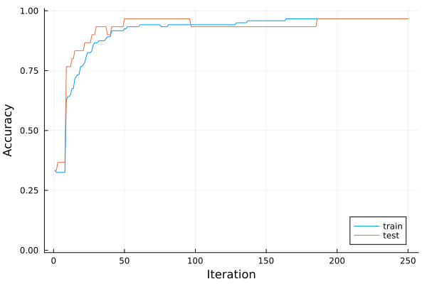

# Introduction to Flux

Flux is a library for using neural networks. This part will present the basics of Flux on the Iris dataset from the previous lecture. We include the auxiliary functions from the previous lesson into the `utilities.jl` file, which we include by

```@example iris
include("utilities.jl")

nothing # hide
```

We set the seed and load the data in the same way as during the last lecture.

```@example iris
using RDatasets
using Random

Random.seed!(666)

iris = dataset("datasets", "iris")

X = Matrix{Float32}(iris[:, 1:4])
y = iris.Species

X_train, y_train, X_test, y_test, classes = prepare_data(X', y; dims=2)

nothing # hide
```

## Creating the network

We recall that machine learning minimizes the discrepancy between the predictions ``\operatorname{predict}(w; x_i)`` and labels ``y_i``. Mathematically, this amounts to minimizing the following objective function:

```math
L(w) = \frac1n\sum_{i=1}^n \operatorname{loss}(y_i, \operatorname{predict}(w; x_i)).
```

To build the objective ``L``, we first specify the prediction function ``\operatorname{predict}``, which we denote by model `m`.  We start by creating the same network by the function `Chain`. Its inputs are the individual layers. Dense layers are created by `Dense` with the correct number of input and output neurons. We also need to specify the activation functions.

```@example iris
using Flux

n_hidden = 5
m = Chain(
    Dense(size(X_train,1) => n_hidden, relu),
    Dense(n_hidden => size(y_train,1), identity),
    softmax,
)

nothing # hide
```

Since `identity` is the default argument, it is possible to remove it in the second layer. However, we recommend keeping it for clarity.

We can evaluate the whole dataset.

```@example iris
m(X_train)
```

Because there are ``3`` classes and ``120`` samples in the training set, it returns an array of size ``3\times 120``. Each column corresponds to one sample and forms a vector of probabilities due to the last layer of softmax.

We access the neural network parameters by using `params(m)`. We can select the second layer of `m` by `m[2]`. Since the second layer has ``5 `` inputs and ``3`` output neurons, its parameters are a matrix of size ``3\times 5`` and a vector of length ``3``. The parameters `params(m[2])` are a tuple of the matrix and the vector. This also implies that the parameters are initialized randomly, and we do not need to take care of it. We can also easily modify any parameters.

```@example iris
using Flux: params

params(m[2])[2] .= [-1;0;1]

nothing # hide
```

## Training the network

To train the network, we need to define the objective function ``L``. Since we already defined ``\operatorname{predict}``, it suffices to define the loss function ``\operatorname{loss}``. Since we work with a multi-class problem, the loss function is usually the cross-entropy.

```@example iris
using Flux: crossentropy

L(ŷ, y) = crossentropy(ŷ, y)

nothing # hide
```

The `loss` function should be defined between predicted $\hat{y}$ and true label $y$. Therefore, we can evaluate the objective function by

```@example iris
L(m(X_train), y_train)
```

where `ŷ = m(x)`.

This computes the objective function on the whole training set. Since Flux is (unlike our implementation from the last lecture) smart, there is no need to take care of individual samples.

!!! info "Notation:"
    While the [standard definition](https://en.wikipedia.org/wiki/Cross_entropy) of cross-entropy is ``\operatorname{loss}(y,\hat y)``, [Flux](https://fluxml.ai/Flux.jl/stable/models/losses/) uses ``\operatorname{loss}(\hat y,y)``.

Since we have the model and the loss function, the only remaining thing is the gradient. Flux again provides a smart way to compute it.

```@example iris
grads = Flux.gradient(m -> L(m(X_train), y_train), m)

nothing # hide
```

The function `gradient` takes as inputs a function to differentiate, and arguments that specify the parameters we want to differentiate with respect to. Since the argument is the model `m` itself, the gradient is taken with respect to the parameters of `m`. The `L` function needs to be evaluated at the correct points `m(X_train)` (predictions) and `y_train` (true labels).

The `grads` structure is a tuple holding a named tuple with the `:layers` key. Each layer then holds the parameters of the model, in this case, the weights $W$, bias $b$, and optionally parameters of the activation function $\sigma$.

```julia
julia> grads[1][:layers][2]
(weight = Float32[0.30140522 0.007785671 … -0.070617765 0.014230583; 0.06814249 -0.07018863 … 0.17996183 -0.20995824; -0.36954764 0.062402964 … -0.10934405 0.19572766], bias = Float32[0.0154182855, 0.022615476, -0.03803377], σ = nothing)
```

Now, we train the classifiers for 250 iterations. In each iteration, we compute the gradient with respect to all network parameters and perform the gradient descent with stepsize ``0.1``. Since Flux@0.14, there's been a change from implicit definition to explicit definition of optimisers. Since now, we need to use `Flux.setup(optimiser, model)` to create an optimiser that would optimise over the model's parameters.

```@example iris
opt = Descent(0.1)
opt_state = Flux.setup(opt, m)
max_iter = 250

acc_train = zeros(max_iter)
acc_test = zeros(max_iter)
for i in 1:max_iter
    gs = Flux.gradient(m -> L(m(X_train), y_train), m)
    Flux.update!(opt_state, m, gs[1])
    acc_train[i] = accuracy(X_train, y_train)
    acc_test[i] = accuracy(X_test, y_test)
end

nothing # hide
```

Both the accuracy on the training and testing set keeps increasing as the training progresses. This is a good check that we are not over-fitting.

```@example iris
using Plots

plot(acc_train, xlabel="Iteration", ylabel="Accuracy", label="train", ylim=(-0.01,1.01))
plot!(acc_test, xlabel="Iteration", label="test", ylim=(-0.01,1.01))

savefig("Iris_train_test_acc.svg") # hide
```


