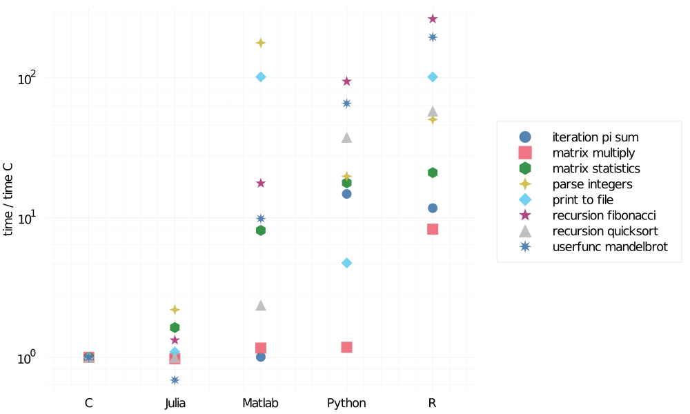

# Why julia?

There are many established programming languages like Python, Matlab, R, or C. When a new language is introduced, the natural question is why I should learn this new language. What are the advantages and disadvantages of this language? This section introduces significant advantages and disadvantages of Julia and compares it to Python, Matlab, R, and C.

```@raw html
<div class = "exercise-body">
<header class = "exercise-header">Advantages:</header><p>
```

- **Intuitive and flexible syntax:** Julia was designed to be easy to use and powerful at the same. Julia provides a very intuitive syntax and supports many useful concepts from other languages such as generators from Python. More details and examples are provided in the separate section below.
- **Performance:** Since Julia is a compiled language, code in Julia is generally faster than code written in pure Python or Matlab. More details and examples are provided in the separate section below.
- **Type system:** Like Matlab or Python, it is not necessary to use type annotations for variable or function input arguments. However, since everything in Julia has its own type, it is possible to use type annotation. This allows the compiler to optimize the code, and it can also prevent mistakes.
- **Multiple dispatch:** Julia multiple dispatch means that one functions consist of multiple methods which may differ in the number of input arguments or their type. When a function is called, the most specific method definition matching the number and argument types is executed. This allows defining general functions such as `convert` for all conversion operations, instead of using specific function names like `str2double` typically used in Matlab.

```@raw html
</p></div>
```

To be as objective as possible, we provide a list of Julia disadvantages.

```@raw html
<div class = "theorem-body">
<header class = "theorem-header">Disadvantages:</header><p>
```

- **A limited number of packages:** Even though Julia grows rapidly and there are many packages, it can not compete with the number of available packages in Python or R. However, Julia provides a simple way of interacting with other languages. If there is no adequate package in Julia, it is possible to use packages from other languages.

- **Slow first run:** Since Julia uses just-in-time compilation, the first call of every function is slower due to compilation. This slowdown can be significant if multiple functions are called for the first time. This includes creating a plot in a new Julia session because packages for plotting are large and use many functions. It results in a long time to the first plot (~20 s with [Plots.jl](https://github.com/JuliaPlots/Plots.jl)).

- **Limited number of job opportunities:** Because Julia is a relatively new language, there is a limited number of job opportunities, especially compared to Python. On the other hand, there is a list of Julia users and Julia Computing customers on the official webpage of [Julia Computing](https://juliacomputing.com/) including Amazon, Google, IBM, Intel and many others.

```@raw html
</p></div>
```


## Intuitive and flexible syntax

Julia provides very intuitive and yet flexible syntax, which allows users to write relatively complicated functions in a simple and readable way. As an example, we can compare the definition of the function that computes the [Fibonacci number](https://en.wikipedia.org/wiki/Fibonacci_number). A naive Matlab implementation of this function would be:

```matlab
function f = fib(n)
    if n < 2
        f = n;
    else
        f = fib(n-1) + fib(n-2);
    end
end
```

We do not check whether the input argument is a non-negative integer for simplicity. Python would result in the following implementation:

```python
def fib(n):
    if n<2:
        return n
    return fib(n-1) + fib(n-2)
```

Finally, an implementation in C would be close to:

```c
int fib(int n) {
    return n < 2 ? n : fib(n-1) + fib(n-2);
}
```

We see that these three implementations are very different. Surprisingly, the implementation in C is the shortest one. The reason is that C allows using the [ternary operator](https://en.wikipedia.org/wiki/%3F:). Even though Matlab allows to write the `if-else` statement on one line, this would decrease the code readability. Julia can implement this function in a simple way.

```julia
fib(n::Int) = n < 2 ? n : fib(n-1) + fib(n-2)
```

At the same time, it is possible to use traditional multiline function declaration syntax.

```julia
function fib(n::Int)
    if n < 2
        return n
    else
        return fib(n-1) + fib(n-2)
    end
end
```

The annotation of the input argument type and the `return` keyword are optional and can be both omitted. Julia, therefore, supports different syntax for defining functions. This is very useful because it is possible to write simple functions on one line or use a multiline syntax for more complicated functions. Additionally, Julia authors took inspiration from other languages, and Julia provides many handy features known from other languages:
- The syntax of matrix operations is inspired by Matlab.
- Statistical packages use similar syntax to R packages.
- It is possible to use list comprehensions and generators like in Python.

## Performance

One of the most obvious advantages of Julia is its speed. Since Julia uses just-in-time compilation, it is possible to achieve the performance of C without using any special tricks or packages. It can be seen in the following figure, which shows a speed comparison of various languages for multiple micro-benchmarks. A full description of these micro-benchmarks can be found on the official [Julia Micro-Benchmarks](https://julialang.org/benchmarks/) webpage.

These micro-benchmarks test performance on a range of common code patterns, such as function calls, string parsing, sorting, numerical loops, random number generation, recursion, or array operations. It is important to say that the used benchmark codes are not optimized for maximal performance. Instead, the benchmarks are written to test the performance of identical algorithms and code patterns implemented in each language. The following figure shows a computational time increase against the C language for several benchmark functions. The time on the ``y`` axis is logarithmic.



It is fair to say that sometimes other languages an use simple tricks to improve their performance. For example, the performance of Python can be enhanced by Numba: an open-source JIT compiler that translates a subset of Python and NumPy into fast machine code using the [LLVM](https://en.wikipedia.org/wiki/LLVM) compiler. Since both Numba and Julia use the same compiler, it is interesting to compare the performance of Julia and Python+Numba.

For the comparison consider the following example of estimating ``\pi`` using the Monte Carlo sampling originally posted [here](https://blakeaw.github.io/2019-09-20-numba-vs-julia/). A naive implementation of such estimation in pure Python 3.8.5 (using NumPy for the random number generator) is as follows:

```python
import numpy as np

def estimate_pi(n):
    n_circle = 0
    for i in range(n):
        x = 2*np.random.random() - 1
        y = 2*np.random.random() - 1
        if np.sqrt(x**2 + y**2) <= 1:
           n_circle += 1
    return 4*n_circle/n
```

To track the computational time, we use the [IPython 7.13.0](https://ipython.org/) command shell in combination with the `timeit` package.

```python
In [2]: import timeit
   ...: n = 10000000

In [3]: %timeit estimate_pi(n)
18.3 s ± 990 ms per loop (mean ± std. dev. of 7 runs, 1 loop each)
```

The average computation time is **18.3** seconds, which is a lot. The reason is that `for` loops in Python (and Matlab) are slow. One way to improve the performance is to use NumPy vectorized operations (it is a similar approach used often in Matlab to improve performance).

```python
def estimate_pi_vec(n):
    xy = 2*np.random.random((n, 2)) - 1
    n_circle = (np.sqrt((xy**2).sum(axis = 1)) <= 1).sum()
    return 4*n_circle/n
```

```python
In [5]: %timeit estimate_pi_vec(n)
354 ms ± 21.3 ms per loop (mean ± std. dev. of 7 runs, 1 loop each)
```

We use the same function to track the computational time, which amounts to **354** milliseconds. The vectorized version is 50 times faster than the pure Python implementation using the `for` loop. However, it requires rewriting the code and in many cases, which can often be very difficult or even impossible. Another approach is to use the Numba package mentioned above. The Numba package is straightforward to use by including one additional line of code before the function definition.

```python
import numba

@numba.jit()
def estimate_pi_numba(n):
    n_circle = 0
    for i in range(n):
        x = 2*np.random.random() - 1
        y = 2*np.random.random() - 1
        if np.sqrt(x**2 + y**2) <= 1:
           n_circle += 1
    return 4*n_circle/n
```

```python
In [7]: %timeit estimate_pi_numba(n)
109 ms ± 2.3 ms per loop (mean ± std. dev. of 7 runs, 1 loop each)
```

The result is quite impressive and the average computational time is only **109** milliseconds, which is more than 150 times faster than the pure Python implementation. However, Numba is not guaranteed to speed all computations.

How fast is Julia? To answer this question, we use the same function definition as in the pure Python implementation.

```julia
function estimate_pi(n)
    n_circle = 0
    for i in 1:n
        x = 2*rand() - 1
        y = 2*rand() - 1
        if sqrt(x^2 + y^2) <= 1
           n_circle += 1
        end
    end
    return 4*n_circle/n
end
```

In Julia, we can use the `BenchmarkTools` package that allows simple benchmarking of the code. To track the computational time we use `@benchmark` macro.

```julia
julia> using BenchmarkTools

julia> n = 10000000
10000000

julia> @benchmark estimate_pi(n)
BenchmarkTools.Trial:
  memory estimate:  16 bytes
  allocs estimate:  1
  --------------
  minimum time:     86.532 ms (0.00% GC)
  median time:      93.298 ms (0.00% GC)
  mean time:        95.266 ms (0.00% GC)
  maximum time:     112.988 ms (0.00% GC)
  --------------
  samples:          53
  evals/sample:     1
```

We see that the average computation time is **95** milliseconds. Without any modifications, the Julia code is slightly faster than the Python implementation with Numba. Even though the performance gap is not large, the Numba package will only work on a small Python and NumPy functionalities subset. Of course, other packages such as Cython can be used to increase performance. But all these packages have the same problem as Numba and will not support all Python functionalities. Python was not designed to be compiled, which results in many limitations that can not be easily solved. On the other hand, Julia was designed to be fast and provide high-performance without taking any additional steps. Moreover, Julia performance is not restricted to a subset of the language as in the case of Numba and other similar packages.
